# IDEA创建JavaWeb项目并配置servlet


# 1.创建JavaWeb项目

File -> new Project -> 选中Web Application ,然后next ,finish

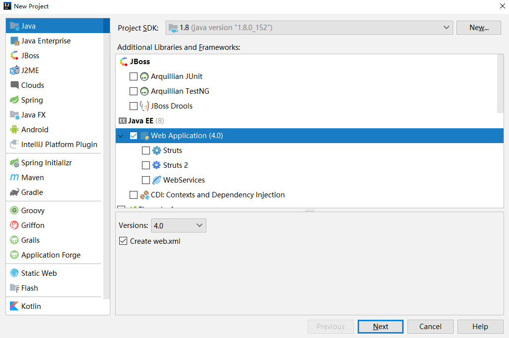


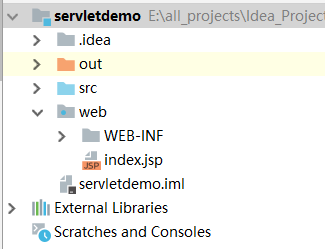

# 2.创建JavaWeb项目

2.1 在WEB-INF 目录下点击右键，New --> Directory，创建 classes 和 lib 两个目录
classes目录用于存放编译后的class文件，lib用于存放依赖的jar包

**注意：lib 里面放入 tomcat -》 lib 下面的servlet-api.jar包**


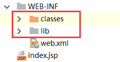


2.2 File --> Project Structure...，进入 Project Structure窗口，点击 Modules --> 选中项目“JavaWeb” --> 切换到 Paths 选项卡 --> 勾选 “Use module compile output path”，将 “Output path” 和 “Test output path” 都改为之前创建的classes目录
即将后面编译的class文件默认生成到classes目录下

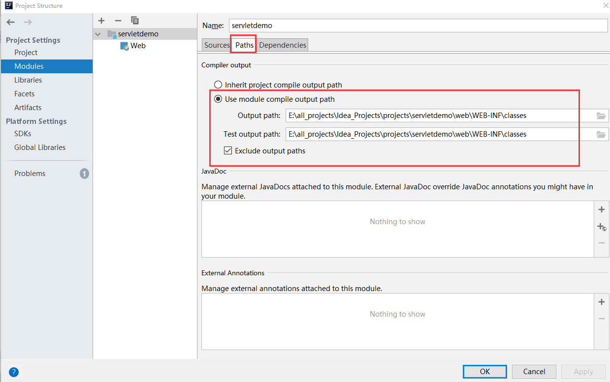


2.3 点击 Modules --> 选中项目“JavaWeb” --> 切换到 Dependencies 选项卡 --> 点击右边的“+”，选择 “JARs or directories...”，选择创建的lib目录

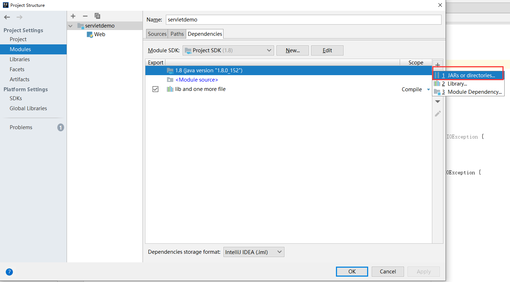

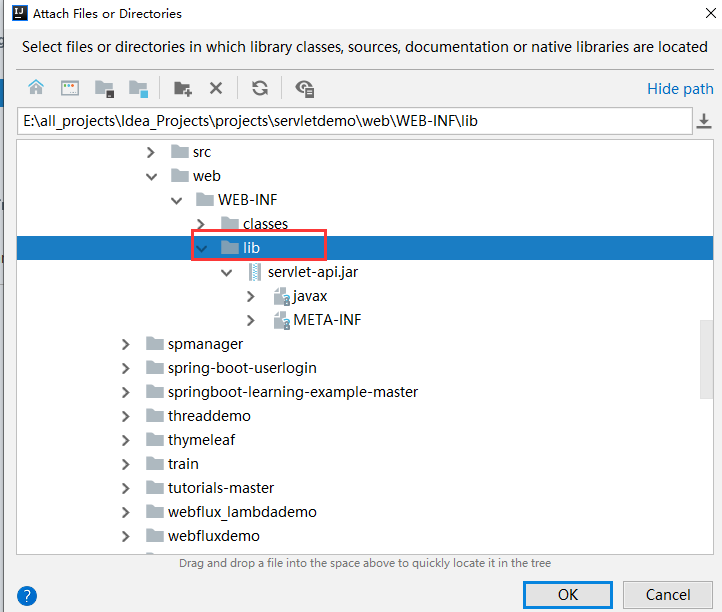

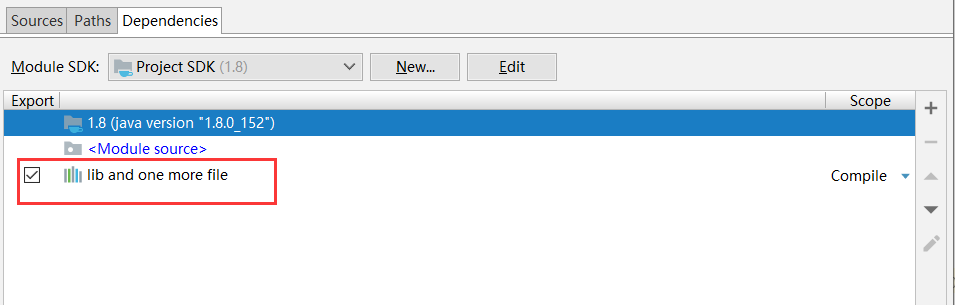


# 3.配置Tomcat

------

3.1 Run -> Edit Configurations，进入“Run Configurations”窗口，点击"+"-> Tomcat Server -> Local，创建一个新的Tomcat容器

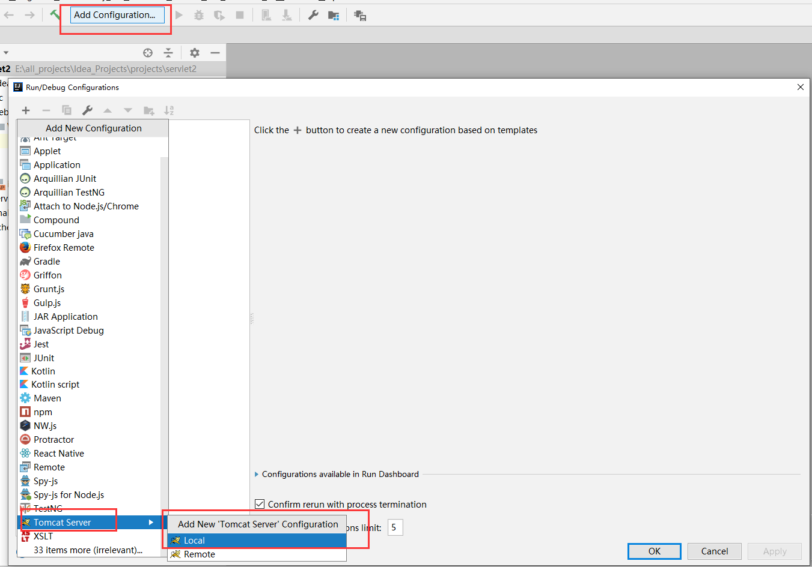


3.2 在"Name"处输入新的服务名，点击“Application server”后面的“Configure...”，弹出Tomcat Server窗口，选择本地安装的Tomcat目录 -> OK

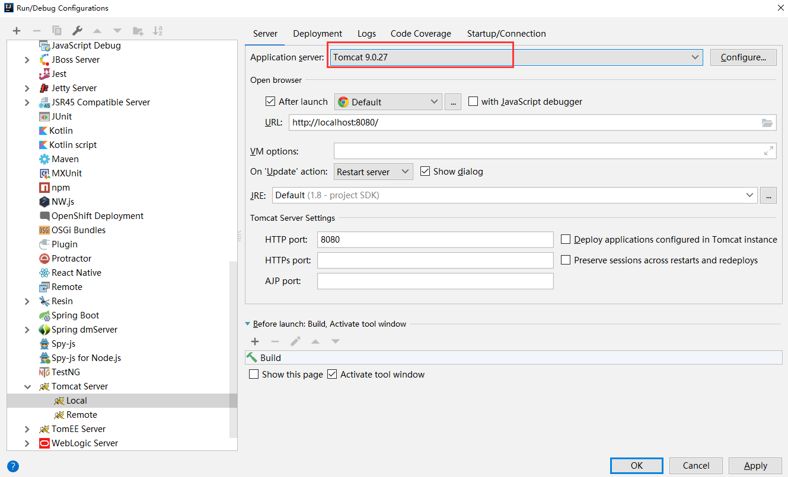


3.3  配置打包，在“Run Configurations”窗口的“Deployment”面板中，点右边的加号，选择Artifact

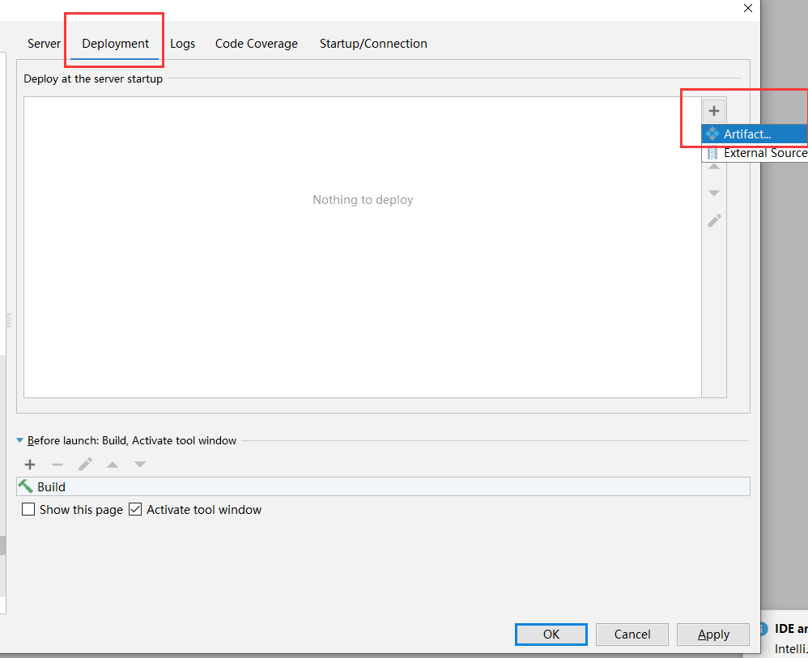

IDEA会为该项目自动创建一个名为“JavaWeb:war exploded”的打包方式，表示 打包成war包，并且是文件展开性的，输出路径为当前项目下的 out 文件夹，保持默认即可，应用。

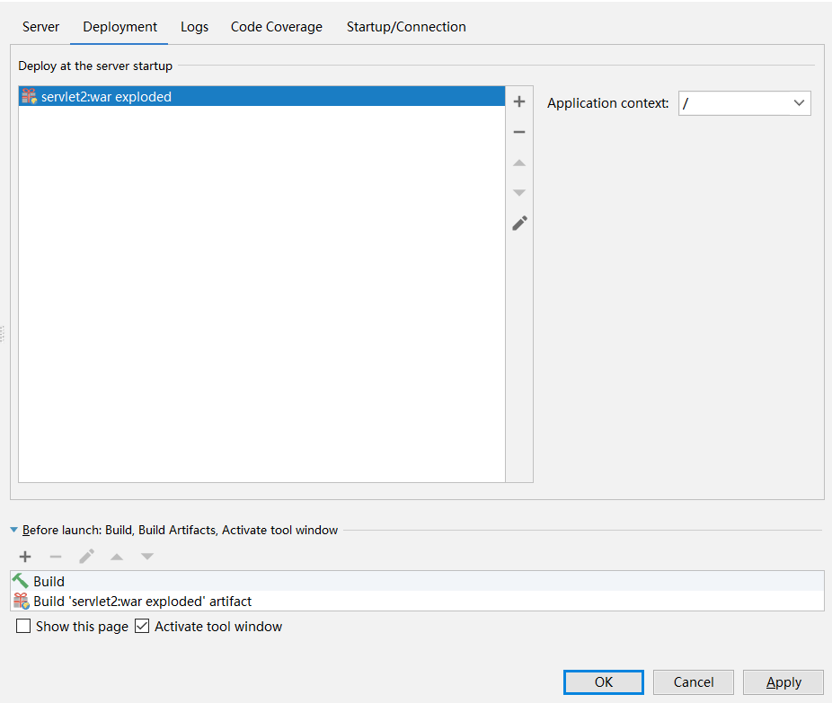


# 4.Servlet测试

4.1在src目录下创建servlet类

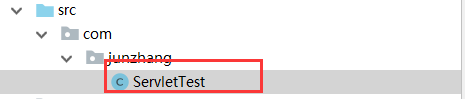

```
import java.io.IOException;
import java.io.PrintWriter;
import javax.servlet.annotation.WebServlet;
import javax.servlet.http.HttpServlet;
import javax.servlet.http.HttpServletRequest;
import javax.servlet.http.HttpServletResponse;

@WebServlet("/testServlet")
public class ServletTest extends HttpServlet {
    protected void doPost(HttpServletRequest request, HttpServletResponse response) throws javax.servlet.ServletException, IOException {

    }

    protected void doGet(HttpServletRequest request, HttpServletResponse response) throws javax.servlet.ServletException, IOException {
        response.setContentType("text/html");
        PrintWriter out = response.getWriter();
        out.println("Hello Servlet!");
    }
}

```


4.2 启动tomcat

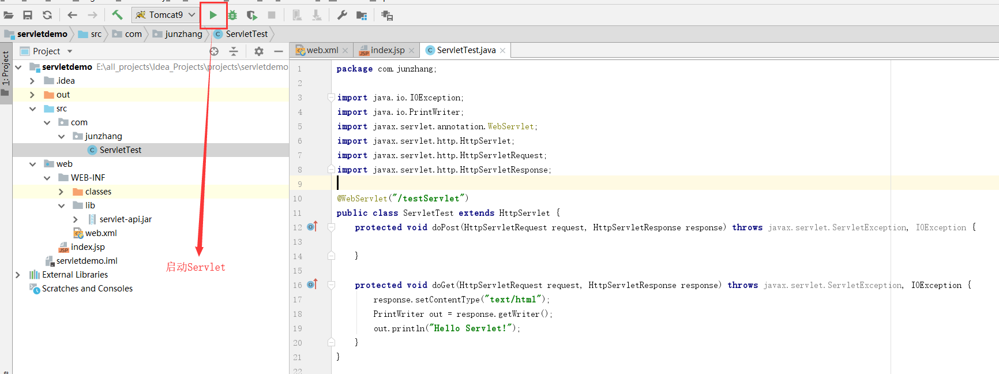


4.3 访问Servlet

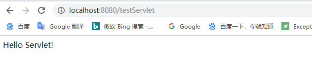


本文参考： https://blog.csdn.net/xuefu_78/article/details/72511744 ，在此基础上加以实践并修改了一些步骤