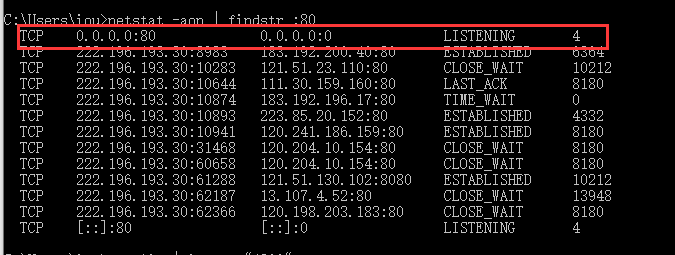
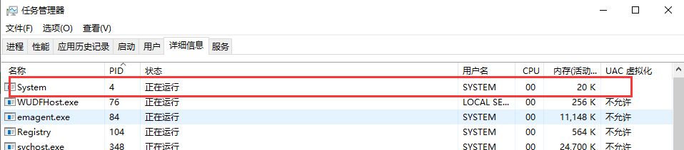
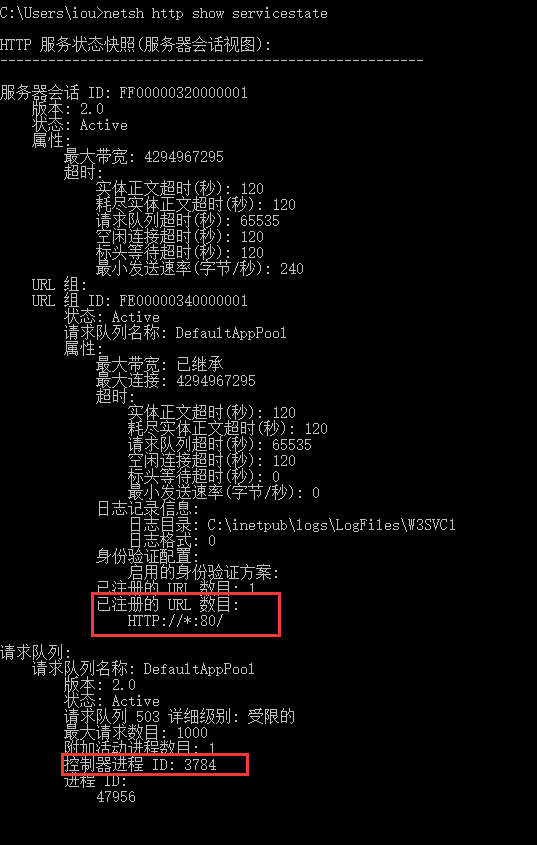

若没有开启IIS功能

1、若安装了安装 SQL Server，关闭服务（services.msc）

若关闭之后，重启还是80端口被占用

80 端口被莫名占用，咋一看还是 System 这个进程

又无法结束这货，于是开始慢慢查看到底是什么东西占用了

首先，打开 cmd 跑这一句，80 端口被System 占用，肯定是 HTTP 服务搞的鬼

2.cmd 查询

netsh http show servicestate

3.去任务管理器关掉对应的PID就好

是 svchost.exe

参考https://www.cnblogs.com/webenh/p/7714639.html  解决

