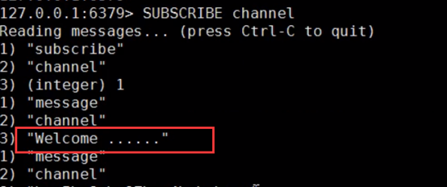
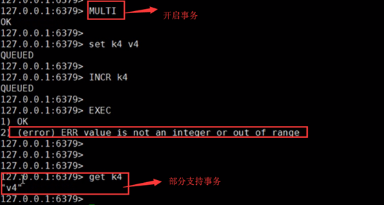

Redis系统介绍：

Redis的基础介绍与安装使用步骤：https://www.jianshu.com/p/2a23257af57b
Redis的基础数据结构与使用：https://www.jianshu.com/p/c95c8450c5b6
Redis核心原理：https://www.jianshu.com/p/4e6b7809e10a
Redis 5 之后版本的高可用集群搭建：https://www.jianshu.com/p/8045b92fafb2
Redis 5 版本的高可用集群的水平扩展：https://www.jianshu.com/p/6355d0827aea
Redis 5 集群选举原理分析：https://www.jianshu.com/p/e6894713a6d5
Redis 5 通信协议解析以及手写一个Jedis客户端：https://www.jianshu.com/p/575544f68615


优秀博客：

https://blog.csdn.net/btt2013/article/details/78138045
https://blog.csdn.net/m0_37450089/article/details/78740692
https://blog.csdn.net/hjm4702192/article/details/80518856
https://blog.csdn.net/qq_34337272/article/details/80012284


官网：

https://redis.io/

https://www.redis.net.cn/


# redis 介绍

> Redis is an open source (BSD licensed), in-memory data structure store, used as a database, cache and message broker. It supports data structures such as strings, hashes, lists, sets, sorted sets with range queries, bitmaps, hyperloglogs, geospatial indexes with radius queries and streams. Redis has built-in replication, Lua scripting, LRU eviction, transactions and different levels of on-disk persistence, and provides high availability via Redis Sentinel and automatic partitioning with Redis Cluster

Redis(Remote Dictionary Server) 是一个开源（BSD许可），**内存存储**的**数据结构服务器**，可用作**数据库，高速缓存和消息队列代理**。它支持[字符串](https://www.redis.net.cn/tutorial/3508.html)、[哈希表](https://www.redis.net.cn/tutorial/3509.html)、[列表](https://www.redis.net.cn/tutorial/3510.html)、[集合](https://www.redis.net.cn/tutorial/3511.html)、[有序集合](https://www.redis.net.cn/tutorial/3512.html)，[位图](https://www.redis.net.cn/tutorial/3508.html)，[hyperloglogs](https://www.redis.net.cn/tutorial/3513.html)等数据类型。内置复制、[Lua脚本](https://www.redis.net.cn/tutorial/3516.html)、LRU收回、[事务](https://www.redis.net.cn/tutorial/3515.html)以及不同级别磁盘持久化功能，同时通过Redis Sentinel提供高可用，通过Redis Cluster提供自动分区

> BSD[开源协议](https://baike.baidu.com/item/开源协议)（original BSD license、FreeBSD license、Original BSD license）是一个给于使用者很大自由的协议，BSD 代码鼓励代码共享，但需要尊重代码作者的著作权


redis属于**NoSQL数据库**，(NoSQL = Not Only SQL )，C语言编写的**key-value内存存储**的数据结构服务器，采用**单进程单线程模型**，并发能力强大，是当前互联网架构中主流的**分布式缓存工具**


## Nosql和关系型数据库的区别

由于web2.0的发展，社交、互动等应用的发展，让人们重新思考数据存储模型

1. 存储方式

   关系型数据库是表格式(行列)，Nosql数据库，大块的组合在一起。通常存储在数据集中，就像文档、键值对或者图结构

2. 存储结构

   关系型数据库对应的是结构化数据，预先定义了结构(列)，Nosql数据库基于动态结构

3. 存储规范

   关系型数据库的数据存储为了更高的规范性，把数据分割为最小的关系表以避免重复，管理起来很清晰，但单个操作设计到多张表的时候，数据管理就显得有点麻烦。

   Nosql数据存储在平面数据集中，数据经常可能会重复。单个数据库很少被分隔开，而是存储成了一个整体，整块数据更加便于读写

4. 查询方式

   关系型数据支持数据库CURD操作的功能非常强大，是业界的标准用法。而Nosql查询以块为单元操作数据，使用的是非结构化查询语言（UnQl），它是没有标准的

5. 事务

   关系型数据库遵循ACID规则（原子性(Atomicity)、一致性(Consistency)、隔离性(Isolation)、持久性(Durability)）

   Nosql数据库遵循BASE原则（基本可用（Basically Availble）、软/柔性事务（Soft-state ）、最终一致性（Eventual Consistency））

   关系型数据库的数据强一致性，所以对事务的支持很好。关系型数据库支持对事务原子性细粒度控制，并且易于回滚事务。

   Nosql数据库是在CAP（一致性、可用性、分区容忍度）中任选两项，因为基于节点的分布式系统中，很难全部满足，所以对事务的支持不是很好

   


## Nosql存储类型

| 类型          | 举例                               |
| ------------- | ---------------------------------- |
| key-value存储 | Redis、MemcacheDB、Berkeley DB     |
| 文档存储      | MongoDB(文档型的行存储)、CouchDB   |
| 列存储        | Hadoop的Hbase、Cassandra           |
| 图数据库      | GraphDB、Neo4J、OrientDB、InfoGrid |

1. key-value存储

   以键值对存储数据的一种数据库，类似map。可以将整个数据库理解为一个大的map，每个键都会对应一个唯一的值

2. 列存储

   

   

   

3. 文档存储

   MongoDB 介于关系数据库和非关系数据库之间。每一条记录就是一个文档（对应关系数据库的row），一批文档组成文档组（即集合，对应table），可以对文档的某些字段建立索引。可以像关系数据库一样去支持丰富的查询语言

   

4. 图数据库

   社会网络中人与人之间的关系。关系型数据库用于存储关系型数据的效果并不好，其查询复杂、缓慢、超出预期

   大量复杂、互连接、低结构化的图结构场合，如社交网络、推荐系统等

   灵活性高、支持复杂的图形算法、可用于构建复杂的关系图谱


## redis

redis之父--Salvatore Sanfilippo（[Antirez](https://link.jianshu.com/?t=http://antirez.com/)）

2008年，意大利的一家创业公司Merzia推出了一款基于MySQL的网站实时统计系统LLOOGG，然而没过多久该公司的创始人Salvatore Sanfilippo便开始对MySQL的性能感到失望，于是他决定亲自为LLOOGG量身定做一个数据库，并于2009年开发完成，这个数据库就是Redis。

不过Salvatore Sanfilippo并不满足只将Redis用于LLOOGG这一款产品，而是希望让更多的人使用它，于是在同一年Salvatore Sanfilippo将Redis开源发布，并开始和Redis的另一名主要的代码贡献者Pieter Noordhuis一起继续着Redis的开发，直到今天。

Salvatore Sanfilippo自己也没有想到，短短的几年时间，Redis就拥有了庞大的用户群体。Hacker News在2012年发布了一份数据库的使用情况调查，结果显示有近12%的公司在使用Redis。国内如新浪微博、知乎，国外如GitHub、Stack Overflow、Flickr、暴雪和Instagram，都是Redis的用户。

VMware公司从2010年开始赞助Redis的开发，Salvatore Sanfilippo和Pieter Noordhuis也分别于同年的3月和5月加入VMware，全职开发Redis。

Redis的代码托管在GitHub上https://github.com/antirez/redis，开发十分活跃，代码量只有三万多行。


# redis的特点

1. redis足够简单和稳定

2. 支持丰富的数据结构

3. Redis是基于内存的，内存的读写速度非常快；

   Redis是单线程的，省去了很多上下文切换线程的时间；

   Redis使用多路复用技术，可以处理并发的连接。非阻塞IO 内部实现采用epoll，采用了epoll+自己实现的简单的事件框架。epoll中的读、写、关闭、连接都转化成了事件，然后利用epoll的多路复用特性，绝不在io上浪费一点时间

4. 提供持久化的支持

5. 支持部分事务操作


## Redis的内存占用量

（所有示例均使用64位实例获得）

- 一个空的实例使用〜3MB的内存。
- 1百万个小键->字符串值对使用〜85MB的内存。
- 1百万个键->哈希值，代表具有5个字段的对象，使用〜160 MB的内存

64位系统将使用比32位系统更多的内存来存储相同的键，尤其是在键和值较小的情况下。这是因为在64位系统中，指针占用8个字节


# redis的应用场景

1. 缓存：相对静态、或变化缓慢的数据，可以利用缓存降低数据库IO压力，提升性能
2. 分布式session
3. 分布式锁：集群环境下对同一个资源的竞争，可借助redis来实现对资源加锁。
4. 秒杀：在redis中进行预处理，充当缓冲，将处理结果延迟持久化到数据库。规避高并发对DB的压力
5. 计算器：每次操作加1，redis天然支持计数的api操作
6. 消息队列：功能太简单，一般不用
7. ……


# redis知识树


# redis 下载安装(Linux)

详细见文档

## 下载

官网：https://redis.io/download

或

```
wget http://download.redis.io/releases/redis-5.0.5.tar.gz
```


## 安装

1. 解压 

   ```
   tar -zxvf redis-5.0.5.tar.gz
   ```

2. 编译

   ```
   cd redis-5.0.5/
   ```

   ```
   make
   ```

   make命令执行过程中可能报错，根据控制台输出的错误信息进行解决

   错误一：gcc命令找不到，是由于没有安装gcc导致

   错误二： error: jemalloc/jemalloc.h: No such file or directory

   注意：安装完gcc之后，再执行make，先执行 make distclean 清理一下上次make后产生的文件

3. make all（可选）

   该操作则将 src下的许多可执行文件复制到/usr/local/bin 目录下 =》以后可以在任意目录访问redis

   

## 启动

1. 后台启动

   ```
   cd redis-5.0.5/src/
   ```

   ```
   ./redis-server &
   ```

2. 后台启动并输出日志到nohup.out文件

   ```
   nohup /usr/local/redis-3.2.9/src/redis-server &
   ```

   ```
   ps -ef | grep redis  # 查看redis进程
   ```

3. 切换到src目录，redis-cli连接数据库测试服务

   ```
   ./redis-cli –h 127.0.0.1 –p 6379
   ```

   ```
   ping   # 输出pong，证明服务启动正常
   ```

   

## 关闭

- 方式一：切换到redis-5.0.5/src目录执行：

```
./redis-cli shutdown
```

- 方式二：kill pid 或者 kill -9 pid

```
kill pid
```

```
kill -9 pid  # 表示强制杀死该进程
```

```
pkill -9 redis # 批量结束redis进程
```


# redis 下载安装(Windows)

> The Redis project does not officially support Windows. However, the Microsoft Open Tech group develops and maintains this Windows port targeting Win64. Learn more
>
> **官方不支持Windows系统，但是微软自己做了一个支持win64位系统的**

## 下载

windows版本：https://github.com/MSOpenTech/redis/releases

## 安装

解压缩redis压缩包到指定目录


打开cmd命令窗口，将目录指向解压的redis目录

## 启动

- 方式一：

```
redis-server redis.windows.conf
```

- 方式二：

也可将redis设置为windows服务；用命令启动或者windows服务启动（services.msc）

```
redis-server --service-install redis.windows-service.conf --loglevel verbose
```

命令启动：

```
redis-server --service-start
```


进入redis安装目录下，点击redis-cli客户端测试redis服务

```
ping   # 输出pong，证明服务启动正常
```

Tip:	cmd窗口不需要进入redis的安装目录才能输入redis-cli解决方案：系统变量Path添加redis解压路径


注意：

1、windows10 上有的电脑有个诡异的现象

cmd直接启动服务正常，但是安装服务成功后，服务开启失败，解决办法：在redis-64.3.0.503文件夹下新建一个空文件夹，命名为logs，即可解决。


2、需要修改密码，但不想重启服务可使用 config命令；但是这种方式下次重启失效


3、windows 上在配置文件中设置密码，若redis是以系统服务的方式，需修改

​		**redis.windows-service.conf文件 而不是 redis.windows.conf**


4、Linux统一 配置文件：redis.conf；当然也可以指定


## 关闭

- 方式一：

```
redis-server --service-stop
```

- 方式二：

windows停止该服务即可


卸载服务：

```
redis-server --service-uninstall
```


# redis 客户端

## redis 命令客户端

redis-cli（Redis Command Line Interface）是Redis自带的基于命令行的Redis客户端，用于与服务端交互，我们可以使用该客户端来执行redis的各种命令。

直接连接redis (默认ip127.0.0.1，端口6379)：./redis-cli 

指定IP和端口连接redis：./redis-cli -h 127.0.0.1 -p 6379(默认端口 6379)   (有密码，指定 -a password)


## redis 远程客户端

Redis Desktop Manager

phpRedisAdmin


## redis 编程客户端

redis以键值对的方式存储数据在服务器上，那么我们Java程序如何读取键值对中的值内容呢？
所以有人编写了一套程序，专门去连接redis并读取其中的键值对内容，这套程序就像驱动程序一样，
我们使用它提供的API就能访问服务器上的redis并对它进行各种操作。

| 编程客户端 |                                                              |
| ---------- | ------------------------------------------------------------ |
| Jedis      | redis的Java编程客户端，Redis官方首选推荐使用Jedis，jedis是一个很小但很健全的redis的java客户端 |
| Lettuce    | Lettuce是一个可伸缩线程安全的Redis客户端。多个线程可以共享同一个RedisConnection。它利用优秀netty NIO框架来高效地管理多个连接，Lettuce能够支持Reactive方式 |
| ……         | https://redis.io/clients                                     |

redis的其他编程语言客户端

C、C++、C#、Erlang、Lua、Objective-C、Perl、PHP、Python、Ruby、Scala、Go等40多种语言都有连接redis的编程客户端


# redis 初相识

1. redis命令行初体验

   ```
   redis> ping
   PONG                 # 输入ping，redis给我们返回PONG，表示redis服务运行正常
   ```

   

2. redis默认为16个库 (在redis.conf文件可配置，该文件很重要，后续很多操作都是这个配置文件)

   - **Redis默认支持16个数据库（可以通过配置文件支持更多，无上限）**，可以通过配置databases来修改这一数字。

   - 一个Redis实例提供了多个用来存储数据的字典，客户端可以指定将数据存储在哪个字典中

   - 每个字典都 => 独立的数据库，每个字典的数据是隔离的不能共享。**基于单机，集群就没有数据库的概念**

   - 以数字命名的数据库又与我们理解的数据库有所区别。Redis不支持自定义数据库的名字，每个数据库都以编号命名，开发者必须自己记录哪些数据库存储了哪些数据。

   - **Redis也不支持为每个数据库设置不同的访问密码**，所以一个客户端要么可以访问全部数据库，要么连一个数据库也没有权限访问

   - 多个数据库之间并不是完全隔离的，比如FLUSHALL命令可以清空一个Redis实例中所有数据库中的数据

   - 这些数据库更像是一种命名空间，而不适宜存储不同应用程序的数据。

   - 应用场景： 

     0号 -》 某个应用生产环境中的数据； 1号 -》存储测试环境中的数据；

     0号 -》存储A应用的数据，1号 -》B应用的数据     X  

     不同的应用应该使用不同的Redis实例存储数据。由于Redis非常轻量级，一个空Redis实例占用的内在只有1M左右，所以不用担心多个Redis实例会额外占用很多内存。 

3. redis默认自动使用0号库

4. 切换库命令：select db 

5. 删除实例所有库的数据：flushall

6. 删除实例当前库的数据：flushdb

7. config get * 获得redis的所有配置值

8. redis自带的客户端退出当前redis连接: exit 或 quit

9. 查看当前数据库中key的数目：dbsize

10. 查看redis服务器的统计信息：info

    

# redis 的命令与手册

## 手册

redis英文版命令大全：https://redis.io/commands

redis中文版命令大全：http://redisdoc.com/

## 1 + 5 命令

### 1种key操作

| key命令            |                                                              |
| ------------------ | ------------------------------------------------------------ |
| keys *             | 列出所有的key                                                |
| exists key         | 检查某个key是否存在                                          |
| move key db        | 将当前库的key移动到给定的库db中，比如：move k1 2             |
| expire key seconds | 设置key的值的过期时间                                        |
| ttl key            | ttl（time to live）查看key还有多少秒过期，-1永不过期，-2已过期或key不存在 |
| type key           | 查看key所储存的值的类型                                      |
| del key            | 删除key                                                      |


### 5种数据类型

https://redis.io/topics/data-types-intro

- 字符串类型 string

  字符串类型是Redis中最基本的数据类型，它能存储任何形式的字符串，包括二进制数
  据，序列化后的数据，JSON化的对象甚至是一张图片

  

  | 常见命令 |                                                              |
  | -------- | ------------------------------------------------------------ |
  | set      | 将字符串值 value 设置到 key 中                               |
  | get      | 获取 key 中设置的字符串值                                    |
  | incr     | 将 key 中储存的数字值加1，如果 key 不存在，则 key 的值先被初始化为 0 再执行 INCR 操作（只能对数字类型的数据操作）**(incr key)** |
  | decr     | 将 key 中储存的数字值减1，如果 key 不存在，则么 key 的值先被初始化为 0 再执行 DECR 操作（只能对数字类型的数据操作）**(decr key)** |
  | setex    | set expire的简写，设置key的值 ，并将 key 的生存时间设为 seconds (以秒为单位) (**setex key seconds value**) |
  | setnx    | setnx 是 set if not exists 的简写，如果key不存在，则 set 值，存在则不设置值(**setnx key value**) |
  | getset   | 设置 key 的值为 value ，并返回 key 的旧值(**getset key value**) |

  | 进阶命令 |                                                              |
  | -------- | ------------------------------------------------------------ |
  | strlen   | 返回 key 所储存的字符串值的长度                              |
  | append   | 如果 key 存在且是字符串， 则将 value 追加到 key 原来旧值的末尾<br/>如果 key 不存在， 则将key 设置值为 value |
  | incrby   | 将 key 所储存的值加上增量值，如果 key 不存在，则 key 的值先被初始化为 0 再执行 INCRBY 命令 |
  | decrby   | 将 key 所储存的值减去减量值，如果 key 不存在，则 key 的值先被初始化为 0 再执行 DECRBY 命令 |
  | getrange | 获取 key 中字符串值从 start 开始 到 end 结束 的子字符串      |
  | setrange | 从指定的位置开始将key的值替换为新的字符串，比如旧值helloworld，setrange 5 redis，将从第5个下标位置往后开始替换为新的字符串redis，最终结果：helloredis |
  | mset     | 同时设置一个或多个 key-value 对                              |
  | mget     | 获取所有(一个或多个)给定 key 的值                            |
  | msetnx   | 同时设置一个或多个 key-value 对，当且仅当所有给定 key 都不存在时才能设置成功，否则只要有一个key存在都会失败 |
  |          |                                                              |

  

- 哈希类型 hash

  Redis hash 是一个string类型的field和value的映射表，hash特别适合用于存储对象

  

  | 常用命令 |                                                              |
  | -------- | ------------------------------------------------------------ |
  | hset     | 将哈希表 key 中的域 field 的值设为 value（**hset hash field value** -> hset student name zhangsan） |
  | hget     | 获取哈希表 key 中给定域 field 的值(**hget hash field** -> hget student name) |
  | hmset    | 同时将多个 field-value (域-值)对设置到哈希表 key 中 (**hmset key field value [field value …]** -> hmset student name zhangsan age 20) |
  | hmget    | 获取哈希表 key 中一个或多个给定域的值(**hmget key field [field …]** -> hmget student name age) |
  | hgetall  | 获取哈希表 key 中所有的域和值 (**hgetall key** -> hgetall student) |
  | hdel     | 删除哈希表 key 中的一个或多个指定域field(**hdel key field [field …]** -> hdel student name) |
  | hkeys    | 查看哈希表 key 中的所有field域(**hkeys key** -> hkeys student) |
  | hvals    | 查看哈希表 key 中所有域的值(**hvals key** -> hvals student)  |
  |          |                                                              |

  

- 列表类型 list

  Redis列表是简单的字符串列表，按照插入顺序排序。你可以添加一个元素导列表的头部（左边）或者尾部（右边）

  

  | 常用命令  |                                                              |
  | --------- | ------------------------------------------------------------ |
  | lpush     | 将一个或多个值 value 插入到列表 key 的表头（每次放到左边(头)）(**LPUSH key value [value …]** -> lpush list 1 2)      (2  1) -> lpop list  -> 2    rpop list ->1 |
  | rpush     | 将一个或多个值 value 插入到列表 key 的表尾（每次放到右边(尾)）(**RPUSH key value [value …]** -> rpush list 1 2)      (1  2)-> lpop list -> 1        rpop list -> 2 |
  | lrange    | 获取列表 key 中指定区间内的元素，0 表示列表的第一个元素，以 1 表示列表的第二个元素， -1 表示列表的最后一个元素， -2 表示列表的倒数第二个元素，以此类推。(**lrange key start stop** ->  lpush list 1 2 3  (3 2 1) -> lrange list 0 1 (3,2) ) |
  | lpop      | 从左边获取列表 key 的一个元素，并将该元素移除                |
  | rpop      | 从右边获取列表 key 的一个元素，并将该元素移除                |
  | lindex    | 获取列表 key 中下标为指定 index 的元素（**lindex key index** -> lindex list 2 (1)） |
  | llen      | 获取列表 key 的长度(**llen key** -> llen list (3))           |
  | lrem      | 从左到右删除列表中指定个数的并与指定value值相等的value (LREM key count value -> lpush list 1 3 3 4 3 3  (3 3 4 3 3 1)  -> lrem list 1 2 (3 3 2 2 1))     count (> \|\| < \|\| =)  = 0 |
  | ltrim     | 删除指定区域外的元素，比如LTRIM list 0 2 ，表示只保留列表 list 的前三个元素，其余元素全部删除(**LTRIM key start stop**) |
  | rpoplpush | RPOPLPUSH source destination 将列表 source 中的最后一个元素(尾元素)弹出插入到列表 destination ，作为 destination 列表的的头元素（**RPOPLPUSH source destination** ） |
  | lset      | 将列表 key 下标为 index 的元素的值设置为 value(**LSET key index value**) |
  | ……        |                                                              |

  

- 集合类型 set

  Redis的Set是string类型的无序集合，集合成员是唯一的，即集合中不能出现重复的数据

  

  | 常用命令    |                                                              |
  | ----------- | ------------------------------------------------------------ |
  | sadd        | 将一个或多个 member 元素加入到集合 key 当中，已经存在于集合的 member 元素将不会再加入 （**SADD key member [member …]** ->  sadd set 1 2 2 3） |
  | smembers    | 获取集合 key 中的所有成员元素 (**smembers key**)             |
  | sismember   | 判断 member 元素是否是集合 key 的成员 (**sismember key  member **) |
  | scard       | 获取集合里面的元素个数(**scard key**)                        |
  | srem        | 删除集合 key 中的一个或多个 member 元素(**SREM key member [member …]** -> srem set 1 2) |
  | srandmember | 随机返回集合中的元素(**SRANDMEMBER key [count]**)  count可<0 |
  | spop        | 随机从集合中删除一个元素(**SPOP key**)                       |
  | smove       | 将 member 元素从一个集合移动到另一个集合(**SMOVE source destination member**)   destination可不存在 |

  

- 有序集合类型 zset （sorted set）

  Redis 有序集合zset和集合set一样也是string类型元素的集合，且不允许重复的成员。
  不同的是zset的每个元素都会关联一个分数（分数可以重复），redis通过分数来为集合中的成员进行从小到大的排序

  

  | 常用命令         |                                                              |
  | ---------------- | ------------------------------------------------------------ |
  | zadd             | 将一个或多个 member 元素及其 score 值加入到有序集合 key 中（**ZADD key score member [[score member] [score member] …]** ->  zadd zset 20 name 30 age） |
  | zrem             | 删除有序集合 key 中的一个或多个成员                          |
  | zcard            | 获取有序集 key 的元素成员的个数 (**zcard key** -> zcard zset) |
  | zrank            | 获取有序集 key 中成员 member 的排名，有序集成员按 score 值从小到大顺序排列(**zrank key member**) (0表示第一个) |
  | zrevrank         | 获取有序集 key 中成员 member 的排名，有序集成员按 score 值从大到小顺序排列 |
  | zrangebyscore    | 获取有序集 key 中，所有 score 值介于 min 和 max 之间的成员（**zrangebyscore key min max**）(<=max && >= min) |
  | zrevrangebyscore | 获取有序集 key 中， score 值介于 max 和 min 之间的所有的成员 |
  | zcount           | 获取有序集 key 中，所有 score 值介于 min 和 max 之间的成员的个数(**zcount key min max**) |
  | zrange           | 获取有序集 key 中，指定区间内的成员，按 score 值从小到大排列 |
  | zrevrange        | 获取有序集 key 中，指定区间内的成员，按 score 值从大到小排列 |


总结

| 结构类型 | 结构存储的值                                                 | 读写能力                                                     |
| -------- | ------------------------------------------------------------ | ------------------------------------------------------------ |
| String   | 可以是字符串、整数或者浮点数                                 | 对整个字符串或者字符串的其中一部分执行操作；对象和浮点数执行自增(increment)或者自减(decrement) |
| List     | 一个链表，链表上的每个节点都包含了一个字符串                 | 从链表的两端推入或者弹出元素；根据偏移量对链表进行修剪(trim)；读取单个或者多个元素；根据值来查找或者移除元素 |
| Set      | 包含字符串的无序收集器(unorderedcollection)，并且被包含的每个字符串都是独一无二的、各不相同 | 添加、获取、移除单个元素；检查一个元素是否存在于某个集合中；计算交集、并集、差集；从集合里面随机获取元素 |
| Hash     | 包含键值对的无序散列表                                       | 添加、获取、移除单个键值对；获取所有键值对                   |
| ZSet     | 字符串成员(member)与浮点数分值(score)之间的有序映射，元素的排列顺序由分值的大小决定 | 添加、获取、删除单个元素；根据分值范围(range)或者成员来获取元素 |


### 各个数据类型应用场景

| 类型                 | 简介                                                   | 特性                                                         | 场景                                                         |
| :------------------- | :----------------------------------------------------- | :----------------------------------------------------------- | :----------------------------------------------------------- |
| String(字符串)       | 二进制安全                                             | 可以包含任何数据,比如jpg图片或者序列化的对象,一个键最大能存储512M | ---                                                          |
| Hash(字典)           | 键值对集合,即编程语言中的Map类型                       | 适合存储对象,并且可以像数据库中update一个属性一样只修改某一项属性值(Memcached中需要取出整个字符串反序列化成对象修改完再序列化存回去) | 存储、读取、修改用户属性                                     |
| List(列表)           | 链表(双向链表)                                         | 增删快,提供了操作某一段元素的API                             | 1,最新消息排行等功能(比如朋友圈的时间线) 2,消息队列          |
| Set(集合)            | 哈希表实现,元素不重复                                  | 1、添加、删除,查找的复杂度都是O(1) 2、为集合提供了求交集、并集、差集等操作 | 1、共同好友 2、利用唯一性,统计访问网站的所有独立ip 3、好友推荐时,根据tag求交集,大于某个阈值就可以推荐 |
| Sorted Set(有序集合) | 将Set中的元素增加一个权重参数score,元素按score有序排列 | 数据插入集合时,已经进行天然排序                              |                                                              |


> ## What is the maximum number of keys a single Redis instance can hold? and what the max number of elements in a Hash, List, Set, Sorted Set?
>
> Redis can handle up to 2^32 keys, and was tested in practice to handle at least 250 million keys per instance.
>
> Every hash, list, set, and sorted set, can hold 2^32 elements.
>
> In other words your limit is likely the available memory in your system

一个Redis实例可以容纳的最大密钥数是多少？哈希，列表，集合，排序集合中的最大元素数量是多少？

Redis最多可以处理2^32个密钥，并且经过实践测试，每个实例至少可以处理2.5亿个密钥。

每个哈希，列表，集合和排序集合都可以容纳2^32个元素。

换句话说，您的限制可能是系统中的可用内存。


# SpringBoot整合Redis（Spring Data Redis）

## Spring MVC

### 1、引入redis 客户端依赖

在 springboot 1.5.x版本的默认的Redis客户端是 Jedis实现的，**springboot 2.x版本中默认客户端是用 lettuce实现的**,默认只引入了lettuce

**注意的是：如果你的spring boot的版本号在1.5.0以后的，添加redis的jar包就必须是spring-boot-starter-data-redis**，而不是spring-boot-starter-redis

**Spring Boot 1.x默认使用的是Jedis客户端，2.x替换成了Lettuce，但如果从Spring Boot 1.5.x切换过来，几乎感受不大差异，因为spring-boot-starter-data-redis隔离了其中的差异性**

```
<!-- redis客户端 提供了RedisTemplate来操作Redis，类似于JdbcTemplate操作数据库 -->
<dependency>
	<groupId>org.springframework.boot</groupId>
	<artifactId>spring-boot-starter-data-redis</artifactId>
</dependency>
```


### 2、配置连接池

无需每次连接生成Jedis对象，降低开销

使用连接池的形式保护和控制资源的使用

**SpringBoot2.0默认采用Lettuce客户端来连接Redis服务端的，默认是不使用连接池的，只有配置 redis.lettuce.pool（配置文件）下的属性的时候才可以使用到redis连接池**

**使用连接池，要依赖apache commons-pool2（****无论lettuce还是jedis客户端，都需要**），则需要导入如下依赖

异常：

Caused by: java.lang.ClassNotFoundException: org.apache.commons.pool2.impl.GenericObjectPoolConfig

```
<!-- 连接池依赖 -->
<dependency>
      <groupId>org.apache.commons</groupId>
      <artifactId>commons-pool2</artifactId>
 </dependency>
```


connectionFactory -> connectionProvider -> poolConfig

io.lettuce.core.EpollProvider
io.lettuce.core.KqueueProvider 

epoll：可以理解为event poll，不同于忙轮询和无差别轮询，epoll之会把哪个流发生了怎样的I/O事件通知我们。此时我们对这些流的操作都是有意义的。epoll是Linux内核为处理大批量文件描述符而作了改进的poll，是Linux下多路复用IO接口select/poll的增强版本，它能显著提高程序在大量并发连接中只有少量活跃的情况下的系统CPU利用率
Kqueue：与epoll类似


### 3、配置文件(yml)

redis配置项查看：
org.springframework.boot.autoconfigure.data.redis.RedisProperties

```
spring:
  #redis配置
  redis:
    # Redis数据库索引（默认为0）
    database: 0
    host: 127.0.0.1
    port: 6379
    password: zhangjun
    lettuce:
      pool:
        # 连接池最大连接数（使用负值表示没有限制） 默认8
        max-active: 8
        # 连接池最大阻塞等待时间（使用负值表示没有限制） 默认-1
        max-wait: -1ms
        # 连接池中的最大空闲连接 默认8
        max-idle: 8
        # 连接池中的最小空闲连接 默认0
        min-idle: 0
    # 连接超时时间（毫秒）默认是2000ms
    timeout: 2000ms
```


### 4、使用工具类操作redis

spring-boot-autoconfigure-2.0.4.RELEASE.jar包中**RedisAutoConfiguration**.java已经自动声明了两个redis操作bean：**RedisTemplate，StringRedisTemplate**

RedisAutoConfiguration  中注入了这两个bean


**具体操作方法对比redis命令手册（见下一节：RedisTemplate操作五种数据类型）** 

例子：zredistemplate -> test -> controller


## Spring WebFlux

**ReactiveRedisTemplate、ReactiveStringRedisTemplate**

但RedisReactiveAutoConfiguration中只声明了 **ReactiveRedisTemplate**

需要自己手动注入ReactiveStringRedisTemplate

```
@Bean
    ReactiveStringRedisTemplate reactiveStringRedisTemplate(LettuceConnectionFactory factory) {
        return new ReactiveStringRedisTemplate(factory);
    }
```


### 1、引入依赖（与MVC中的1不同）

```
<dependency>
    <groupId>org.springframework.boot</groupId>
    <artifactId>spring-boot-starter-data-redis-reactive</artifactId>
</dependency>
```

### 2、配置连接池 （同上）

### 3、yml配置（同上）

### 4、使用工具类  

flushdb

例子：service-redis-cache-webflux -> MonoTest

数据不共通：ReactiveRedisTemplate只能管理ReactiveRedisTemplate里面的数据，ReactiveStringRedisTemplate只能管理ReactiveStringRedisTemplate中的数据


# 工具类

RedisAutoConfiguration ：RedisTemplate、StringRedisTemplate

跟JdbcTemplate一样,Spring在spring-data-redis包下封装了RedisTemplate对象来进行对Redis的各种操作，它支持所有的Redis原生的api


#### RedisTemplate<K,V>

K 类型说明：
K 类型只能是String,即是RedisTemplate<String,Object>
the Redis key type against which the template works (usually a String)
若定义为RedisTemplate<Object, Object>，否则根据里氏替换原则(抽象、多态)，使用的时候会造成类型错误

V 类型说明：

```
redisTemplate.opsForValue();//操作字符串
redisTemplate.opsForHash();//操作hash
redisTemplate.opsForList();//操作list
redisTemplate.opsForSet();//操作set
redisTemplate.opsForZSet();//操作有序set
```

RedisTemplate使用的序列类在在操作数据的时候，比如说存入数据会将数据先序列化成字节数组
然后在存入Redis数据库，这个时候打开Redis查看的时候，你会看到你的数据不是以可读的形式
展现的，而是以字节数组显示


例子：zredistemplate -> RedisTemplateTest

不影响同一个程序使用，但是客户端不可读


客户端查看：


#### StringRedisTemplate

StringRedisTemplate也是Spring Boot内置的操作Redis的API实现类 

```
StringRedisTemplate extends RedisTemplate<String, String>
```

StringRedisTemplate的API假定所有的数据类型化都是字符类型，即key和value都是字符串类型，对于常见的SpringBoot应用系统，使用字符串操作也已经足够了，而且能方便的通过客户端管理工具管理


客户端查看：


#### RedisTemplate与StringRedisTemplate的关系

1. RedisTemplate是一个泛型类，StringRedisTemplate继承RedisTemplate

2. 如果存储的是其他类型，比如对象，集合这些，就要用RedisTemplate

3. **两者的数据是不共通的；也就是说StringRedisTemplate只能管理StringRedisTemplate里面的数据，RedisTemplate只能管理RedisTemplate中的数据**

   

   

4. 使用不同的序列化类  ->  乱码的原因，无法交换存取的原因

   **RedisTemplate默认使用的是JdkSerializationRedisSerializer（若存储对象需要对象可序列化=>对象需要实现Serializable接口）**

   ```
   class Student implements Serializable
   ```

   

   客户端查看：

   

   

   乱码的原因：

   RedisTemplate -> afterPropertiesSet(JdkSerializationRedisSerializer)

   SerializingConverter
   DefaultSerializer
   Serializer
   OutputStream 编码是ISO-8859-1

   

十六进制与文本互转：http://www.bejson.com/convert/ox2str/  

```
   \xAC\xED\x00\x05t\x00\x0DredisTemplate  # For input string: "t0"
```


StringRedisTemplate默认使用的是StringRedisSerializer

StringRedisTemplate ->  this.setKeySerializer(RedisSerializer.string())  -> string() 如下：

```
   public StringRedisSerializer() {
        this(StandardCharsets.UTF_8);
       }
```


#### 解决客户端乱码方案

1. 更改序列化方式（但是不同的客户端可能会有不同情况的乱码，不重新设置序列器不影响程序结果）

   RedisConfig

   spring-data-redis提供如下几种选择：

   - GenericToStringSerializer: 可以将任何对象泛化为字符串并序列化

   - Jackson2JsonRedisSerializer: 跟JacksonJsonRedisSerializer实际上是一样的

   - JacksonJsonRedisSerializer: 序列化object对象为json字符串

   - JdkSerializationRedisSerializer: 序列化java对象

   - StringRedisSerializer: 简单的字符串序列化

     例：RedisTemplate配置，修改序列化方式（Jackson2JsonRedisSerializer）

     若存对象，不需要对象实现Serializable接口

     ```
     @Bean
         public RedisTemplate<String, Object> redisTemplate(RedisConnectionFactory redisConnectionFactory)
          {
                 RedisTemplate<String, Object> template = new RedisTemplate<String, Object>();
                 Jackson2JsonRedisSerializer<Object> jackson2JsonRedisSerializer = new Jackson2JsonRedisSerializer<Object>(Object.class);
                 ObjectMapper om = new ObjectMapper();
                 om.setVisibility(PropertyAccessor.ALL, JsonAutoDetect.Visibility.ANY);
                 om.enableDefaultTyping(ObjectMapper.DefaultTyping.NON_FINAL);
              jackson2JsonRedisSerializer.setObjectMapper(om);
                 template.setConnectionFactory(redisConnectionFactory);
              template.setKeySerializer(jackson2JsonRedisSerializer);
                 template.setValueSerializer(jackson2JsonRedisSerializer);
                 template.setHashKeySerializer(jackson2JsonRedisSerializer);
                 template.setHashValueSerializer(jackson2JsonRedisSerializer);
                 template.afterPropertiesSet();
                 return template;
           }
     ```

      

   


2. 手动转化成json串再使用StringRedisSerializer存储 （推荐形式）

   

   客户端查看：

   

   


# RedisTemplate操作五种数据类型

Redis的String数据结构

**可直接使用StringRedisTemplate**

Tip：**使用redisTemplate，jackson2JsonRedisSerializer序列化方式比原来StringRedisTemplate序列化方式，String会多一对引号**

public interface ValueOperations<K,V>

Redis operations for simple (or in Redis terminology 'string') values.
ValueOperations可以对String数据结构进行操作：

- set void set(K key, V value);

  ```
  redisTemplate.opsForValue().set("name","StringRedisTemplate");
  ```

- V get(Object key);

  ```
  redisTemplate.opsForValue().get("name");  // StringRedisTemplate
  ```

- get String get(K key, long start, long end);
  截取key所对应的value字符串

  ```
  stringRedisTemplate.opsForValue().set("name","StringRedisTemplate");
  System.out.println(stringRedisTemplate.opsForValue().get("name"));
  // StringRedisTemplate
  System.out.println(stringRedisTemplate.opsForValue().get("name",0,5));
  // String
  System.out.println(stringRedisTemplate.opsForValue().get("name",0,-1));
  // StringRedisTemplate
  System.out.println(stringRedisTemplate.opsForValue().get("name",-3,-1));
  // ate
  ```

- set void set(K key, V value, long timeout, TimeUnit unit);

  ```
  redisTemplate.opsForValue().set("name","tom",10, TimeUnit.SECONDS);
  ```

- set void set(K key, V value, long offset);
  该方法是用 value 参数覆写(overwrite)给定 key 所储存的字符串值，从偏移量 offset 开始

  ```
  stringRedisTemplate.opsForValue().set("key","helloworld");
  stringRedisTemplate.opsForValue().set("key","redis", 2); 
  System.out.println(stringRedisTemplate.opsForValue().get("key")); // heredisrld
  ```

- Boolean setIfAbsent(K key, V value);

  ```
  redisTemplate.opsForValue().setIfAbsent("name","nick");
  System.out.println(redisTemplate.opsForValue().get("name")); // StringRedisTemplate
  ```

- multiSet void multiSet(Map<? extends K, ? extends V> m);
  为多个键分别设置它们的值

- multiGet List<V> multiGet(Collection<K> keys);
  为多个键分别取出它们的值

  ```
  Map<String,String> maps = new HashMap<String, String>();
  maps.put("multi1","multi1");
  maps.put("multi2","multi2");
  maps.put("multi3","multi3");
  template.opsForValue().multiSet(maps);
  
  List<String> keys = new ArrayList<String>();
  keys.add("multi1");
  keys.add("multi2");
  keys.add("multi3");
  System.out.println(template.opsForValue().multiGet(keys)); // [multi1, multi2, multi3]
  ```

- Boolean multiSetIfAbsent(Map<? extends K, ? extends V> m);
  为多个键分别设置它们的值，如果存在则返回false,不更新;不存在返回true,同时set进去

  ```
  Map<String,String> maps1 = new HashMap<String, String>();
  maps.put("multi11","multi111");
  maps.put("multi22","multi22");
  maps.put("multi33","multi33");
  Map<String,String> maps2 = new HashMap<String, String>();
  maps2.put("multi1","multi1");
  maps2.put("multi2","multi2");
  maps2.put("multi3","multi3");
  System.out.println(redisTemplate.opsForValue().multiSetIfAbsent(maps)); // true，同时set进去
  System.out.println(redisTemplate.opsForValue().multiSetIfAbsent(maps2));// false，不更新
  
  ```

- getAndSet V getAndSet(K key, V value);
  设置键的字符串值并返回其旧值

  ```
  redisTemplate.opsForValue().set("getSetTest","test");
  System.out.println(redisTemplate.opsForValue().getAndSet("getSetTest","test2")); // test
  System.out.println(redisTemplate.opsForValue().get("getSetTest")); // test2
  ```

- increment Long increment(K key, long delta);
  支持整数

  ```
  Long increlong = redisTemplate.opsForValue().increment("increlong", 1);
  System.out.println(increlong); // 1
  ```

- increment Double increment(K key, double delta);
  也支持浮点数

  ```
  Double increlong1 = redisTemplate.opsForValue().increment("increlong", 1.2);
  System.out.println(increlong1); // 2.2
  ```

- Integer append(K key, String value);
  如果key已经存在并且是一个字符串，则该命令将该值追加到字符串的末尾。如果键不存在，则它被创建并设置为空字符串，因此APPEND在这种特殊情况下将类似于SET。返回字符串内容的长度

  ```
  System.out.println(stringRedisTemplate.opsForValue().get("appendTest")); // null
  stringRedisTemplate.opsForValue().append("appendTest","hello");        System.out.println(stringRedisTemplate.opsForValue().append("appendTest","hello")); 
  // hellohello
  ```

- size Long size(K key);
  返回key所对应的value值得长度

  ```
  System.out.println(stringRedisTemplate.opsForValue().size("name")); 
  // 19  StringRedisTemplate
  ```

  

## Redis的List数据结构

（**修改序列化方式 -> RedisConfig**）

public interface ListOperations<K,V>
Redis列表是简单的字符串列表，按照插入顺序排序。你可以添加一个元素导列表的头部（左边）或者尾部（右边）
ListOperations专门操作list列表：

- Long leftPush(K key, V value);
  将所有指定的值插入存储在键的列表的头部。如果键不存在，则在执行推送操作之前将其创建为空列表。（从左边插入）

  ```
  redisTemplate.opsForList().leftPush("list","java");
  redisTemplate.opsForList().leftPush("list","python");
  Long list = redisTemplate.opsForList().leftPush("list", "c++"); // [c++, python, java]
  ```

- Long leftPushAll(K key, V... values);
  批量把一个数组插入到列表中

  ```
  String[] a_str = new String[]{"1","2","3"};
  Long listarray = redisTemplate.opsForList().leftPushAll("listarray", a_str); // [3, 2, 1]
  ```

- Long leftPushAll(K key, Collection<V> values);
  批量把一个集合插入到列表中

  ```
  List<Object> strings = new ArrayList<Object>();
  strings.add("1");
  strings.add("2");
  strings.add("3");
  redisTemplate.opsForList().leftPushAll("listcollection", strings); // [3, 2, 1]
  ```

- Long leftPushIfPresent(K key, V value);
  只有存在key对应的列表才能将这个value值插入到key所对应的列表中

  ```
  System.out.println(redisTemplate.opsForList().leftPushIfPresent("leftPushIfPresent","aa")); // 0  此时无leftPushIfPresent
  System.out.println(redisTemplate.opsForList().leftPushIfPresent("leftPushIfPresent","bb")); // 0  此时无leftPushIfPresent
  System.out.println("===========================================================");
  System.out.println(redisTemplate.opsForList().leftPush("leftPushIfPresent","aa")); // 1，因为list的长度为1; 此时leftPushIfPresent:[aa]
  System.out.println(redisTemplate.opsForList().leftPushIfPresent("leftPushIfPresent","bb")); // 1，因为list的长度为1; 此时leftPushIfPresent:[bb,aa]
  ```

- Long leftPush(K key, V pivot, V value);
  把value值放到key对应列表中pivot值的左边，如果pivot值存在的话

  ```
  System.out.print(redisTemplate.opsForList().range("list",0,-1)); // [python, java]
  redisTemplate.opsForList().leftPush("list","java","oc");
  System.out.print(redisTemplate.opsForList().range("list",0,-1)); // [python, oc, java]
  ```

- List<V> range(K key, long start, long end);
  返回存储在键中的列表的指定元素。偏移开始和停止是基于零的索引，其中0是列表的第一个元素（列表的头部），1是下一个元素

- void trim(K key, long start, long end);
  修剪现有列表，使其只包含指定的指定范围的元素，起始和停止都是基于0的索引

  ```
  redisTemplate.opsForList().trim("list",1,-1);//裁剪第一个元素
  System.out.println(redisTemplate.opsForList().range("list",0,-1)); // [python, java]
  ```

- Long size(K key);
  返回存储在键中的列表的长度。如果键不存在，则将其解释为空列表，并返回0。当key存储的值不是列表时返回错误。

  ```
  System.out.println(redisTemplate.opsForList().size("list")); // 2
  ```

- Long rightPush(K key, V value);
  将所有指定的值插入存储在键的列表的头部。如果键不存在，则在执行推送操作之前将其创建为空列表。（从右边插入）

- Long rightPushAll(K key, V... values);

- Long rightPushAll(K key, Collection<V> values);

- Long rightPushIfPresent(K key, V value);
  只有存在key对应的列表才能将这个value值插入到key所对应的列表中

- Long rightPush(K key, V pivot, V value);
  把value值放到key对应列表中pivot值的右边，如果pivot值存在的话

- void set(K key, long index, V value);
  在列表中index的位置设置value值

  ```
  System.out.println(redisTemplate.opsForList().range("list",0,-1)); // [python, oc, java]
  redisTemplate.opsForList().set("list",1,"setValue");
  System.out.println(redisTemplate.opsForList().range("list",0,-1)); // [python, setValue, java]
  ```

- Long remove(K key, long count, Object value);
  从存储在键中的列表中删除等于值的元素的第一个计数事件。
  计数参数以下列方式影响操作：
  count > 0：删掉从左边找 |count| 个等于value的值
  count <0：删掉从右边找 |count| 个等于value的值 
  count = 0：删除所有等于value的元素

  ```
  List<Object> string = new ArrayList<Object>();
          string.add("a");
          string.add("b");
          string.add("c");
          string.add("a");
          string.add("b");
          string.add("c");
          redisTemplate.opsForList().leftPushAll("removelist", string);
          System.out.println(redisTemplate.opsForList().range("removelist",0,-1)); 
          // [c, b, a, c, b, a]
          redisTemplate.opsForList().remove("removelist",1,"a");
          //count > 0  删掉从左边找 |count| 个等于value 的值   [c, b, c, b, a]
  		// redisTemplate.opsForList().remove("removelist",-1,"a");
          //count < 0  删掉从右边找 |count| 个等于value 的值      [c, b, c, b]
         // redisTemplate.opsForList().remove("removelist",0,"c");
         //count = 0  删掉所有等于value 的值    [b,b]
          System.out.println(redisTemplate.opsForList().range("removelist",0,-1));
  ```

  

- V index(K key, long index);
  根据下表获取列表中的值，下标是从0开始的

  ```
  System.out.println(redisTemplate.opsForList().range("removelist",0,-1)); // [b,b]
  System.out.println(redisTemplate.opsForList().index("removelist",1));        // [b]
  ```

  

- V leftPop(K key);
  弹出最左边的元素，弹出之后该值在列表中将不复存在

  ```
  System.out.println(redisTemplate.opsForList().range("list",0,-1));  // [python, setValue, java]
  System.out.println(redisTemplate.opsForList().leftPop("list"));           //  python
  System.out.println(redisTemplate.opsForList().range("list",0,-1)); //  [setValue, java]
  ```

  

- V leftPop(K key, long timeout, TimeUnit unit);
  移出并获取列表的第一个元素， 如果列表没有元素会阻塞列表直到等待超时或发现可弹出元素为止

- V rightPop(K key);
  弹出最右边的元素，弹出之后该值在列表中将不复存在

- V rightPop(K key, long timeout, TimeUnit unit);
  移出并获取列表的最后一个元素， 如果列表没有元素会阻塞列表直到等待超时或发现可弹出元素为止。

- V rightPopAndLeftPush(K sourceKey, K destinationKey);
  用于移除列表的最后一个元素，并将该元素添加到另一个列表并返回。

  ```
  System.out.println(redisTemplate.opsForList().range("list",0,-1));  // [setValue, java]
  System.out.println(redisTemplate.opsForList().range("removelist",0,-1)); // [b, b]
  redisTemplate.opsForList().rightPopAndLeftPush("list","removelist");
  System.out.println(redisTemplate.opsForList().range("list",0,-1));     // [setValue]
  System.out.println(redisTemplate.opsForList().range("removelist",0,-1)); // [java, b, b]
  ```

  

- V rightPopAndLeftPush(K sourceKey, K destinationKey, long timeout, TimeUnit unit);
  用于移除列表的最后一个元素，并将该元素添加到另一个列表并返回，如果列表没有元素会阻塞列表直到等待超时或发现可弹出元素为止。


## Redis的Hash数据机构

（**修改序列化方式 -> RedisConfig**）

Redis的散列可以让用户将多个键值对存储到一个Redis键里面
public interface HashOperations<H,HK,HV>
HashOperations提供一系列方法操作hash

- void put(H key, HK hashKey, HV value);
  设置散列hashKey的值

  ```
  redisTemplate.opsForHash().put("redisHash","name","nick");
  redisTemplate.opsForHash().put("redisHash","name","tom");
  redisTemplate.opsForHash().put("redisHash","age","26");
  redisTemplate.opsForHash().put("redisHash","class","6");
  ```

- void putAll(H key, Map<? extends HK, ? extends HV> m);
  使用m中提供的多个散列字段设置到key对应的散列表中

  ```
  Map<String,Object> testMap = new HashMap();
  testMap.put("name","jack");
  testMap.put("age","27");
  testMap.put("class","1");
  redisTemplate.opsForHash().putAll("redisHash1",testMap);
  ```

- Boolean putIfAbsent(H key, HK hashKey, HV value);
  仅当hashKey不存在时才设置散列hashKey的值

  ```
  System.out.println(redisTemplate.opsForHash().putIfAbsent("redisHash","age","30"));
  System.out.println(redisTemplate.opsForHash().putIfAbsent("redisHash","kkk","kkk"));
  ```

- HV get(H key, Object hashKey);
  从键中的哈希获取给定hashKey的值

  ```
  System.out.println(redisTemplate.opsForHash().get("redisHash","age"));  // 26
  ```

- List<HV> multiGet(H key, Collection<HK> hashKeys);
  从哈希中获取给定hashKey的值

  ```
  List<Object> kes = new ArrayList<Object>();
  kes.add("name");
  kes.add("age");
  System.out.println(redisTemplate.opsForHash().multiGet("redisHash",kes));  
  // [tom, 26]
  ```

- Set<HK> keys(H key);
  获取key所对应的散列表的key

  ```
  System.out.println(redisTemplate.opsForHash().keys("redisHash")); 
  // [name, age, class, kkk]
  ```

- List<HV> values(H key);
  获取整个哈希存储的值根据密钥

  ```
  System.out.println(redisTemplate.opsForHash().values("redisHash")); 
  // [tom, 26, 6, kkk]
  ```

- Map<HK, HV> entries(H key);
  获取整个哈希存储根据密钥

  ```
  System.out.println(redisTemplate.opsForHash().entries("redisHash")); 
  // {name=tom, age=26, class=6, kkk=kkk}
  ```

  

- Cursor<Map.Entry<HK, HV>> scan(H key, ScanOptions options);
  使用Cursor在key的hash中迭代，相当于迭代器。

  ```
  Cursor<Map.Entry<Object, Object>> curosr = redisTemplate.opsForHash().scan("redisHash", ScanOptions.NONE);
  while(curosr.hasNext()){
      Map.Entry<Object, Object> entry = curosr.next();
      System.out.println(entry.getKey()+":"+entry.getValue());
      // name:tom
      //age:26
      //class:6
      //kkk:kkk
  }
  ```

- Long size(H key);
  获取key所对应的散列表的大小个数

  ```
  System.out.println(redisTemplate.opsForHash().size("redisHash")); // 4
  ```

- Long delete(H key, Object... hashKeys);
  删除给定的哈希hashKeys

  ```
  System.out.println(redisTemplate.opsForHash().delete("redisHash","kkk")); // 1
  System.out.println(redisTemplate.opsForHash().entries("redisHash"));    
  // {name=tom, age=26, class=6}
  ```

- Boolean hasKey(H key, Object hashKey);
  确定哈希hashKey是否存在

  ```
  System.out.println(redisTemplate.opsForHash().hasKey("redisHash","age")); // true
  System.out.println(redisTemplate.opsForHash().hasKey("redisHash","kkk")); // false
  ```

- Long increment(H key, HK hashKey, long delta);
  通过给定的delta增加散列hashKey的值（整型）

  ```
  System.out.println(redisTemplate.opsForHash().get("redisHash","age")); // 26
  System.out.println(redisTemplate.opsForHash().increment("redisHash","age",1)); // 27
  ```

- Double increment(H key, HK hashKey, double delta);
  通过给定的delta增加散列hashKey的值（浮点数）

  ```
  System.out.println(redisTemplate.opsForHash().get("redisHash","age")); // 27
  System.out.println(redisTemplate.opsForHash().increment("redisHash","age",1.1)); // 28.1
  ```

  

## Redis的Set数据结构

（**修改序列化方式 -> RedisConfig**）

Redis的Set是string类型的**无序集合**。集合成员是唯一的，这就意味着集合中**不能出现重复**的数据。
Redis 中 集合是通过哈希表实现的，所以添加，删除，查找的复杂度都是O(1)。
public interface SetOperations<K,V>
SetOperations提供了对无序集合的一系列操作

- Long add(K key, V... values);
  无序集合中添加元素，返回添加个数
  也可以直接在add里面添加多个值 

  ```
  redisTemplate.opsForSet().add("setTest","aaa","bbb");
  String[] strarrays = new String[]{"strarr1","starr2"};
  System.out.println(redisTemplate.opsForSet().add("setTest", strarrays)); // 2
  ```

- Set<V> members(K key);

- 返回集合中的所有成员

  ```
  System.out.println(redisTemplate.opsForSet().members("setTest")); 
  // [aaa, strarr1, starr2, bbb]
  ```

- Boolean isMember(K key, Object o);
  判断 member 元素是否是集合 key 的成员

  ```
  System.out.println(redisTemplate.opsForSet().isMember("setTest","ccc")); // false
  System.out.println(redisTemplate.opsForSet().isMember("setTest","aaa")); // true
  ```

- Long remove(K key, Object... values);
  移除集合中一个或多个成员

  ```
  String[] strarray = new String[]{"strarr1","starr2"};
  System.out.println(redisTemplate.opsForSet().remove("setTest",strarray)); // 2
  ```

- V pop(K key);
  移除并返回集合中的一个随机元素

  ```
  System.out.println(redisTemplate.opsForSet().pop("setTest")); // aaa
  System.out.println(redisTemplate.opsForSet().members("setTest")); // [bbb]
  ```

- Long size(K key);
  无序集合的大小长度

  ```
  System.out.println(redisTemplate.opsForSet().size("setTest")); // 1
  ```

- Boolean move(K key, V value, K destKey);
  将 member 元素从 source 集合移动到 destination 集合 注：key:destination必须要先存在

  ```
  redisTemplate.opsForSet().add("setTest2","aaa","bbb");
  redisTemplate.opsForSet().move("setTest","bbb","setTest2");
  System.out.println(redisTemplate.opsForSet().members("setTest")); // []
  System.out.println(redisTemplate.opsForSet().members("setTest2"));// [aaa, bbb]
  ```

- Set<V> intersect(K key, K otherKey);
  key对应的无序集合与otherKey对应的无序集合求交集

  ```
  System.out.println(redisTemplate.opsForSet().intersect("setTest","setTest2")); // []
  ```

- Set<V> intersect(K key, Collection<K> otherKeys);
  key对应的无序集合与多个otherKey对应的无序集合求交集

  ```
  redisTemplate.opsForSet().add("setTest","aaa");
  redisTemplate.opsForSet().add("setTest3","aaa","bbb");
  List<String> strlist = new ArrayList<String>();
  strlist.add("setTest2");
  strlist.add("setTest3");
  System.out.println(redisTemplate.opsForSet().intersect("setTest",strlist)); // [aaa]
  ```

- Long intersectAndStore(K key, K otherKey, K destKey);
  key无序集合与otherkey无序集合的交集存储到destKey无序集合中 注：destKey 可以先不存在

  ```
  System.out.println(redisTemplate.opsForSet().members("setTest"));// [aaa]
  System.out.println(redisTemplate.opsForSet().members("setTest2")); // [aaa, bbb]
  System.out.println(redisTemplate.opsForSet().intersectAndStore("setTest","setTest2","destKey1"));
  System.out.println(redisTemplate.opsForSet().members("destKey1")); // [aaa]
  ```

- Long intersectAndStore(K key, Collection<K> otherKeys, K destKey);
  key对应的无序集合与多个otherKey对应的无序集合求交集存储到destKey无序集合中

- Set<V> union(K key, K otherKey);
  key无序集合与otherKey无序集合的并集

  ```
  System.out.println(redisTemplate.opsForSet().union("setTest","setTest2")); 
  // [aaa, bbb]
  ```

- Set<V> union(K key, Collection<K> otherKeys);
  key无序集合与多个otherKey无序集合的并集

- Long unionAndStore(K key, K otherKey, K destKey);
  key无序集合与otherkey无序集合的并集存储到destKey无序集合中

  ```
  System.out.println(redisTemplate.opsForSet().members("setTest")); //  [aaa]
  System.out.println(redisTemplate.opsForSet().members("setTest2")); // [aaa, bbb]
  System.out.println(redisTemplate.opsForSet().unionAndStore("setTest","setTest2","unionAndStoreTest")); // 2
  System.out.println(redisTemplate.opsForSet().members("unionAndStoreTest")); // [aaa, bbb]
  ```

- Long unionAndStore(K key, Collection<K> otherKeys, K destKey);
  key无序集合与多个otherkey无序集合的并集存储到destKey无序集合中

- Set<V> difference(K key, K otherKey);
  key无序集合与otherKey无序集合的差集 (并集 - 交集) -> 注：有顺序 (第一个有，第二个没有)

  ```
  System.out.println(redisTemplate.opsForSet().members("setTest")); // [aaa]
  System.out.println(redisTemplate.opsForSet().members("setTest2"));// [aaa, bbb]
  System.out.println(redisTemplate.opsForSet().difference("setTest2","setTest")); // [bbb]
  System.out.println(redisTemplate.opsForSet().difference("setTest","setTest2")); // []
  ```

- Set<V> difference(K key, Collection<K> otherKeys);
  key无序集合与多个otherKey无序集合的差集

- Long differenceAndStore(K key, K otherKey, K destKey);
  key无序集合与otherkey无序集合的差集存储到destKey无序集合中

  ```
  System.out.println(redisTemplate.opsForSet().members("setTest")); // [aaa]
  System.out.println(redisTemplate.opsForSet().members("setTest2"));// [aaa, bbb]
  System.out.println(redisTemplate.opsForSet().differenceAndStore("setTest2","setTest","differenceAndStore")); // 1
  System.out.println(redisTemplate.opsForSet().members("differenceAndStore")); // [bbb]
  ```

- Long differenceAndStore(K key, Collection<K> otherKeys, K destKey);
  key无序集合与多个otherkey无序集合的差集存储到destKey无序集合中

- V randomMember(K key);
  随机获取key无序集合中的一个元素

  ```
  System.out.println(redisTemplate.opsForSet().randomMember("setTest")); // bbb
  System.out.println(redisTemplate.opsForSet().randomMember("setTest")); // aaa
  ```

- List<V> randomMembers(K key, long count);
  随机获取多个key无序集合中的元素，count表示个数

  ```
  redisTemplate.delete("setTest");
  redisTemplate.opsForSet().add("setTest", "a","b","c","d","e");
  System.out.println(redisTemplate.opsForSet().randomMembers("setTest",8));//[c, e, e, a, c, b, c, e]
  System.out.println(redisTemplate.opsForSet().randomMembers("setTest",4));//[c, c, b, e]
  ```

- Set<V> distinctRandomMembers(K key, long count);
  获取多个key无序集合中的元素（去重），count表示个数

  ```
  System.out.println(redisTemplate.opsForSet().distinctRandomMembers("setTest",6));
  //[a, e, b, c, d]
  System.out.println(redisTemplate.opsForSet().distinctRandomMembers("setTest",4));
  // [d, a, c, e]
  ```

- Cursor<V> scan(K key, ScanOptions options);
  遍历set

  ```
  Cursor<Object> curosr = redisTemplate.opsForSet().scan("setTest", ScanOptions.NONE);
      while(curosr.hasNext()){
          System.out.println(curosr.next());
          //a
          //d
          //c
          //e
          //b
      }
  ```

  

## Redis的ZSet数据结构

（**修改序列化方式 -> RedisConfig**）

Redis**有序集合**和无序集合一样也是string类型元素的集合,且**不允许重复**的成员。
不同的是每个元素都会关联一个double类型的分数。redis正是通过分数来为集合中的成员进行从小到大的排序。
有序集合的成员是唯一的,但分数(score)却可以重复。
public interface ZSetOperations<K,V>
ZSetOperations提供了一系列方法对有序集合进行操作

- Boolean add(K key, V value, double score);
  新增一个有序集合，存在的话为false，不存在的话为true

  ```
  System.out.println(redisTemplate.opsForZSet().add("zset1","zset-1",1.0)); // true
  ```

- Long add(K key, Set<TypedTuple<V>> tuples);
  新增一个有序集合

  ```
  ZSetOperations.TypedTuple<Object> objectTypedTuple1 = new DefaultTypedTuple<Object>("zset-5",9.6);
  ZSetOperations.TypedTuple<Object> objectTypedTuple2 = new DefaultTypedTuple<Object>("zset-6",9.9);
  Set<ZSetOperations.TypedTuple<Object>> tuples = new HashSet<ZSetOperations.TypedTuple<Object>>();
  tuples.add(objectTypedTuple1);
  tuples.add(objectTypedTuple2);
  System.out.println(redisTemplate.opsForZSet().add("zset1",tuples)); // 2
  System.out.println(redisTemplate.opsForZSet().range("zset1",0,-1)); // [zset-1, zset-5, zset-6]
  ```

- Set<V> range(K key, long start, long end);
  通过索引区间返回有序集合成指定区间内的成员，其中有序集成员按分数值递增(从小到大)顺序排列

  ```
  System.out.println(redisTemplate.opsForZSet().range("zset1",0,-1)); 
  // [zset-1, zset-5, zset-6]
  ```

- Set<TypedTuple<V>> rangeWithScores(K key, long start, long end);
  通过索引区间返回有序集合成指定区间内的成员对象，其中有序集成员按分数值递增(从小到大)顺序排列

  ```
  Set<ZSetOperations.TypedTuple<Object>> tuples1 = redisTemplate.opsForZSet().rangeWithScores("zset1",0,-1);
  Iterator<ZSetOperations.TypedTuple<Object>> iterator = tuples1.iterator();
  while (iterator.hasNext())
  {
      ZSetOperations.TypedTuple<Object> typedTuple = iterator.next();
      System.out.println("value:" + typedTuple.getValue() + "；score:" + typedTuple.getScore());
      //value:zset-1；score:1.0
      //value:zset-5；score:9.6
      //value:zset-6；score:9.9
  }
  ```

  

- Set<V> rangeByScore(K key, double min, double max);
  通过分数返回有序集合指定区间内的成员，其中有序集成员按分数值递增(从小到大)顺序排列

  ```
  System.out.println(redisTemplate.opsForZSet().rangeByScore("zset1",0,5)); // [zset-1]
  ```

- Set<TypedTuple<V>> rangeByScoreWithScores(K key, double min, double max);
  通过分数返回有序集合指定区间内的成员对象，其中有序集成员按分数值递增(从小到大)顺序排列

  ```
  Set<ZSetOperations.TypedTuple<Object>> tuples2 = redisTemplate.opsForZSet().rangeByScoreWithScores("zset1",0,5);
  Iterator<ZSetOperations.TypedTuple<Object>> iterator1 = tuples2.iterator();
  while (iterator1.hasNext())
  {
      ZSetOperations.TypedTuple<Object> typedTuple = iterator1.next();
      System.out.println("value:" + typedTuple.getValue() + "；score:" + typedTuple.getScore()); // value:zset-1；score:1.0
  }
  ```

- Set<V> rangeByScore(K key, double min, double max, long offset, long count);
  通过分数返回有序集合指定区间内的成员，并在索引范围内，其中有序集成员按分数值递增(从小到大)顺序排列

  ```
  redisTemplate.opsForZSet().add("zset1","set-2",1.2);
  redisTemplate.opsForZSet().add("zset1","zset-3",2.3);
  redisTemplate.opsForZSet().add("zset1","zset-4",6.6);
  System.out.println(redisTemplate.opsForZSet().rangeByScore("zset1",0,5)); // [zset-1, set-2, zset-3]
  System.out.println(redisTemplate.opsForZSet().rangeByScore("zset1",0,5,2,1)); // [zset-3]
  ```

- Set<TypedTuple<V>> rangeByScoreWithScores(K key, double min, double max, long offset, long count);
  通过分数返回有序集合指定区间内的成员对象，并在索引范围内，其中有序集成员按分数值递增(从小到大)顺序排列

  ```
  Set<ZSetOperations.TypedTuple<Object>> tuples3 = redisTemplate.opsForZSet().rangeByScoreWithScores("zset1", 0, 5, 1, 2);
  Iterator<ZSetOperations.TypedTuple<Object>> iterator3 = tuples3.iterator();
  while (iterator3.hasNext()) {
      ZSetOperations.TypedTuple<Object> typedTuple = iterator3.next();
      System.out.println("value:" + typedTuple.getValue() + "；score:" + typedTuple.getScore());
      // value:set-2；score:1.2
      // value:zset-3；score:2.3
  }
  ```

  

- Set<V> reverseRange(K key, long start, long end);
  通过索引区间返回有序集合成指定区间内的成员，其中有序集成员按分数值递减(从大到小)顺序排列

  ```
  System.out.println(redisTemplate.opsForZSet().reverseRange("zset1",0,-1)); // [zset-6, zset-5, zset-4, zset-3, set-2, zset-1]
  ```

  

- Set<TypedTuple<V>> reverseRangeWithScores(K key, long start, long end);
  通过索引区间返回有序集合成指定区间内的成员对象，其中有序集成员按分数值递减(从大到小)顺序排列

- Set<V> reverseRangeByScore(K key, double min, double max);
  与rangeByScore调用方法一样，其中有序集成员按分数值递减(从大到小)顺序排列

- Set<TypedTuple<V>> reverseRangeByScoreWithScores(K key, double min, double max);
  与rangeByScoreWithScores调用方法一样，其中有序集成员按分数值递减(从大到小)顺序排列

- Set<V> reverseRangeByScore(K key, double min, double max, long offset, long count);
  与rangeByScore调用方法一样，其中有序集成员按分数值递减(从大到小)顺序排列

- Set<TypedTuple<V>> reverseRangeByScoreWithScores(K key, double min, double max, long offset, long count);
  与rangeByScoreWithScores调用方法一样，其中有序集成员按分数值递减(从大到小)顺序排列

- Long rank(K key, Object o);
  返回有序集中指定成员的排名，其中有序集成员按分数值递增(从小到大)顺序排列

  ```
  System.out.println(redisTemplate.opsForZSet().range("zset1",0,-1)); // [zset-1, set-2, zset-3, zset-4, zset-5, zset-6]
  System.out.println(redisTemplate.opsForZSet().rank("zset1","zset-3")); // 2
  System.out.println(redisTemplate.opsForZSet().rank("zset1","zset-7")); // null  若无该Object，返回null
  ```

- Long reverseRank(K key, Object o);
  返回有序集中指定成员的排名，其中有序集成员按分数值递减(从大到小)顺序排列

  ```
  System.out.println(redisTemplate.opsForZSet().range("zset1",0,-1)); // [zset-1, set-2, zset-3, zset-4, zset-5, zset-6]
  System.out.println(redisTemplate.opsForZSet().reverseRank("zset1","zset-3")); // 3
  System.out.println(redisTemplate.opsForZSet().reverseRank("zset1","zset-7")); // null  若无该Object，返回null
  ```

- Long count(K key, double min, double max);
  通过分数返回有序集合指定区间内的成员个数

  ```
  System.out.println(redisTemplate.opsForZSet().rangeByScore("zset1",0,5)); // [zset-1, set-2, zset-3]
  System.out.println(redisTemplate.opsForZSet().count("zset1",0,5)); // 3
  ```

  

- Long size(K key);
  获取有序集合的成员数，内部调用的就是zCard方法

  ```
  System.out.println(redisTemplate.opsForZSet().size("zset1")); // 6
  ```

- Long zCard(K key);
  获取有序集合的成员数

  ```
  System.out.println(redisTemplate.opsForZSet().zCard("zset1")); // 6
  ```

- Double score(K key, Object o);
  获取指定成员的score值

  ```
  System.out.println(redisTemplate.opsForZSet().score("zset1","zset-1")); // 1.0
  ```

- Long remove(K key, Object... values);
  从有序集合中移除一个或者多个元素

  ```
  System.out.println(redisTemplate.opsForZSet().range("zset1",0,-1)); 
  // [zset-1, set-2, zset-3, zset-4, zset-5, zset-6]
  System.out.println(redisTemplate.opsForZSet().remove("zset1","zset-6")); // 1
  System.out.println(redisTemplate.opsForZSet().range("zset1",0,-1)); 
  // [zset-1, set-2, zset-3, zset-4, zset-5]
  ```

- Long removeRange(K key, long start, long end);
  移除指定索引位置的成员，其中有序集成员按分数值递增(从小到大)顺序排列

  ```
  System.out.println(redisTemplate.opsForZSet().add("zset2","zset-1",1.1)); // true
  System.out.println(redisTemplate.opsForZSet().add("zset2","zset-2",1.2)); // true
  System.out.println(redisTemplate.opsForZSet().add("zset2","zset-3",2.3)); // true
  System.out.println(redisTemplate.opsForZSet().add("zset2","zset-4",6.6)); // true
  
  System.out.println(redisTemplate.opsForZSet().range("zset2",0,-1)); 
  // [zset-1, zset-2, zset-3, zset-4]
  System.out.println(redisTemplate.opsForZSet().removeRange("zset2",1,2)); // 2
  System.out.println(redisTemplate.opsForZSet().range("zset2",0,-1)); 
  // [zset-1, zset-4]
  ```

  

- Long removeRangeByScore(K key, double min, double max);
  根据指定的score值得范围来移除成员

  ```
  System.out.println(redisTemplate.opsForZSet().range("zset2",0,-1)); // [zset-1, zset-4]
  System.out.println(redisTemplate.opsForZSet().removeRangeByScore("zset2",1,3)); // 1
  System.out.println(redisTemplate.opsForZSet().range("zset2",0,-1)); //  [zset-4]
  ```

- Long unionAndStore(K key, K otherKey, K destKey);
  计算给定的一个有序集的并集，并存储在新的 destKey中，key相同的话会把score值相加

  ```
  System.out.println(redisTemplate.opsForZSet().add("zzset1","zset-1",1.0));
  System.out.println(redisTemplate.opsForZSet().add("zzset1","zset-2",2.0));
  System.out.println(redisTemplate.opsForZSet().add("zzset1","zset-3",3.0));
  System.out.println(redisTemplate.opsForZSet().add("zzset1","zset-4",6.0));
  
  System.out.println(redisTemplate.opsForZSet().add("zzset2","zset-1",1.0));
  System.out.println(redisTemplate.opsForZSet().add("zzset2","zset-2",2.0));
  System.out.println(redisTemplate.opsForZSet().add("zzset2","zset-3",3.0));
  System.out.println(redisTemplate.opsForZSet().add("zzset2","zset-4",6.0));
  System.out.println(redisTemplate.opsForZSet().add("zzset2","zset-5",7.0));
  System.out.println(redisTemplate.opsForZSet().unionAndStore("zzset1","zzset2","destZset11")); // 5
  
  Set<ZSetOperations.TypedTuple<Object>> tuples4 = redisTemplate.opsForZSet().rangeWithScores("destZset11",0,-1);
  Iterator<ZSetOperations.TypedTuple<Object>> iterator2 = tuples4.iterator();
  while (iterator2.hasNext())
  {
      ZSetOperations.TypedTuple<Object> typedTuple = iterator2.next();
      System.out.println("value:" + typedTuple.getValue() + "；score:" + typedTuple.getScore());
      // value:zset-1；score:2.0
      //value:zset-2；score:4.0
      //value:zset-3；score:6.0
      //value:zset-5；score:7.0
      //value:zset-4；score:12.0
  }
  
  ```

  

- Long unionAndStore(K key, Collection<K> otherKeys, K destKey);
  计算给定的多个有序集的并集，并存储在新的 destKey中

- Long intersectAndStore(K key, K otherKey, K destKey);
  计算给定的一个或多个有序集的交集并将结果集存储在新的有序集合 key 中

  ```
  System.out.println(redisTemplate.opsForZSet().intersectAndStore("zzset1","zzset2","destZset33")); // 4
  Set<ZSetOperations.TypedTuple<Object>> tuples5 = redisTemplate.opsForZSet().rangeWithScores("destZset33",0,-1);
  Iterator<ZSetOperations.TypedTuple<Object>> iterator4 = tuples5.iterator();
  while (iterator4.hasNext())
  {
      ZSetOperations.TypedTuple<Object> typedTuple = iterator4.next();
      System.out.println("value:" + typedTuple.getValue() + "score:" + typedTuple.getScore());
      // value:zset-1score:2.0
      //value:zset-2score:4.0
      //value:zset-3score:6.0
      //value:zset-4score:12.0
  }
  ```

  

- Long intersectAndStore(K key, Collection<K> otherKeys, K destKey);
  计算给定的一个或多个有序集的交集并将结果集存储在新的有序集合 key 中

- Cursor<TypedTuple<V>> scan(K key, ScanOptions options);
  遍历zset

  ```
  Cursor<ZSetOperations.TypedTuple<Object>> cursor = redisTemplate.opsForZSet().scan("zzset1", ScanOptions.NONE);
  while (cursor.hasNext()){
      ZSetOperations.TypedTuple<Object> item = cursor.next();
      System.out.println(item.getValue() + ":" + item.getScore());
      // zset-1:1.0
      //zset-2:2.0
      //zset-3:3.0
      //zset-4:6.0
  }
  ```

  

- Double incrementScore(K key, V value, double delta);
  增加元素的score值，并返回增加后的值

  ```
  System.out.println(redisTemplate.opsForZSet().score("zset1","zset-1")); // 1.0
  System.out.println(redisTemplate.opsForZSet().incrementScore("zset1","zset-1",1.1));  // 2.1
  System.out.println(redisTemplate.opsForZSet().score("zset1","zset-1")); // 2.1
  ```


# redis 持久化

redis =》内存数据库，可是关闭服务后再打开服务，数据仍然在？？   默认持久化

## RDB方式(存数据 默认)

**dump.rdb**

Redis Database（RDB），就是在指定的时间间隔内将**内存中的数据集快照写入磁盘**，数据恢复时将快照文件直接再读到内存，**默认开启此持久化方式**

Redis的RDB文件是二进制格式的文件，从这个方面再次体现了Redis是基于内存的缓存数据库，不管对于存储到硬盘还是恢复数据都十分快捷。Redis有多种数据类型：string、list、hash、set、zset，不同数据类型占用的内存大小是不一样的，解析出自然语言可以识别的数据就需要使用不同的方法，保存到文件的时候也需要一些协议或者规则。这有点类似于编程语言里面的数据类型，不同的数据类型占用的字节大小不一致，但是保存到计算机都是二进制的编码，就看是读取多少个字节，以怎样的方式解读。

举个例子，redis的对象类型是特定的几个字符表示，0代表字符串，读取到字符串类型后，紧接着就是字符串的长度，保存着接下来需要读取的字节大小，读取到的字节最终构成完整字符串对象的值。对于保存了"name" => "hoohack"键值对的字符串对象保存到内存可以用下图表示：


redis字符串存储

当然，除了字符串，redis还有列表，集合，哈希等各种对象，针对这些类型，在RDB文件里面都有不同的规则定义，只需要按照RDB文件格式的协议来解读文件，就能完整无误地把文件解读成自然语言能描述的字符。


### dump.rdb文件说明


参数详细解释：

Redis参数：16进制的前5个字节中，是“REDIS"五个大字母，判断当前的文件是否为“RDB 文件“

db_version： 在Redis字符之后，我们看到了占用4个字节的0006，这个就是RDB文件结构图中的 db_version

database：

​	database [selectDB]： selectDB其实就是一个无法用unicode标记出来的一个字节，十六进制就是FE，当redis碰到这个字符的时候就知道自己该干嘛了，准备执行select命令

​	database[db_number]： 在FE之后，是十六进制的 ”01“，也就是切换到第1个数据库中

​	database【pairs】【type]:  当知道select哪一号数据库之后，接下来的操作就是怎么去分析key,value数据了，在key/value数据中，第一个就是type，其实这个type就是你的value的encoding类型


​	type和encoding的对应关系：

​	


​	database[pairs][key][len]：  在type之后，就是所谓的key，而key的组合模式是【len，value】,其中len就是key的长度， “04”表示name的长度为4

 	database[pairs][key][value]  同样的道理，这里的模式也是【len，value】，前面为value的length，后面为value的具体值

EOF：   16进标识的“FF”，标识database的结束

checksum： 从名字上你就可以看得到，它就是一个校验和，原理当然就是看文件是否损坏，或者是否被修改，它占用了8个字节


工具：

Hex-editor  NotePadd++ 插件   16进制查看插件


### 实现方式

RDB方式的数据持久化，仅需在redis.conf文件中配置即可，配置文件redis.conf中搜索 **SNAPSHOTTING**

```
# dir：指定RDB和AOF文件的目录
# dbfilename：设置RDB的文件名，默认文件名为dump.rdb
# 配置格式：save <seconds> <changes>   # save 秒钟 写操作次数

save 900 1                           # 15分钟内改了1次
save 300 10                          # 5分钟内改了10次
save 60 10000                        # 1分钟内改了1万次

```

### 禁用：


### 总结

- 优点：由于存储的是**数据快照文件，恢复数据很方便**，也比较快
- 缺点：**会丢失最后一次快照以后更改的数据**
- 如果你的应用能容忍一定数据的丢失，那么使用rdb是不错的选择，如果你不能容忍一定数据的丢失，使用rdb就不是一个很好的选择
- 由于需要经常操作磁盘，RDB 会经常 fork 出一个子进程。如果你的redis数据库很大的话，Fork 占用比较多的时间，并且可能会影响 Redis 暂停服务一段时间（millisecond 级别），如果你的数据库超级大并且你的服务器CPU比较弱，有可能是会达到一秒


## AOF方式(存写操作命令)

Append-only File（AOF），Redis每次接收到一条**改变数据的命令**时，它将把**该命令写到一个AOF文件**中（只记录写操作，读操作不记录），当Redis重启时，它通过执行AOF文件中所有的命令来恢复数据


### appendonly.aof文件说明

*N 是命令的参数个数，命令本身也是参数
$M 是参数的长度，即字节数

```
*2             #当前命令有两个参数
$6             #第一个参数长度是6字节，即SELECT
SELECT         #当前命令的第一个参数值
$1             #当前命令的第二个参数，长度是1，即0
0             #当前命令的第二个参数值
```

​	

### 实现方式

AOF方式的数据持久化，仅需在redis.conf文件中配置即可，在redis.conf配置文件中搜索**APPEND ONLY MODE**

**appendonly：默认是no，改成yes即开启了aof持久化**


```
dir：指定AOF和RDB文件的目录
appendfilename：指定AOF文件名，默认文件名为appendonly.aof
appendfsync：配置向aof文件写命令数据的策略
			no：不主动进行同步操作，而是完全交由操作系统来做（即每30秒一次），比较快但不是很安全
			always：每次执行写入都会执行同步，慢一些但是比较安全
			everysec：每秒执行一次同步操作，比较平衡，介于速度和安全之间，默认值
```


AOF重写

```
auto-aof-rewrite-percentage：100  
# 默认当AOF文件的体积大于64MB，并且AOF文件的体积比上一次重写之后的体积大了至少一倍（100%）的时候(如果之前没有重写，则以启动时的aof文件大小为依据)，Redis将执行BGREWRITEAOF重写命令
# aof文件的重写就是对文件内容的整理，将一些命令进行优化，从而可以让文件体积变小，比如 set  k1 v1, 然后又set k1 v2，那么重写后就只会留下set k1 v2，前一个set k1 v1会被删除，因为没有作用

auto-aof-rewrite-min-size：64mb
# 默认允许重写的最小AOF文件大小
```


### 总结

1. Redis 默认开启RDB，在指定的时间间隔内，执行指定次数的写操作，则将内存中的数据写入到磁盘中，RDB 持久化适合大规模的数据恢复，但数据一致性和完整性较差
2. Redis 可手动开启AOF，默认是每秒将写操作日志追加到AOF文件中
3. AOF 的数据完整性比RDB高，但文件会越来越大，影响数据恢复效率，针对 AOF文件大问题，提供AOF重写机制（将多个命令操作同一数据的合并为一个命令）
4. Redis 做缓存使用时，可关闭持久化
5. 若使用Redis 的持久化，建议RDB和AOF都开启
6. **若同时开启RDB模式和AOF模式 则从appendonly.aof恢复数据**，RDB，AOF同时存在时，优先使用AOF文件


## redis关闭持久化：做缓存

禁用Redis服务器的持久化功能，这样我们就可以将Redis视为一个功能加强版的memcached了。
无持久化的配置，将RDB配置全部注释掉

- 方式一：修改配置文件后重启

  - 1. 注释掉原来的持久化规则

  ```
  #save 900 1
  #save 300 10
  #save 60 10000
  ```

  - 2. appendonly 仍旧为no，同时设置 save ""

  - 3. 重启

       

- 方式二：执行操作命令: 无需重启

  ```
  CONFIG SET save ""
  ```


# 搭建分布式系统框架监控监控集成turbine遇到的问题记录：

Hystrix-dashboard是一款针对Hystrix进行实时监控的工具，通过Hystrix Dashboard我们可以在直观地看到各Hystrix Command的请求响应时间, 请求成功率等数据。但是只使用Hystrix Dashboard的话, 你只能看到单个应用内的服务信息, 这明显不够. 我们需要一个工具能让我们汇总系统内多个服务的数据并显示到Hystrix Dashboard上, 这个工具就是Turbine

**1、配置turbine后，一直为loading.**

​	1、配置turbine的路径为 instanceUrlSuffix: /hystrix.stream

​	2、需要在turbine监控的项目中添加hystrix 和 dashboard

 

**2、hystrix.stream 404**

 2.0 Dashboard 必须注入ServletRegistrationBean，才可以启用dashboard


# redis 缓存（2019/10/12）

|  | Redis、memcached、Ehcache |
| --------- | ------------------------------------------------------------ |
| Redis | 存储数据类型丰富，对于存储数据量不是很大的情况下处理性能效果较好、支持持久化 |
| memcached | 对于大量的数据存储和读取性能要优于Redis、没有持久化 |
| Ehcache | 最大的特点是轻量级，而且存储的数据类型为对象 |


Spring针对不同的缓存技术，需要实现不同的cacheManager， Spring定义了如下的cacheManger实现


### 数据缓存

使用Redis做为数据缓存是最常用的场景。绝大多数的网站/系统，最先遇到的一个性能瓶颈就是数据库，使用Redis做数据库的前置缓存，可以有效的降低数据库的压力，从而提升整个系统的响应效率和并发量。Spring Boot也提供了非常简单的解决方案 spring-cache

从3.1开始，Spring引入了对Cache的支持。当我们在调用一个缓存方法时会把该方法参数和返回结果作为一个键值对存放在缓存中，等到下次利用同样的参数来调用该方法时将不再执行该方法，而是直接从缓存中获取结果进行返回。所以在使用Spring Cache的时候我们要保证我们缓存的方法对于相同的方法参数要有相同的返回结果


spring-boot-starter-cache会进行缓存的自动化配置和识别，Spring Boot为Redis自动配置了RedisCacheConfiguration等信息

1. 引入依赖

   ```
   <!--redis 依赖 -->
   <dependency>
   	<groupId>org.springframework.boot</groupId>
   	<artifactId>spring-boot-starter-data-redis</artifactId>
   </dependency>
   
   <!--springboot2.X默认使用lettuce连接池，需要引入commons-pool2-->
   <dependency>
   	<groupId>org.apache.commons</groupId>
   	<artifactId>commons-pool2</artifactId>
   </dependency>
   
   <!--spring cache 依赖-->
   <dependency>
   	<groupId>org.springframework.boot</groupId>
   	<artifactId>spring-boot-starter-cache</artifactId>
   </dependency>
   ```

   

2. yml配置文件

   ```
   spring:
     cache:
       # spring cache 缓存类型为redis  也可以是其他的实现
       type: redis
       redis:
         ## Entry expiration in milliseconds. By default the entries never expire.
         time-to-live: 60s  # 1d
   ```

   

3. 启用缓存（@EnableCaching）

   需要使用启用缓存配置，否则出现注解不生效的情况

   ```
   @Configuration
   @EnableCaching
   public class RedisConfig extends CachingConfigurerSupport
   {
       
   }
   ```


#### 基于注解

> springboot2.0 redis EnableCaching的配置和使用
>
> https://www.cnblogs.com/hujunzheng/p/9660681.html
>
> 
>
> Spring缓存注解@Cacheable、@CacheEvict、@CachePut使用
>
> https://www.cnblogs.com/fashflying/p/6908028.html
>
> 


缓存注解 @Cacheable、@CachePut、@CacheEvict

##### @Cacheable

用来声明方法是可缓存的，**将结果存储到缓存中以便后续使用相同参数调用时不需执行实际的方法**，直接从缓存中取值。注解可以标记在一个方法上，也可以标记在一个类上，当标记在一个方法上时表示该方法是支持缓存的，当标记在一个类上时则表示该类所有的方法都是支持缓存的

- 注解参数

  value：缓存的名称。
  key：缓存的key，可以为空，如果不指定，则缺省按照方法的所有参数进行组合。
  condition：触发条件，只有满足条件的情况才会加入缓存，默认为空，既表示全部都加入缓存，支持SpEL

  @Cacheable(value ="userCache") 当调用这个方法的时候，会从一个key为userCache:id的缓存中查询，如果没有，则执行实际的方法，并将返回的结果存入缓存中；否则返回缓存中的对象

SpEL:

Spring Expression Language —— 即Spring3中功能丰富强大的表达式语言，简称SpEL。SpEL是类似于OGNL和JSF EL的表达式语言，能够在运行时构建复杂表达式，存取对象属性、对象方法调用等。所有的SpEL都支持XML和Annotation两种方式，格式：#{ SpEL expression }


##### @CachePut

项目运行中会对数据库的信息进行更新，如果仍然使用@Cacheable就会导致数据库的信息和缓存的信息不一致。项目中，一般更新完数据库后，再手动删除掉Redis中对应的缓存，以保证数据的一致性。Spring Boot提供了另外的一种解决方案，可以优雅的去更新缓存

与@Cacheable不同的是使用@CachePut注解的方法在执行前，不会去检查缓存中是否存在之前执行过的结果，而是每次都会执行该方法，并将执行结果以键值对的形式存入指定的缓存中


##### @CacheEvict

@CacheEvict是用来标注在需要清除缓存元素的方法或类上的，当标记在一个类上时表示其中所有的方法的执行都会触发缓存的清除操作。

@CacheEvict可以指定的参数有value、key、condition、allEntries 和 beforeInvocation。其中value、key 和 condition的语义与@Cacheable对应的属性类似。


allEntries属性

allEntries是boolean类型，表示是否需要清除缓存中的所有元素。默认为false，表示不需要，当指定了allEntries为true时，Spring Cache将忽略指定的key。有的时候需要一次清除Cache中所有的元素，比一个一个清除元素更有效率。

​	

beforeInvocation属性
​清除操作默认是在对应方法成功执行之后触发的，即方法如果因为抛出异常而未能成功返回时也不会触发清除操作。使用beforeInvocation可以改变触发清除操作的时间，当指定该属性值为true时，Spring会在调用该方法之前清除缓存中的指定元素。


##### Spring Cache提供的SpEL上下文数据


##### 配置RedisCacheManager

- 解决redis保存数据乱码的问题

- 解决从redis反序列化报错的问题

- 增加失效时间

  

```
 private Duration timeToLive = Duration.ofSeconds(60);
    public void setTimeToLive(Duration timeToLive) {
        this.timeToLive = timeToLive;
    }

    @Bean
    public CacheManager cacheManager(RedisConnectionFactory factory) {
        RedisSerializer<String> redisSerializer = new StringRedisSerializer();
        Jackson2JsonRedisSerializer jackson2JsonRedisSerializer = new Jackson2JsonRedisSerializer(Object.class);

        //解决查询缓存转换异常的问题
        ObjectMapper om = new ObjectMapper();
        om.setVisibility(PropertyAccessor.ALL, JsonAutoDetect.Visibility.ANY);
        om.enableDefaultTyping(ObjectMapper.DefaultTyping.NON_FINAL);
        jackson2JsonRedisSerializer.setObjectMapper(om);

        // 配置序列化（解决乱码的问题）
        RedisCacheConfiguration config = RedisCacheConfiguration.defaultCacheConfig()
                .entryTtl(timeToLive)
                .serializeKeysWith(RedisSerializationContext.SerializationPair.fromSerializer(redisSerializer))
                .serializeValuesWith(RedisSerializationContext.SerializationPair.fromSerializer(jackson2JsonRedisSerializer))
                .disableCachingNullValues();

        RedisCacheManager cacheManager = RedisCacheManager.builder(factory)
                .cacheDefaults(config)
                .build();
        return cacheManager;
    }
```


##### 设置KeyGenerator

RedisCacheConfiguration ——>  CacheKeyPrefix ——> simple()


默认情况下，key值是有问题，当**方法入参相同时，key值**也相同，这样会造成不同的方法读取相同的缓存，从而造成异常。

可以通过extends CachingConfigurerSupport，并覆盖keyGenerator方法配置自定义的KeyGenerator


```
@Bean
    public KeyGenerator simpleKeyGenerator() {
        return (o, method, objects) -> {
            StringBuilder stringBuilder = new StringBuilder();
            stringBuilder.append(o.getClass().getSimpleName());
            stringBuilder.append(".");
            stringBuilder.append(method.getName());
            stringBuilder.append("[");
            for (Object obj : objects) {
                stringBuilder.append(obj.toString());
            }
            stringBuilder.append("]");

            return stringBuilder.toString();
        };
    }
```


然后使用Cacheable注解的时候可以使用指定key，也可以使用Spring的自动生成策略key具体方法

```
@Cacheable(value = "", key = "simpleKeyGenerator")// 自定义key策略
```


#### 自定义缓存

例子：service-redis-cache-webflux （HelloHandler）

- 1.引入依赖

使用响应式的redis依赖spring-boot-starter-data-redis-reactive

```
<dependency>
	<groupId>org.springframework.boot</groupId>
	<artifactId>spring-boot-starter-data-redis-reactive</artifactId>
</dependency>
```


目前，@Cacheable 等注解形式实现缓存没有很好的集成，二者 Mono / Flux 对象没有实现 Serializable，无法通过默认序列化器，解决方式是需要自定义序列化，通过手动方式与 Redis 手动集成，并实现缓存策略。


RedisReactiveAutoConfiguration中只声明了 **ReactiveRedisTemplate**

需要自己手动注入ReactiveStringRedisTemplate

```
@Bean
    ReactiveStringRedisTemplate reactiveStringRedisTemplate(LettuceConnectionFactory factory) {
        return new ReactiveStringRedisTemplate(factory);
    }
```


我们要把一个查询函数加入缓存功能，大致需要三步。

一、在函数执行前，我们需要先检查缓存中是否存在数据，如果存在则返回缓存数据。
二、如果不存在，就需要在数据库的数据查询出来
三、最后把数据存放在缓存中，当下次调用此函数时，就可以直接使用缓存数据，减轻了数据库压力


### 分布式共享session

方案：redis 缓存sessionId

> spring-session（一）揭秘
>
> https://www.cnblogs.com/lxyit/p/9672097.html 
>
> 
>
> Spring Session的简单搭建与源码阅读
>
> https://www.cnblogs.com/nick-huang/p/6986824.html#my_inner_label10
>
> 
>
> 从Spring-Session源码看Session机制的实现细节
>
> https://www.bbsmax.com/A/8Bz8YO8kJx/


#### Session简介

由于HTTP协议是无状态的协议，服务端需要记录用户的状态时，需要用某种机制来识具体的用户。

Session是另一种记录客户状态的机制，不同的是Cookie保存在客户端浏览器中，而Session保存在服务器上。

session其实是在cookie中保存了一个sessionid，用户每次访问都将sessionid发给服务器，服务器通过ID查找用户对应的状态数据


不同的 web 站点能够共享同一份 session 数据  ？？


HttpSession 是通过 Servlet 容器创建和管理的，像 Tomcat/Jetty 都是保存在内存中的。而如果我们把 web 服务器搭建成分布式的集群，然后利用 Nginx 做负载均衡，那么来自同一用户的 Http 请求将有可能被分发到两个不同的 web 站点中去。那么问题就来了，如何保证不同的 web 站点能够共享同一份 session 数据呢？

最简单的想法将 session 管理从容器中独立出来，使用外部缓存Session后，我们的共享数据都会放到外部缓存容器中，服务本身就会变成无状态的服务，可以随意的根据流量的大小增加或者减少负载的设备，实现方案有很多种：

1. 第一种是使用容器扩展来实现，大家比较容易接受的是通过容器插件来实现，比如基于 Tomcat 的 tomcat-redis-session-manager ，基于 Jetty 的 jetty-session-redis 等等。好处是对项目来说是透明的，无需改动代码。不过前者目前还不支持 Tomcat 8 ，或者说不太完善。但是由于过于依赖容器，一旦容器升级或者更换意味着又得从新来过。
2. 第二种是自己写一套会话管理的工具类，包括 Session 管理和 Cookie 管理，在需要使用会话的时候都从自己的工具类中获取，而工具类后端存储可以放到 Redis 中。很显然这个方案灵活性最大，但开发需要一些额外的时间。并且系统中存在两套 Session 方案，很容易弄错而导致取不到数据。
3. 第三种是使用框架的会话管理工具，也就是如下介绍的 spring-session ，可以理解是替换了 Servlet 那一套会话管理，接管创建和管理 Session 数据的工作。既不依赖容器，又不需要改动代码

 


#### Spring Session 简介

> Spring Session provides an API and implementations for managing a user’s session information.
> Spring Session makes it trivial to support clustered sessions without being tied to an application container specific solution. It also provides transparent integration with:
>
> HttpSession - allows replacing the HttpSession in an application container (i.e. Tomcat) neutral way, with support for providing
> session IDs in headers to work with RESTful APIs
> WebSocket - provides the ability to keep the HttpSession alive when receiving WebSocket messages
> WebSession - allows replacing the Spring WebFlux’s WebSession in an application container neutral way
>
> Spring Session提供了用于管理用户会话信息的API和实现。
> Spring Session使得支持集群会话变得微不足道，而不依赖于特定于应用程序容器的解决方案。它还提供透明集成：
>
> HttpSession - 允许以应用程序容器（即Tomcat）中立的方式替换HttpSession，支持在头文件中提供会话ID以使用RESTful API
> WebSocket - 提供在接收WebSocket消息时保持HttpSession活动的能力
> WebSession - 允许以应用程序容器中立方式替换Spring WebFlux的WebSession


Spring Session提供了集群Session（Clustered Sessions）功能，默认采用外置的Redis来存储Session数据，以此来解决Session共享的问题

用redis缓存sessionId好处：服务器重启之后，session未过期，可以继续使用


**traditional-session方案和spring-session方案**


​	传统模式中，当request进入web容器，根据reqest获取session时，如果web容器中存在session则返回，如果不存在，web容器则创建一个session。然后返回response时，将sessonId一并返回给客户端或者浏览器。

​	但traditional-session的局限性在于：单机session。在此限制下，将session从web容器中抽出来，形成独立的模块，以便分布式应用或者集群都能共享。


spring-session在无需绑定web容器的情况下提供对集群session的支持。并提供对以下情况的透明集成：

- HttpSession：容许替换web容器的HttpSession
- WebSocket：使用WebSocket通信时，提供Session的活跃
- WebSession：容许以应用中立的方式替换webflux的webSession


**spring-session的核心思想**

1. 将session从web容器中剥离，存储在独立的存储服务器中

2. 目前支持多种形式的session存储器：Redis、Database、MogonDB等

3. session的管理责任委托给spring-session承担。当request进入web容器，根据request获取session时，由spring-session负责存存储器中获取session，如果存在则返回，如果不存在则创建并持久化至存储器中


#### Spring Session 架构设计

高层抽象结构图


实现原理介绍

当Web服务器接收到http请求后，当请求进入对应的Filter进行过滤，将原本需要由web服务器创建会话的过程转交给Spring-Session进行创建，本来创建的会话保存在Web服务器内存中，通过Spring-Session创建的会话信息可以保存第三方的服务中，如：redis,mysql等。Web服务器之间通过连接第三方服务来共享数据，实现Session共享


#### Spring Session 工作原理

spring-session无缝替换应用服务器的request：

1. 自定义Filter，实现doFilter方法 
2. 继承 HttpServletRequestWrapper 、HttpServletResponseWrapper 类，重写getSession等相关方法(在这些方法里调用相关的 session存储容器操作类)。 
3. 在 第一步的doFilter中，new 第二步 自定义的request和response的类。并把它们分别传递 到 过滤器链 
4. 把该filter配置到 过滤器链的第一个位置上


spring-session分为以下核心模块：

- SessionRepositoryFilter：Servlet规范中Filter的实现，用来切换HttpSession至Spring Session，包装HttpServletRequest和HttpServletResponse

  

- HttpServerletRequest/HttpServletResponse/HttpSession Wrapper包装器：包装原有的HttpServletRequest、HttpServletResponse和Spring Session，实现切换Session和透明继承HttpSession的关键之所在

  

- Session：Spring Session模块

  tomcat中直接对HttpSession接口进行实现，而spring-session中则抽象出单独的Session层接口，让后再使用适配器模式将Session适配层Servlet规范中的HttpSession

  该Session可以被HttpSession、WebSocket Session，非WebSession等使用

  ExipringSession：提供Session额外的过期特性

  MapSession：基于java.util.Map的ExpiringSession的实现

  RedisSession：基于MapSession和Redis的ExpiringSession实现，提供Session的持久化能力

  

  

- SessionRepository：管理Spring Session的模块

  

  

  

  

- HttpSessionStrategy：建立Request/Response和Session之间的映射关系的策略

  

  

  策略模式

  是java的多态非常典型应用，是开闭原则、迪米特法则的具体体现。将同类型的一系列的算法封装在不同的类中，通过使用接口注入不同类型的实现，以达到的高扩展的目的。一般是定义一个策略接口，按照不同的场景实现各自的策略


#### **SpringBoot整合Spring Session**

A应用登录  B应用免再次登录

- 1.引入依赖(Redis来存储应用的session)

  ```
  <dependency>
      <groupId>org.springframework.boot</groupId>
      <artifactId>spring-boot-starter-data-redis</artifactId>
  </dependency>
  <dependency>
      <groupId>org.apache.commons</groupId>
      <artifactId>commons-pool2</artifactId>
  </dependency>
  
  <!--spring session redis-->
  <dependency>
      <groupId>org.springframework.session</groupId>
      <artifactId>spring-session-data-redis</artifactId>
  </dependency>
  ```
  

  
- 2.yml配置(**必须项只有redis的配置**)

  注意：测试yml的配置不起作用

  ```
  spring:
    # Spring Session 配置
    session:
      store-type: redis   # 默认就是redis
      
    # redis相关配置
    redis:
      database: 0
      host: localhost
      port: 6379
      password: zhangjun
      lettuce:
        pool:
          # 连接池最大连接数（使用负值表示没有限制）
          max-active: 8
          # 连接池最大阻塞等待时间（使用负值表示没有限制）
          max-wait: -1ms
          # 连接池中的最大空闲连接
          max-idle: 8
          # 连接池中的最小空闲连接
          min-idle: 0
      # 连接超时时间（毫秒）默认是2000ms
      timeout: 2000ms
  ```
  
  
  
  RedisFlushMode
  
  Spring session 对于什么时候将session 中的数据同步到redis 中提供了两种模式
  
  `ON_SAVE`：只有当 `SessionRepository.save(Session)`方法被调用时，才会将session中的数据同步到redis中。在web 应用中，当请求完成响应后，才开始同步。也就是说在执行response 之前session数据都是缓存在本地的
  

`IMMEDIATE`：实时同步session 数据到redis。当执行 `SessionRepository.createSession()`时, 会将session数据同步到redis中；当对session的attribute进行set/remove 等操作时，也会同步session中的数据到redis中


- 3.启用EnableRedisHttpSession 

  开启spring session的配置，该配置会负责创建一个Servlet的过滤器:SessionRepositoryFilter，该过滤器负责包装HttpServletRequest，并将替换HttpSession的实现

  ```
  @Configuration
  @EnableRedisHttpSession(maxInactiveIntervalInSeconds = 86400,redisNamespace = "redis:session")
  # 设置 Session 失效时间,使用 RedisSession 之后，原Spring Boot 的 server.session.timeout 属性不再生效;设置命名空间为redis:session
  public class SessionConfig
  {
  
  }
  ```


例子：service-redis-session


#### Session 在 Redis 中的存储结构

SessionRepository 存储 Session，本质上是在操作 Redis

在 Redis 中所有 Key 的前缀都是 `spring:session`，假设多个项目共用一个 Redis，这时需要改变前缀，前缀中可以加入项目名如 lily 变为 `lily:spring:session`  ,可通过设置命名空间实现

```
@EnableRedisHttpSession(redisNamespace = "lily:spring:session")
```


默认的session失效时间 1800s  （RedisHttpSessionConfiguration）


在 Redis 中会为 Session 设置以下属性 creationTime、maxInactiveInterval 和 lastAccessedTime 与上文中的创建时间、有效时间、上次访问时间相对应


Redis会为每个RedisSession存储三个k-v。

1. **hash结构记录**：第三个k-v用来存储Session的详细信息，包括Session的过期时间间隔、最近的访问时间、attributes等等。这个k的过期时间为Session的最大过期时间 + 5分钟。如果默认的最大过期时间为30分钟，则这个k的过期时间为35分钟

   creationTime（创建时间）

   lastAccessedTime（最后访问时间）

   maxInactiveInterval（session 失效的间隔时长） 默认值为 1800 ，表示 1800s 之内该 session 没有被再次使用，则表明该 session 已过期

   sessionAttr:xx 可能会存在多个键值对，用户存放在 session 中的数据如数存放于此

   

2. **string结构记录**第二个k-v用来表示Session在Redis中的过期，这个k-v不存储任何有用数据，只是表示Session过期而设置。这个k在Redis中的过期时间即为Session的过期时间间隔

   

3. **set结构记录**第一个k-v存储这个Session的id，是一个Set类型的Redis数据结构。这个k中的最后的1439245080000值是一个时间戳，根据这个Session过期时刻滚动至下一分钟而计算得出

   

   

   

   为什么一个RedisSession却如此复杂的存储。ttl A 30 分钟，这样 30分钟之后 session 过期，0-30 分钟期间如果用户持续操作，那就根据 sessionId 找到 A 类型的 key，刷新 lastAccessedTime 的值，并重新设置 ttl，这样就完成了「续签」的特性。

   显然 Spring Session 没有采用如此简练的设计

   > One problem with relying on Redis expiration exclusively is that Redis makes no guarantee of when the expired event will be fired if the key has not been accessed. Specifically the background task that Redis uses to clean up expired keys is a low priority task and may not trigger the key expiration. For additional details see [Timing of expired events](http://redis.io/topics/notifications) section in the Redis documentation

   

   大致意思是说，redis 的键过期机制不“保险”，这和 redis 的设计有关，redis 在键实际过期之后不一定会被删除，可能会继续存留，但具体存留的时间可能是 1~2 分钟，可能会更久

   关于这个可以参考spring-session作者本人在github上的两篇回答：

   [Why does Spring Session use spring:session:expirations?](https://github.com/spring-projects/spring-session/issues/92)
   
   [Clarify Redis expirations and cleanup task](https://github.com/spring-projects/spring-session/commit/d96c8f2ce5968ced90cb43009156a61bd21853d1)
   
   
   
   

**依赖redis自身提供的有效期并不能保证及时删除（见Session有效期与删除），spring-session为了能够及时的产生Session的过期时的过期事件**，所以增加了：

spring:session:sessions:expires:33fdd1b6-b496-4b33-9f7d-df96679d32fe
spring:session:expirations:1439245080000（作为了一个桶,存放着这一分钟应当过期的 session 的 key）


org.springframework.session.data.redis.RedisSessionExpirationPolicy#roundUpToNextMinute

spring:session:expirations的值计算 = （Unix 时间戳(lastAccessedTime ) + maxInactiveInterval * 1000）


定时任务：

spring-session中有个定时任务，每个整分钟都会查询相应的**spring:session:expirations:整分钟的时间戳**中的过期SessionId，然后再访问一次这个SessionId，即**spring:session:sessions:expires:SessionId**，以便能够让Redis及时的产生key过期事件——即Session过期事件

HttpSessionEvent，即Session创建、过期、销毁等事件。当应用用监听器设置监听相应事件，Session发生上述行为时，监听器能够做出相应的处理

spring:session:sessions:[sessionId] 和 spring:session:expirations:[min] 比真正的有效期大 5 分钟，目的是确保当 expire key 数据过期后，监听事件还能获取到 session 保存的原始数据


org.springframework.session.data.redis.RedisSessionExpirationPolicy#cleanExpiredSessions

@Scheduled   ->   RedisHttpSessionConfiguration（@EnableScheduling）

```
   # 定时任务
   public void configureTasks(ScheduledTaskRegistrar taskRegistrar) {
           taskRegistrar.addCronTask(() -> {
               this.sessionRepository().cleanupExpiredSessions();
           }, this.cleanupCron);
       }
```

   

   后台提供了定时任务去“删除”过期的 key，来补偿 redis 到期未删除的 key。

   理解：取得当前时间的时间戳作为 key，去 redis 中定位到 spring:session:expirations:{当前时间戳} ，这个 set 里面存放的便是所有过期的 key 了

   

   定时任务每分钟的 0 秒开始执行，如果开发人员觉得这个频率太高，可以通过自定义 `spring.session.cleanup.corn.expression` 进行更改任务的执行时间


总结：

**sessions key 记录 session 本身的数据，expires key标记 session 的准确过期时间，expiration key 保证 session 能够被及时删除，spring 监听事件能够被及时处理(定时任务)**


#### Session策略

**SpringBoot 1.x 与 2.x在实现session存储策略的类已修改**

SpringBoot 1.x

https://docs.spring.io/spring-session/docs/1.3.3.RELEASE/api/


SpringBoot 2.x

https://docs.spring.io/spring-session/docs/2.2.x/api/


默认的情况下，使用的是 CookieHttpSessionIdResolver

```
# SessionRepositoryFilter

private HttpSessionIdResolver httpSessionIdResolver = new CookieHttpSessionIdResolver();
```


| 策略                                | 介绍                                                         |
| ----------------------------------- | ------------------------------------------------------------ |
| CookieHttpSessionIdResolver（默认） | 允许使用setCookieName来指定Cookie的名称，如果不指定，默认是SESSION。当一个会话被创建时，HTTP响应将会有一个包含指定cookie名称和session id的cookie |
| HeaderHttpSessionIdResolver         | 将sessionid存储在Httpheader里,这样可以不借助cookie而获取sessionid |


使用 HeaderHttpSessionIdResolver策略

**对于RESTful API ，很容易使用HeaderHttpSessionStrategy像身份验证（默认情况下是名称X-AUTH-TOKEN）这样的令牌**

```
@Bean
public HttpSessionIdResolver httpSessionStrategy() {
//  return new HeaderHttpSessionIdResolver("X-Auth-Token");
	return HeaderHttpSessionIdResolver.xAuthToken();
}
```


Tip:在实际的使用中，请求经过zuul的时候，session就会发生改变，导致后面的请求获取不到session中的内容

```
zuul:
  # zuul在路由的时候,zuul会改写request中的header信息,这个配置就是对哪些header敏感,会过滤这些header,为空则都不过滤 => zuul默认是屏蔽Cookie的 (Cookie,Set-Cookie,Authorization)
  sensitive-headers: 
```


#### Session 有效期与删除

spring session 的有效期指的是访问有效期，每一次访问都会更新 lastAccessedTime 的值，过期时间为lastAccessedTime + maxInactiveInterval ，也即在有效期内每访问一次，有效期就向后延长 maxInactiveInterval。

对于过期数据，一般有三种删除策略：

1）**定时删除**，即在设置键的过期时间的同时，创建一个定时器， 当键的过期时间到来时，立即删除。

2）**惰性删除**，即在访问键的时候，判断键是否过期，过期则删除，否则返回该键值。

3）**定期删除**，即每隔一段时间，程序就对数据库进行一次检查，删除里面的过期键。至于要删除多少过期键，以及要检查多少个数据库，则由算法决定。


sessions key 记录 session 本身的数据，expires key标记 session 的准确过期时间，expiration key 保证 session 能够被及时删除，spring 监听事件能够被及时处理

 redis 删除过期数据采用的是**懒性删除+定期删除**组合策略，也就是数据过期了并不会及时被删除。为了实现 session 过期的及时性，spring session 采用了**定时删除**的策略，但它并不是如上描述在设置键的同时设置定时器，而是采用固定频率（1分钟）轮询删除过期值，这里的删除是**惰性删除**。

 轮询操作并没有去扫描所有的 spring:session:sessions:[sessionId] 的过期时间，而是在当前分钟数检查前一分钟应该过期的数据，即 spring:session:expirations:[min] 的 members ，然后 delete 掉 spring:session:expirations:[min] ，惰性删除 spring:session:sessions:expires:[sessionId] 。

 还有一点是，查看三个数据结构的TTL时间，spring:session:sessions:[sessionId] 和 spring:session:expirations:[min] 比真正的有效期大 5 分钟，目的是确保当 expire key 数据过期后，监听事件还能获取到 session 保存的原始数据

```
#org.springframework.session.data.redis.RedisSessionExpirationPolicy#cleanExpiredSessions

public void cleanExpiredSessions() {
    long now = System.currentTimeMillis();
    long prevMin = roundDownMinute(now);
    // preMin 时间到，将 spring:session:expirations:[min], 
    // set 集合中 members 包括了这一分钟之内需要过期的所有
    // expire key 删掉, member 元素为 expires:[sessionId]
    
    String expirationKey = getExpirationKey(prevMin);
    Set<Object> sessionsToExpire = this.redis.boundSetOps(expirationKey).members();
    this.redis.delete(expirationKey);
    for (Object session : sessionsToExpire) {
        // sessionKey 为 spring:session:sessions:expires:[sessionId]
        String sessionKey = getSessionKey((String) session);
        // 利用 redis 的惰性删除策略
        touch(sessionKey);
    }
}

```


#### Spring Session 在 Redis 中的实现分析

Spring Session 创建 Session 后，使用 SessionRepository 将 Session 持久化到 Redis 中。当 Session 中的数据更新时，Redis 中的数据也会更新；当 Session 被重新访问刷新时，Redis 中的过期时间也会刷新；当 Redis 中的数据失效时，Session 也会失效

**session信息被过滤器拦截之后，会存放在redis中，Spring-Session是通过过滤器实现的session共享**


##### 核心类

1、DelegatingFilterProxy代理类
DelegatingFilterProxy -> initFilterBean() -> getFilterName

DelegatingFilterProxy里没有实现过滤器的任何逻辑，具体逻辑在其指定的filter-name过滤器（springSessionRepositoryFilter）中，这个名称是一个固定值此filter在RedisHttpSessionConfiguration中被定义


2、RedisHttpSessionConfiguration配置类
在RedisHttpSessionConfiguration的父类SpringHttpSessionConfiguration中定义了springSessionRepositoryFilter

此方法返回值是SessionRepositoryFilter；方法参数sessionRepository同样使用@Bean注解的方式定义，此方法的返回值是RedisOperationsSessionRepository，有关于session持久化到redis的相关操作都在此类中；
注：持久化到redis只是spring-session的一种方式，也支持持久化到其他数据库中


3、SessionRepositoryFilter过滤器
Filter过滤器，符合Servlet的规范定义，用来修改包装请求和响应。这里负责包装切换HttpSession至Spring Session的请求和响应

所有的请求都会先经过SessionRepositoryFilter过滤器，在doFilter方法中，request被包装成了SessionRepositoryRequestWrapper对象，response被包装成了SessionRepositoryResponseWrapper对象，SessionRepositoryRequestWrapper中重写了getSession等方法；finally中执行了commitSession方法，将session进行持久化操作

责任链模式

SessionRepositoryFilter拦截过程


4、SessionRepositoryRequestWrapper包装类
重写的getSession方法
大致分为三步，首先去本地内存中获取session，如果获取不到去指定的数据库中获取，这里其实就是去redis里面获取，sessionRepository就是上面定义的RedisOperationsSessionRepository对象；如果redis里面也没有则创建一个新的session

(获取 session 流程：

 应用通过 getSession(boolean create) 方法来获取 session 数据，参数 create 表示 session 不存在时是否创建新的 session 。 getSession 方法首先从请求的 “.CURRENT_SESSION” 属性来获取 currentSession ，没有 currentSession ，则从 request 取出 sessionId ，然后读取 spring:session:sessions:[sessionId] 的值，同时根据 lastAccessedTime 和 MaxInactiveIntervalInSeconds 来判断这个 session 是否过期。如果 request 中没有 sessionId ，说明该用户是第一次访问，会根据不同的实现，如 RedisSession ，MongoExpiringSession ，GemFireSession 等来创建一个新的 session )

装饰器模式，与jdk中的FilterInputStream/FilterInputStream如出一辙


5、RedisOperationsSessionRepository类

关于session的保存，更新，删除，获取操作都在此类中；

FindByIndexNameSessionRepository 


SessionRepository保存session数据


6、Http请求与Session的关系策略 HttpSessionIdResolver

springsession 使用cookie传递session id，每个cookie的path不一致。 springsession默认使用DefaultCookieSerializer 来序列化cookie信息


#### Reactive spring-session

在传统的Servlet方法中，Spring Session提供了一个HttpSessionStrategy检测cookie或请求头中的会话。对于RESTful API ，很容易使用HeaderHttpSessionStrategy像身份验证（默认情况下是名称X-AUTH-TOKEN）这样的令牌。

Spring 5核心WebSessionIdResolver为Reactive环境提供了同样的功能

Spring Framework的spring-web模块默认使用它的CookieWebSessionIdResolver，它基于cookie。如果您创建一个类型为HeaderWebSessionIdResolver的替代bean，它将被Spring Session自动拾取并切换到基于头的策略


base64解码：https://base64.supfree.net/ 


#### session共享例子：（清除缓存）

**service1(httpSession)  和  service2(httpSession)  和 service3(WebSession)** 

 **1登录 1,2取(相同的cookie策略)**

session共享登录过程：先测试cookie形式（配置文件都要是cookie策略）

localhost:8000/service1/index

localhost:8000/service2/index

localhost:8000/service1/login?userName=admin&password=111111
localhost:8000/service2/index

**结论：1登录，2可不用再次登录**

 

**1登录 1,2,3取(相同的cookie策略)**

localhost:8000/service1/index
localhost:8000/service2/index
localhost:8000/service3/index

localhost:8000/service1/login?userName=admin&password=111111

**结论：1登录后，2不用再次登录，但是3不行**

1和2都是 httpSession,3是WebSession


 

 cookie禁用：

```
chrome://settings/content/cookies
```


**service1  和  service2  和 service3  1登录 1,2,3取(相同的header策略)**

localhost:8000/service1/index
 localhost:8000/service2/index
 localhost:8000/service3/index

localhost:8000/service1/login?userName=admin&password=111111

获取token后，1,2,3带上token再次登录

**结论：1登录后，1,2,3都可以登录**


 


使用token形式  

网关 token验证


# redis 发布和订阅

消息传递模式：**点对点传递模式、发布-订阅模式**。大部分的消息系统选用发布-订阅模式。Kafka就是一种发布-订阅模式

常用的流行的消息队列有：ActiveMQ、RabbitMQ等

消息队列的三要素：生产者(producer)、消费者(consumer)、消息服务中介(broker)


1、点对点

消息系统中，消息持久化到一个队列中。此时，将有一个或多个消费者消费队列中的数据。但是一条消息只能被消费一次。当一个消费者消费了队列中的某条数据之后，该条数据则从消息队列中删除。该模式即使有多个消费者同时消费数据，也能保证数据处理的顺序

**生产者发送一条消息到queue，只有一个消费者能收到**


2、发布-订阅消息传递模式

发布订阅是消息队列的一种方式，基于消息队列的方式，可以实现系统解耦、削峰填谷，顶住流量洪峰

发布-订阅消息系统中，消息被持久化到一个topic中。与点对点消息系统不同的是，消费者可以订阅一个或多个topic，消费者可以消费该topic中所有的数据，同一条数据可以被多个消费者消费，数据被消费后不会立马删除。在发布-订阅消息系统中，消息的生产者称为发布者，消费者称为订阅者

**发布者发送到topic的消息，只有订阅了topic的订阅者才会收到消息**


- Redis 发布订阅

  - redis的主业目前是基于键值对的数据存储、缓存等，消息队列可能是redis的一种尝试，但对redis消息队列以后的发展我们可以保持持续关注
  - Redis充当消息服务中介，发布者发布消息到Redis,消费者从里面取

  

  

  

  

  

  

  

  

  基于PUB/SUB，只需要所有的用户(client)都订阅(subscribe)同一个IRC频道(channel)，就可以接收所有用户发出的消息了。发出消息时，只需使用发布命令(publish)命令即可

  

- 实现（命令行）

  1. 开启4个redis客户端，如上图，3个客户端作为消息订阅者，1个为消息发布者：./redis-cli 

  2. 让3个消息订阅者订阅某个频道主题：subscribe channel

     

     如果是订阅匹配模式的频道主题：psubscribe chan*  （表示匹配以chan开头的频道主题）
     注意命令是psubscribe，有个p字母

  3. 让1个消息发布者向频道主题上发布消息：publish channel message

     

  4. 观察消息的发布和订阅情况

  5. 观察消息的发布和订阅情况

     

     

     **注意：有顺序，先订阅，再发布**  (发布之后再订阅的消费者无法获取到已发布的数据) -》最新的stream可解决

     

  6. 实现

     见service-zpubsub
     
     http://localhost:8000/service6/send/hi
     
     8011 ：Receive: hi
     
     8012：Receive: hi

  

- 扩展：Stream数据类型

  redis 5   https://redis.io/topics/streams-intro
  
  - 在Stream之前，Redis PUB/SUB亦可可实现消息的传递及广播，但消息不支持持久化，不记录消费端状态，并且“Fire and Forgot”，可靠性无法保证，如果**某个消费者突然崩溃，那么这段时间多播的消息对于该消费者来说就是永久错过了**，如果**redis宕机，那么所有的消息都会直接被丢弃**，redis5中引入了一个持久化消息队列stream来解决这个问题
  
  - stream 是一个日志形式的存储结构，可以往里追加数据，每条数据都会生成一个时间戳ID，stream 也有便捷的读取数据的模型，借鉴了Kafka的设计，支持多播和消费群组机制，支持消息持久化，对消费组状态也有持久化及主备同步，即使发生服务重启或主备切换，消费组的状态也能持，stream 的特性使其适合做消息队列和时间序列存储
  
  - 在某些特定场景可以使用redis的stream代替kafka等消息队列，减少系统复杂性，增强系统的稳定性
  
  - 命令全都以X开头
  
    
  
    | pub/sub                             | stream                                                       |
    | ----------------------------------- | ------------------------------------------------------------ |
    | 不能持久化消息                      | 可以持久化，支持RDB和AOF两种持久化机制                       |
    | 没有消息队列中群组的概念            | 引入了消费组的概念                                           |
    | redis客户端断线重连会丢失中间的数据 | 支持position，能够消费历史消息。断线后支持消息继续从上次的时间点读取，不会丢失消息，也可以直接读取最新消息 |
    | redis断线后需要重新订阅             | 不存在这个问题                                               |
    | 没有ack机制                         | 有ACK机制，能够一定程度保证消息“at least once” 消费          |
  
    

# redis 事务

Redis中的事务（transaction）是一组命令的集合，至少是两个或两个以上的命令，redis事务保证这些命令被执行时中间不会被任何其他操作打断

**部分支持，入队成功，即执行；入队不成功，回滚**


redis对事务控制的实现：

1. 正常情况

   ```
   MULTI  # 用MULTI命令告诉Redis，接下来要执行的命令你先不要执行，而是把它们暂时存起来 （开启事务）
   SADD "user1" 2    #第一条命令进入等待队列（命令入队）
   SADD "user2" 1    #第二条命令进入等待队列（命令入队）
   EXEC              #告知redis执行前面发送的两条命令（提交事务）
   ```

   

2. 异常情况

   ```
   MULTI          #正常命令
   SET key value  #正常命令
   SET key        #命令语法错误
   EXEC           #无法执行事务，那么第一条正确的命令也不会执行，所以key的值不会设置成功
   ```

   

3. 例外情况

   ```
   MULTI         #正常命令
   SET key v1    #正常命令
   INCR key      #此命令错误，字符串不能自增
   EXEC          #事务依然提交了，key的值被设置为v1，自增操作执行失败，但整个事务没有回滚
   			  #可以放弃事务：discard
   ```

   

   

4. 放弃情况

   ```
   MULTI        #正常命令
   SET age 25   #命令入队
   SET age 30   #命令入队
   DISCARD      #放弃事务，则命令队列不会被执行
   ```

   

5. 复杂情况

   - 悲观锁

     悲观锁(Pessimistic Lock)， 顾名思义，就是很悲观，每次去拿数据的时候都认为别人会修改该数据，所以**每次在拿数据的时候都会先上锁，这样别人想拿这个数据就会block阻塞直到它拿到锁**。传统的关系型数据库里边就用到了很多这种锁机制，比如行锁，表锁等，读锁，写锁等，都是在做操作之前先上锁，让别人无法操作该数据，如select … for update

     

     悲观锁：假定会发生并发冲突，屏蔽一切可能违反数据完整性的操作。

     Java synchronized 就属于悲观锁的一种实现，每次线程要修改数据时都先获得锁，保证同一时刻只有一个线程能操作数据，其他线程则会被block

     

   - 乐观锁

     乐观锁(Optimistic Lock)，顾名思义，就是很乐观，**每次去拿数据的时候都认为别人不会修改该数据**，所以不会上锁，但是在**更新的时候会判断一下在此期间别人有没有去更新这条数据**，**一般使用版本号机制进行判断**。乐观锁适用于多读的应用类型，这样可以提高吞吐量

     

     乐观锁：假设不会发生并发冲突，**只在提交操作时检查是否违反数据完整性**。
   
     Java JUC(java.util.concurrent)中的atomic包就是乐观锁的一种实现，AtomicInteger 通过CAS（Compare And Set）操作实现线程安全的自增
   
     乐观锁大多数情况是基于**数据版本号（version）**的机制实现的。

     

     数据版本？即为数据增加一个版本标识，在基于数据库表的版本解决方案中，一般是**通过为数据库表添加一个“version”字段来实现读取出数据时，将此版本号一同读出，之后更新时，对此版本号加1**。此时，**将提交数据的版本号与数据库表对应记录的当前版本号进行比对，如果提交的数据版本号大于数据库表当前版本号，则予以更新，否则认为是过期数据，不予更新**

     

     举例：
     
     | 操作员A                                                      | 操作员B                                                      |
     | ------------------------------------------------------------ | ------------------------------------------------------------ |
     | ①  操作员**A将用户信息读出(此时version=1)**,并准备从其账户余额中扣除$50:($100 - $50) | ② 在操作员A操作的过程中，**操作员B也读入此用户信息(此时version=1)**，并准备从其账户余额中扣除$20（$100 - $20） |
   | ③  操作员A完成了修改工作，将数据版本号加1（此时version=2）,连同账户扣除后余额（balance=$50）,提交至数据库更新，此时由于**提交数据版本（version=2）大于数据库记录当前版本（version=1）。数据库记录被更新。数据库记录version被更新为2** |                                                              |
     |                                                              | ④ 操作员B完成了操作，也将版本号加1（version=2）并试图向数据库提交数据（balance=$80）,但此时比对数据库记录版本时发现，**操作员B提交的数据版本号为2，数据库记录当前版本号也为2**,不满足“提交版本必须大于记录当前版本才能执行更新”的乐观锁策略，因此，**操作员B的提交被驳回** |
     
     
   
- **redis的watch机制实现乐观锁**
  
  监视一个(或多个) key ，如果**在事务exec执行之前这个(或这些) key 被其他命令所改动**，那么**事务将被打断**
  
     ```
     set k1 1   # 设置k1值为1
     watch k1   # 监视k1 （当已经开始监控k1，则其他客户端不能修改k1的值）
     set k1 2   # 设置k1值为2
     multi      # 开始事务
     set k1 3   # 修改k值为3
     exec       # 提交事务，但k1值不会被修改为3，k1的值仍然是2，因为在事务开启之前k1的值被修改了
     ```
  
     
  
     

   监视之后，事务开始之前未被修改


# redis 架构

## 单机模式

前面讲的

## 主从复制（master/slave）

通过持久化功能，Redis保证了即使在服务器重启的情况下也不会丢失（或少量丢失）数据，但是由于数据是存储在一台服务器上的，如果这台服务器出现故障，比如硬盘坏了，也会导致数据丢失。

为了避免单点故障，我们需要将数据复制多份部署在多台不同的服务器上，即使有一台服务器出现故障其他服务器依然可以继续提供服务，要求当一台服务器上的数据更新后，自动将更新的数据同步到其他服务器上


### 实现

Redis提供了复制（replication）功能(异步复制-给从节点的数据，都是在异步线程执行的)来自动实现多台redis服务器的数据同步

> redis单线程指的是网络请求模块使用了一个线程（所以不需考虑并发安全性），即一个线程处理所有网络请求，其他模块仍用了多个线程

我们可以通过部署多台redis，并在配置文件中指定这几台redis之间的主从关系，**主负责写入数据，同时把写入的数据实时同步到从机器，这种模式叫做主从复制**，即master/slave，**可级联**。并且**redis默认master用于写，slave用于读，向slave写数据会导致错误**


*master 一定要设置持久化*。原因是 redis 进程关闭之后，内存中的数据将会被清空，重启之后，数据在 empty 的情况下，会同步到 slave 那里，造成所有的数据丢失


支持级联：


- 方式一：

  修改配置文件，启动时，服务器读取配置文件，并自动成为指定服务器的从服务器，从而构成主从复制的关系

  **具体步骤见文档：Linux_Redis_主从复制_哨兵集群；以下只写出重要的配置文件**

  主master:6380.conf

  ```
  # 导入原始配置
  include /usr/local/redis-5.0.5/redis.conf
  
  # 改变配置
  # 后台运行 
  daemonize yes
  # 端口
  port 6380
  # 进程号
  pidfile /var/run/redis_6380.pid
  # 日志
  logfile 6380.log
  #rdb文件
  dbfilename dump6380.rdb
  
  ```

  从slave1: 6381.conf

  ```
  # 导入原始配置
  include /usr/local/redis-5.0.5/redis.conf
  
  # 改变配置
  # 后台运行 
  daemonize yes
  # 端口
  port 6381
  # 进程号
  pidfile /var/run/redis_6381.pid
  # 日志
  logfile 6381.log
  #rdb文件
  dbfilename dump6381.rdb
  # 标识从
  slaveof 127.0.0.1 6380
  # 若主服务器有密码，需要设置
  masterauth zhangjun
  
  ```

  

  从slave2:6382.conf  配置类似于6381.conf

  

  

- 方式二：

  在启动redis时指定当前服务成为某个主Redis服务的从Slave

  ```
  /usr/local/redis-3.2.9/src/redis-server /usr/local/redis-3.2.9/redis6381.conf --slaveof 127.0.0.1 6380 &             # 指定6381 成为 6380 的从
  ```

  

### 容灾处理

当Master服务出现故障，需**手动将slave中的一个提升为master**， 剩下的slave挂至新的master上（冷处理）

```
>slaveof no one，将一台slave服务器提升为Master （提升某slave为master）
```

```
>slaveof 127.0.0.1 6381 （将slave挂至新的master上）
```


### 相关命令

```
./redis-cli -a zhangjun -p 6380    # 进入客户端需指定端口和密码
```

```
info replication                   # 查看redis服务器所处角色
```


### 总结

- 不配置启动默认都是主master
- slave下线，读请求的处理性能下降
- master下线，写请求无法执行
- 当master发生故障，需**手动**将其中一台slave使用slaveof no one命令提升为master，其它slave执行slaveof命令指向这个新的master，从新的master处同步数据
- **主从复制模式的故障转移需要手动操作**，要实现自动化处理，这就需要Sentinel哨兵，实现故障自动转移
- 无法实现动态扩容


## 高可用Sentinel哨兵

高可用(High Availability - HA)：即使一些节点挂了，服务仍然可用

Sentinel哨兵是redis官方提供的高可用方案，可以用它来监控多个Redis服务实例的运行情况

Sentinel系统有三个主要任务:

- 监控：Sentinel不断的检查主服务和从服务器是否按照预期正常工作。
- 提醒：被监控的Redis出现问题时，Sentinel会通知管理员或其他应用程序。
- 自动故障转移：**监控的主Redis不能正常工作，Sentinel会开始进行故障迁移操作**。**将一个从服务器升级新的主服务器。 让其他从服务器挂到新的主服务器。同时向客户端提供新的主服务器地址


### 监控

Sentinel会不断检查Master和Slave是否正常

如果Sentinel挂了，就无法监控，**所以需要多个哨兵，组成Sentinel网络**

监控同一个Master的Sentinel会自动连接，组成一个分布式的Sentinel网络，互相通信并交换彼此关于被监控服务器的信息

当一个Sentinel认为被监控的服务器已经下线时，它会向网络中的其它Sentinel进行确认，判断该服务器是否真的已经下线（**哨兵投票**）

**下线的旧主服务器重新上线，Sentinel会让它成为从，挂到新的主服务器下**   **=>  实现容灾的自动处理**


### Sentinel配置

**具体步骤见文档：Linux_Redis_主从复制_哨兵集群；以下只写出重要的配置文件**   

```
#复制三份sentinel.conf文件：  三个哨兵监控主 6381
sentinel26380.conf
sentinel26381.conf
sentinel26382.conf

三份sentinel配置文件修改：
1、修改 port 26380、 port 26381、 port 26382

Sentinel monitor <name> <masterIP> <masterPort><Quorum投票数>

2、修改 sentinel monitor mymaster 127.0.0.1 6381 2  
```


Sentinel会根据Master的配置自动发现Master的Slave，Sentinel默认端口号为26379

 

启动Sentinel

redis安装时make编译后就产生了redis-sentinel程序文件，可以在一个redis中运行多个sentinel进程

启动一个运行在Sentinel模式下的Redis服务实例，./redis-sentinel  ../sentinel26381.conf

```
执行以下三条命令，将创建三个监视主服务器的Sentinel实例：
./redis-sentinel  ../sentinel26380.conf
./redis-sentinel  ../sentinel26381.conf
./redis-sentinel  ../sentinel26382.conf
```


总结：

- 主从复制，解决了读请求的分担，从节点下线，会使得读请求能力有所下降，Master下线，写请求无法执行
- Sentinel会在**Master下线后自动执行故障转移操作，提升一台Slave为Master，并让其它Slave成为新Master的Slave**
- 如果是**从节点下线了，sentinel是不会对其进行故障转移**的，连接从节点的客户端也无法获取到新的可用从节点
- **Sentinel无法实现动态扩容**


## Redis-Cluster高可用集群

> Redis Cluster 集群使用（3）
>
> https://www.cnblogs.com/hukey/p/10083984.html
>

**单线程多进程**

**redis 5.0之后版本的高可用集群**

**具体步骤见文档：Linux_Redis_Cluster集群**

Redis Cluster是Redis 3.0开始引入的分布式存储方案，集群由多个节点组成，Redis的数据分布在这些节点中。

集群中的节点分为主节点和从节点：**只有主节点负责读写请求和集群信息的维护**，从节点只进行主节点数据和状态信息的复制。集群的作用，可以归纳为两点：

- **数据分片**：集群将数据分散到多个节点，突破了Redis单机内存大小的限制，存储容量大大增加。
- **高可用**：集群支持主从复制和主节点的自动故障转移（与哨兵类似），当任一节点发生故障时，集群仍然可以对外提供服务

在Redis Sentinel模式中，每个节点需要保存全量数据，冗余比较多，而在Redis Cluster模式中，每个分片只需要保存一部分的数据


### 分布式数据库的数据分区

**将一个较大的数据集分布在不同的节点上进行储存**


#### 节点取余

根据key的hash值和节点数取模的方式计算出节点ID，然后向对应的节点提交数据


对于这种分区方式，新增或者删除节点会造成大量的数据迁移。假设数据集为：1 2 3... 10，那么数据分布应如下所示：


如果新增一个节点，那么数据分布会变成什么样子呢？


比较结果：只有 1、2、3还分布在原来的节点上，其余所有的数据都进行了迁移。在这种分区方式下，如果新增的节点时原来节点的倍数时，迁移的节点数量会少很多。

 

#### 一致性哈希

一致性哈希用于解决分布式缓存系统中的数据选择节点存储问题和数据选择节点读取问题以及在增删节点后减少数据缓存的消失范畴，防止雪崩的发生

对于任何的哈希函数，都有其取值范围。我们可以用环形结构来标识范围。通过哈希函数，每个节点都会被分配到环上的一个位置，每个键值也会被映射到环上的一个位置，然后顺时针找到相邻的节点。如下图所示，例如key分布在range1内，那么数据存储在node2上。


 

对于这种分区方式，新增或者删除节点会造成数据分布不均匀。假设数据集 1 2 3 ... 12，数据范围也是1-12，那么数据分布应如下所示：


 

如果我们在node1和node2之间新增一个节点，那么数据分布应该变成什么样子呢？


可以看到，我们只是将数据3进行了迁移。但是造成了每个节点负责的数据范围不等。会造成**数据分布不均等**的问题。


#### **哈希槽**

redis cluster集群没有采用一致性哈希方案，而是采用数据分片中的**哈希槽来进行数据存储与读取的**，Redis的作者认为它的CRC16(key) mod 16384的效果已经不错了，虽然没有一致性hash灵活，但实现很简单，节点增删时处理起来也很方便

Redis 集群中内置了 16384 个哈希槽，当需要在 Redis 集群中放置一个 key-value时，CRC16(key) mod 16383，这样每个 key 都会对应一个编号在 0-16383 之间的哈希槽，redis 会根据节点数量大致均等的将哈希槽映射到不同的节点

Redis数据分区：RedisCluster采用虚拟槽分区，所有的键根据哈希函数映射到0-16383整数槽内

计算公式：slot=CRC16(key) mod 16383。每一个节点负责维护一部分槽以及槽所映射的键值数据

> In our tests CRC16 behaved remarkably well in distributing different kinds of keys evenly across the 16384 slots

假设我们有3个节点，那么可以按如下分配槽：


这个槽是一个虚拟的槽，并不是真正存在的。正常工作的时候，Redis Cluster中的每个Master节点都会负责一部分的槽，当有某个key被映射到某个Master负责的槽，那么这个Master负责为这个key提供服务，至于哪个Master节点负责哪个槽，这是可以由用户指定的，也可以在初始化的时候自动生成。

在Redis Cluster中，只有Master才拥有槽的所有权，如果是某个Master的slave，这个slave只负责槽的使用，但是没有所有权

**槽是 Redis 集群管理数据的基本单位，集群伸缩就是槽和数据在节点之间的移动**。

lot可以动态的分配、删除和迁移


Redis 虚拟槽分区的特点：

- 解耦数据和节点之间的关系，简化了节点扩容和收缩难度。
- 节点自身维护槽的映射关系，不需要客户端或者代理服务维护槽分区元数据
- 支持节点、槽和键之间的映射查询，用于数据路由，在线集群伸缩等场景。


### Redis Cluster 

1、RedisCluster是由多个同时服务于一个数据集合的Redis实例组成的整体，对于用户来说，**用户只关注这个数据集合，而整个数据集合的某个数据子集存储在哪个节点对于用户来说是透明的**

2、redis Cluster集群节点**最小配置6个节点以上（3主3从）**，其中**主节点提供读写操作，从节点作为备用节点，不提供请求，只作为故障转移使用**。一般集群建议搭建三主三从架构，三主提供服务，三从提供备份功能

3、**去中心化，中间件，集群中任意节点平等，任一节点可获得全局的数据**


4、Redis 集群提供了灵活的节点扩容和收缩方案。在不影响集群对外服务的情况下，可以为集群添加节点进行扩容也可以下线部分节点进行缩容。集群的每个节点负责一部分hash槽。这种结构很容易添加或者删除节点，并且无论是添加删除或者修改某一个节点，都不会造成集群不可用的状态

5、客户端与redis节点直连,不需要中间proxy层.客户端不需要连接集群所有节点,连接集群中任何一个可用节点即可

6、集群消息通信通过集群总线通信(cluster bus)，集群总线端口大小为客户端服务端口+10000，这个10000是固定值；


### 容灾处理

当一个从节点发现自己正在复制的主节点进入了已下线时，从节点将开始对已下线的主节点进行故障转移操作，以下是故障转移的执行步骤：

1. 下线的主节点的所有从节点里面会进行选举，选举出一个新的主节点；

2. 被选中的从节点会执行 slave no one命令，成为新的主节点；

3. **新的主节点会撤销所有对已下线主节点的槽指派，并将这些槽指派给自己**；

4. 新的主节点向集群广播一条pong消息，这条pong消息可以让集群中的其他节点立即知道这个节点已经由从节点变成了主节点，并且这个主节点已经接管了原本由已下线节点处理的槽。

5. 新的主节点开始接受和自己负责处理的槽有关的命令请求，故障转移操作完成

   

提示：**当持有槽的主节点下线时，从故障发现到自动完成转移期间整个集群是不可用状态，对于大多数业务无法忍受这情况，因此建议将参数 cluster-require-full-coverage 配置为 no ，当主节点故障时只影响它负责槽的相关命令执行，不会影响其他主节点的可用性**


### Redis Cluster投票：容错

1. 投票过程是集群中**所有master参与,如果半数以上master节点与master节点通信超时**(cluster-node-timeout),认为当前master节点挂掉，对应master节点挂掉，slave会代替工作

2. 如果集群超过半数以上master挂掉，无论是否有slave，集群进入fail状态

   


### 动态扩展

见文档  Linux_Redis_Cluster集群 —》 动态扩展节点

分布式系统中，衡量一个系统好坏的一项重要指标，系统的扩展性。当你新增一些实例的时候，只需要将一部分槽位迁移到新的实例即可

**新增主机，需要自己手动分配槽位，故障转移，自动转移slot**


Redis群集一致性保证

Redis Cluster无法保证**强一致性**。实际上，这意味着在某些情况下，Redis Cluster可能会丢失系统认可给客户端的写入。  — 异步复制


### 为什么RedisCluster有16384个槽


HASH_SLOT=CRC16(key) mod 16384，计算出映射到哪个分片上，然后Redis会去相应的节点进行操作！
那大家思考过，为什么有16384个槽么?ps:CRC16算法产生的hash值有16bit，该算法可以产生2^16-=65536个值。换句话说，值是分布在0~65535之间。那作者在做mod运算的时候，为什么不mod65536，而选择mod16384

作者回答：https://github.com/antirez/redis/issues/2576

总结：

1. 如果槽位为65536，发送心跳信息的消息头达8k，发送的心跳包过于庞大。myslots[CLUSTER_SLOTS/8]。65536÷8÷1024=8kb
2. redis的集群主节点数量基本不可能超过1000个
3. 槽位越小，节点少的情况下，压缩率高（文件压缩前后的大小比）
4. 综上，作者决定取16384个槽，不多不少，刚刚好


### Redis Cluster 例子

（8001 8002 8003 -> 主）  （ 8004 8005 8006 -> 从）


图中描述的是六个redis实例构成的集群

- 集群内部划分为16384个数据分槽，分布在三个主redis中，只有主master分配了槽

- **三个主节点中平均分布着16384数据分槽的三分之一，每个节点中不会存有有重复数据 (数据分片)**

- **从redis中没有分槽，不会参与集群投票，也不会帮忙加快读取数据，仅仅作为主机的备份**

- 它们**之间通过互相的ping-pong判断是否节点可以连接上**。如果有一半以上的节点去ping一个节点的时候没有回应，集群就认为这个节点宕机了，然后去连接它的备用节点


### SpringBoot连接redis-cluster

1. 开启集群

   

2. yml配置集群

   ```
   spring:
     #redis配置
     redis:
       # Redis数据库索引（默认为0）
       database: 2
       #host: 127.0.0.1
       #port: 6379
       password: zhangjun
         # 集群环境打开下面注释，单机不需要打开
         cluster:
           ##集群信息
           nodes: 192.168.234.128:8001,192.168.234.128:8002,192.168.234.128:8003,192.168.234.128:8004,192.168.234.128:8005,192.168.234.128:8006,192.168.234.128:8007,192.168.234.128:8008
           ##默认值是5 一般当此值设置过大时，容易报：Too many Cluster redirections
           maxRedirects: 3
       lettuce:
         pool:
           # 连接池最大连接数（使用负值表示没有限制） 默认为8
           max-active: 8
           # 连接池最大阻塞等待时间（使用负值表示没有限制） 默认为8
           max-wait: -1ms
           # 连接池中的最大空闲连接 默认为8
           max-idle: 8
           # 连接池中的最小空闲连接 默认为0
           min-idle: 0
         # 连接超时时间（毫秒）默认是2000ms
         timeout: 2000ms
   ```

   

3. 使用 StringRedisTemplate操作redis

   

4. 集群中查看刚刚存进去的值

   


优点：

​	遇到单机内存，并发和流量瓶颈等问题时，可采用Cluster方案达到负载均衡的目的

​	自动故障转移、Slot迁移中数据可用

​	这种集群模式没有中心节点，可水平扩展，据官方文档称可以线性扩展到上万个节点(官方推荐不超过1000个节点)。

​	可扩展性：可线性扩展到1000多个节点，节点可动态添加或删除(**见文档 Linux_Redis_Cluster集群**)

​	

​	


缺点：

1、架构比较新，最佳实践较少

2、为了性能提升，客户端需要缓存路由表信息

3、节点发现、reshard操作不够自动化


## redis cluster vs. replication + sentinal

1. 如果你的数据量很少，主要是承载高并发高性能的场景，比如你的缓存一般就几个G，单机足够了
2. replication，一个mater，多个slave，要几个slave跟你的要求的读吞吐量有关系，然后自己搭建一个sentinal集群，去保证redis主从架构的高可用性，就可以了
3. redis cluster，主要是针对海量数据+高并发+高可用的场景，海量数据，如果你的数据量很大，那么建议就用redis cluster


# JMeter测压工具

 安装：https://jmeter.apache.org/download_jmeter.cgi

改变语言：
options->choose language

改变背景颜色：

options->look and feel -> Metal


使用：

JMeter 入门教程

https://www.jianshu.com/p/0e4daecc8122


JMeter测试工具介绍和使用

https://blog.csdn.net/u011935772/article/details/70236732


JMeter做压力测试

Number of Threads (Users)：要模拟的并发用户量。
Ramp Up Period (in seconds)：在多长时间内均匀启动所有的线程。比如Number of Threads设为10，Ramp Up Period设为1，则jmeter每隔0.1秒启动1个线程；Number of Threads设为10，Ramp Up Period设为0，则jmeter同时启动所有线程。

Loop Count：单用户任务重复执行的次数。可以设为Forever，这样jmeter就不会自动停止，需要强制终止

 


# redis 分布式锁（2019/10/15）

>redis官网-分布式锁
>
>https://redis.io/topics/distlock
>
>
>
>Redlock（redis分布式锁）原理分析 （翻译）
>
>https://www.cnblogs.com/rgcLOVEyaya/p/RGC_LOVE_YAYA_1003days.html
>
>
>
>轮子：SpringBoot + Jedis + AOP的组合来实现一个简易的分布式锁
>
>https://juejin.im/post/5cc165816fb9a03202221dd5#heading-11
>
>
>
>基于Redis的分布式锁的实现
>https://juejin.im/post/5cc165816fb9a03202221dd5
>
>
>
>Redlock算法 与 Redisson 实现
>
>Redis作者 antirez基于分布式环境下提出了一种更高级的分布式锁的实现Redlock
>
>https://juejin.im/post/5cc165816fb9a03202221dd5#heading-9
>
>
>
>Redisson实现Redis分布式锁的N种姿势
>
>https://mp.weixin.qq.com/s/8uhYult2h_YUHT7q7YCKYQ
>
>
>
>Redlock：Redis分布式锁最牛逼的实现
>
>https://mp.weixin.qq.com/s?__biz=MzU5ODUwNzY1Nw==&mid=2247484155&idx=1&sn=0c73f45f2f641ba0bf4399f57170ac9b&scene=21#wechat_redirect
>
>
>
>基于 Redis 的分布式锁到底安全吗？
>
>https://juejin.im/post/58b3a93c1b69e60058b49767
>
>
>
>分布式锁的Redis，Zookeeper实现
>
>https://blog.csdn.net/u012488504/article/details/85226990


## Redis 单线程 为何却需要事务处理并发问题

因为客户端多线程操作，客户端并发发送命令的时候，导致串行的命令一些排列问题和网络时间差等造成数据不一致，服务器收到的命令顺序就会乱掉，并不是你想要的那种结果，所以需要锁


多客户端并发，所以必须保证操作的原子性


## JVM锁（2019/10/15）

**AtomicInteger原子操作类** 或者 **ReentrantLock** 或者 **synchronized**

线程锁的实现在根本上是依靠线程之间共享内存实现的

ReentrantLock是可重入锁，特点：同一个线程可以重复拿到同一个资源的锁（不可重入是对同一个线程而言，能否第二次获取锁）


补充：重入锁与不可重入锁：

```
Lock lock = new Lock();
    public void print(){
        lock.lock();
        doAdd();
        lock.unlock();
    }
    public void doAdd(){
        lock.lock();
        //do something
        lock.unlock();
    }

```

不可重入锁：

当前线程执行print()方法首先获取lock，接下来执行doAdd()方法就无法执行doAdd()中的逻辑，必须先释放锁


重入锁：

当前线程调用print()方法获取锁，进入lock()方法，增量lockedCount并记录lockBy为第一个线程。接着第一个线程进入doAdd()方法，由于同一线程，所以不会挂起，接着增量lockedCount，

当第二个线程尝试lock，由于isLocked=true,所以他不会获取该锁，直到第一个线程调用两次unlock()将lockCount递减为0，才将标记为isLocked设置为false

可重入锁的概念和设计思想大体如此


在高并发多线程的情况下，解决问题最有效最普遍的方法就是给共享资源或对共享资源的操作加一把锁，来保证对资源的访问互斥。在Java JDK已经为我们提供了这样的锁，利用ReentrantLcok或者synchronized，即可达到资源互斥访问的目的

JVM锁可以保证在同一个JVM进程内的多个线程同步执行


### Lock接口的主要方法介绍

`lock()`：获取不到锁就不罢休，否则线程一直处于`block`状态。

`tryLock()`：尝试性地获取锁，**不管有没有获取到都马上返回**，拿到锁就返回`true`，不然就返回`false` 。

`tryLock(long time, TimeUnit unit)`：如果获取不到锁，就等待一段时间，超时返回false。

tryLock()方法是有返回值的，它表示用来尝试获取锁，如果获取成功，则返回true，如果获取失败（即锁已被其他线程获取），则返回false，**这个方法无论如何都会立即返回。在拿不到锁时不会一直在那等待**

tryLock(long time, TimeUnit unit)方法和tryLock()方法是类似的，只不过区别在于**这个方法在拿不到锁时会等待一定的时间，在时间期限之内如果还拿不到锁，就返回false。如果一开始拿到锁或者在等待期间内拿到了锁，则返回true**


### Lock锁使用举例

```
lock.lock();
try {
	// 业务代码
	}catch (Exception e){}
	finally {
	lock.unlock(); // 避免死锁
}
```


### Lock锁与synconize的区别

- Lock是一个接口，而synchronized是Java中的关键字
- Lock灵活加解锁，需在finally中释放锁
- Lock接口 中的lock()阻塞一直等到拿到锁，trylock()非阻塞式加锁->加锁不成功就撤 
- lock可以中断、重入、限时等
- 都是jvm内部的锁


**JVM锁解决不了分布式环境多任务对共享资源竞争的协同操作问题**在分布式系统中，由于分布式系统的分布性，即多线程和多进程并且分布在不同机器中，这两种锁将失去原有锁的效果，需要我们自己实现分布式锁——分布式锁


## 分布式锁 Distributed locks

分布式系统部署在不同的机器上，或者只是简单的多进程部署，这样各个进程之间无法共享同一个锁。

这时候我们要加分布式锁。

**分布式锁大概就是这么一个东西：通过共享的存储缓存一个状态值，用状态值的变化标识锁的占用和释放**


### 分布式锁使用场景

1. **多任务环境**中才需要 (分布式-进程、进程内部-线程)，单机的可以使用ReentrantLock或者synchronized代码块来实现
2. 任务都需要对**同一共享资源**进行**写操作**
3. **对资源的访问是互斥的**


流程

任务通过竞争获取锁才能对该资源进行操作（**①竞争锁**）；当有一个任务在对资源进行更新时（**②占用锁**），其他任务都不可以对这个资源进行操作（**③ 任务阻塞**）直到该任务完成更新（**④ 释放锁**）

分布式锁机制保证多个服务之间互斥的访问共享资源，如果一个服务抢占了分布式锁，其他服务没获取到锁，就不进行后续操作


## **分布式锁特性**

分布式锁可以使用，下面这四个条件是必须要满足的：

1、互斥性。在任意时刻，只有一个客户端能持有锁

2、不会发生死锁。即使有一个客户端在持有锁的期间崩溃而没有主动解锁，也能保证后续其他客户端能加锁。

3、具有容错性。当部分节点（redis节点等）down机时，客户端仍然能够获取锁和释放锁

4、解铃还须系铃人(安全性)。加锁和解锁必须是同一个客户端，客户端自己不能把别人加的锁给解了


### 分布式锁特点

1. 互斥性： 同一时刻只能有一个线程持有锁
2. 可重入性： 同一节点上的同一个线程如果获取了锁之后能够再次获取锁
3. 锁超时：和J.U.C中的锁一样支持锁超时，防止死锁
4. 高性能和高可用： 加锁和解锁需要高效，同时也需要保证高可用，防止分布式锁失效
5. 具备阻塞和非阻塞性：和ReentrantLock一样支持lock和trylock以及tryLock(long timeOut)，阻塞锁即没有获取到锁，则继续等待获取锁；非阻塞锁即没有获取到锁后，不继续等待，直接返回锁失败


## 分布式锁实现方式

分布式锁一般有数据库、基于Redis的分布式锁以及基于ZooKeeper的分布式锁三种实现方式

### 一、数据库锁

**1、基于MySQL锁表**

该实现方式完全依靠数据库唯一索引来实现，当想要获得锁时，即向数据库中插入一条记录，释放锁时就删除这条记录。这种方式存在以下几个问题：

​	(1) 锁没有失效时间，解锁失败会导致死锁，其他线程无法再获取到锁，因为唯一索引insert都会返回失败。

​	(2) 只能是非阻塞锁，insert失败直接就报错了，无法进入队列进行重试

​	(3) 不可重入，同一线程在没有释放锁之前无法再获取到锁

**2、采用乐观锁增加版本号**

根据版本号来判断更新之前有没有其他线程更新过，如果被更新过，则获取锁失败。


### 二、缓存锁

主要介绍几种**基于redis实现的分布式锁**：

#### setnx+lua(单点分布式锁)

##### 加锁

最简单的方法是使用setnx命令，某个键不存在的时候才会成功。key是锁的唯一标识，锁的value值可设置为一个随机生成的UUID，也可以是线程的id等

```
setnx（key，1）
```

疑问：有key作为锁不就够了吗，为什么还要用到value？

分布式锁要满足第四个条件解铃还须系铃人，通过给value赋值为requestId，我们就知道这把锁是哪个请求加的了，在解锁的时候就可以有依据


##### 解锁

当得到锁的线程执行完任务，需要释放锁，释放锁之后，其他线程就可以继续执行setnx命令来获得锁

```
del（key）
```


##### 锁超时

如果一个得到锁的线程在执行任务的过程中挂掉，来不及显式地释放锁，这块资源将会永远被锁住，别的线程再也别想进来。

所以，setnx的key必须设置一个超时时间，以保证即使没有被显式释放，这把锁也要在一定时间后自动释放，避免死锁。setnx不支持超时参数，所以需要额外的指令。**Redis 2.6.12以上版本为set指令增加了可选参数，伪代码如下：set（key，1，30，NX）,这样就可以取代setnx指令**

```
expire（key， 30）
```


综合起来，分布式锁实现代码如下：

```
if（setnx（key，1） == 1）{
    expire（key，30）
    try {
        do something ......
    } finally {
        del（key）
    }
}
```


上面的伪代码只是分布式锁的简单实现，存在着三个致命问题：

**1、setnx和expire的非原子性**

设想一个极端场景，当某线程执行setnx，成功得到了锁：


setnx刚执行成功，还未来得及执行expire指令，节点1 Duang的一声挂掉了。 


这样一来，这把锁就没有设置过期时间，变得“长生不老”，别的线程再也无法获得锁了。

怎么解决呢？setnx指令本身不支持传入超时时间，Redis 2.6.12以上版本为set指令增加了可选参数（http://redisdoc.com/string/set.html）

```
SET key value [EX seconds] [PX milliseconds] [NX|XX] 

# EX seconds ： 将键的过期时间设置为 seconds 秒
# PX milliseconds ： 将键的过期时间设置为 milliseconds 毫秒
# NX ： 只在键不存在时， 才对键进行设置操作
# XX ： 只在键已经存在时， 才对键进行设置操作
```


set取代setnx之后的伪代码：

```
if（set（key，1，30，NX） == 1）{
    try {
        do something ......
    } finally {
        del（key）
    }
}
```

由于`SET`命令加上选项已经可以完全取代[SETNX](http://www.redis.cn/commands/setnx.html), [SETEX](http://www.redis.cn/commands/setex.html), [PSETEX](http://www.redis.cn/commands/psetex.html)的功能，在将来的版本中，redis可能会不推荐使用并且最终抛弃这几个命令


**2、del 导致误删**

又是一个极端场景，假如某线程成功得到了锁，并且设置的超时时间是30秒。


如果某些原因导致线程A执行的很慢很慢，过了30秒都没执行完，这时候锁过期自动释放，线程B得到了锁。


随后，线程A执行完了任务，线程A接着执行del指令来释放锁。但这时候线程B还没执行完，**线程A实际上删除的是线程B加的锁。** 


怎么避免这种情况呢？可以在del释放锁之前做一个判断，验证当前的锁是不是自己加的锁。

在加锁的时候把当前的线程ID当做value，并在删除之前验证key对应的value是不是自己线程的ID


```
# 加锁：
String threadId = Thread.currentThread().getId()
set（key，threadId ，30，NX）

# 解锁：
if（threadId .equals(redisClient.get(key))）{
    del(key)
}
```


也可以在释放锁的时候，通过锁的默认value值UUID判断是不是该锁，若是该锁，则执行delete进行锁释放。


但是，这样做又隐含了一个新的问题，判断和释放锁是两个独立操作，不是原子性的

**实现验证和删除过程的原子性，可以使用Lua脚本来实现**

```
String luaScript = "if redis.call('get', KEYS[1]) == ARGV[1] then return redis.call('del', KEYS[1]) else return 0 end";


redisClient.eval(luaScript , Collections.singletonList(key), Collections.singletonList(threadId));
```


**3、守护线程续命**

还是刚才第二点所描述的场景，虽然我们避免了线程A误删掉key的情况，**但是同一时间有A，B两个线程在访问代码块**    

怎么办呢？我们可以让**获得锁的线程开启一个守护线程，用来给快要过期的锁“续航”**


**当 JVM 中不存在任何一个正在运行的非守护线程时，则 JVM 进程即会退出**

有非守护线程线程存在的话，jvm就不会退出，守护线程也不能退出

非守护线程全部退出运行了，只剩下守护线程存在了，虚拟机也就退出了。 因为没有了被守护者，守护线程也就没有工作可做了，也就没有继续运行程序的必要了。

守护线程拥有自动结束自己生命周期的特性，而非守护线程不具备这个特点，通常来说，守护线程经常被用来执行一些后台任务，但是你又希望在程序退出时，或者说 JVM 退出时，线程能够自动关闭，JVM 中的垃圾回收线程就是典型的守护线程


当过去了29秒，线程A还没执行完，这时候守护线程会执行expire指令，为这把锁“续命”20秒。守护线程从第29秒开始执行，每20秒执行一次。


当线程A执行完任务，会显式关掉守护线程。


另一种情况，如果节点1 忽然断电，由于线程A和守护线程在同一个进程，守护线程也会停下。这把锁到了超时的时候，没人给它续命，也就自动释放了。


##### 总结


　Redis分布式锁：`setnx+lua`，或者知道`set key value px milliseconds nx`


　

这种实现方式有3大要点（也是面试概率非常高的地方）：

1. set命令要用`set key value px milliseconds nx`；
2. value要具有**唯一性**；
3. 释放锁时要验证value值，不能误解锁；


#### redission

>20190711更新：redisson官方发布了 redisson-spring-boot-starter
>
>https://github.com/redisson/redisson/tree/master/redisson-spring-boot-starter#spring-boot-starter
>
>https://gitee.com/ztp/redisson-spring-boot-starter
>
>
>
>分布式锁和同步器
>
>https://github.com/redisson/redisson/wiki/8.-%E5%88%86%E5%B8%83%E5%BC%8F%E9%94%81%E5%92%8C%E5%90%8C%E6%AD%A5%E5%99%A8
>
>
>
>Spring-Cloud集成Redisson（包含 cluster集群配置）
>
>https://blog.csdn.net/Pa_Java/article/details/85630526
>
>
>
>Redisson实现Redis分布式锁的N种姿势
>
>https://mp.weixin.qq.com/s/8uhYult2h_YUHT7q7YCKYQ


**主从切换，异步复制，锁丢失**，Redis作者antirez基于分布式环境下提出了一种更高级的分布式锁的实现方式：**Redlock**


##### 多节点redis实现的分布式锁算法(RedLock)

https://redis.io/topics/distlock

**Redlock分布式锁的实现完全基于普通分布式锁**

**核心思想**：

同时使用多个Redis Master来冗余，且这些节点都是完全的独立的，也不需要对这些节点之间的数据进行同步


**实现方法**：

假设我们有N个Redis节点，N应该是一个大于2的奇数 （官方：N=5）


**获取锁**：

1. 取得当前时间

2. 依次获取N个节点的Redis锁

3. 再次获取当前时间，计算获取锁的时间

4. 如果获取到的锁的数量大于 （N/2 + 1）个,且获取锁的时间小于锁的有效时间(lock validity time)就认为获取到了一个有效的锁。
   锁自动释放时间 = 最初的锁释放时间 - 之前获取锁所消耗的时间(其实应该再减去时钟漂移)
   如果获取锁的数量小于 （N/2 + 1），或者在锁的有效时间(lock validity time)内没有获取到足够的说，就认为获取锁失败。这个时候需要向所有节点发送释放锁的消息。
   
5. 获取锁成功，访问资源

   

   Tip：

   假设我们用5个节点实现Redlock算法的分布式锁。那么**要么是5个redis单实例，要么是5个sentinel集群，要么是5个cluster集群**。而不是一个有5个主节点的cluster集群，然后向每个节点通过EVAL命令执行LUA脚本尝试获取分布式锁

   

**释放锁**

向所有的Redis节点发起释放的操作，无论之前是否获取锁成功。


RedLock 算法仍然不能保证锁的正确性（过期时间被 Martin 抓住了小辫子）

**clock drift（时钟漂移）**：

指两个电脑间时间流速基本相同的情况下，两个电脑（或两个进程间）时间的差值；如果电脑距离过远会造成时钟漂移值 过大

http://martin.kleppmann.com/2016/02/08/how-to-do-distributed-locking.html

http://antirez.com/news/101

举例：

RedLock建立在了 Time 是可信的模型上， 系统时钟不同步可能会出现问题：

假设我们有 A、B、C、D、E 五个Redis节点

- 客户端1 从 A、B、C、D、E五个节点中，获取了 A、B、C三个节点获取到锁，我们认为他持有了锁。
- 节点B的时间走的比A、C快, 这时B会先于A、C释放锁
- 客户端2 可以从 B、D、E三个节点获取到锁。

在整个分布式系统就造成 两个 客户端 同时持有锁了


Tip：RedLock建立在了 Time 是可信的模型上，理论上 Time 也是发生错误，但是在现实中，良好的运维和工程一些机制是可以最大限度的保证 Time 可信


**redis分布式锁的高可用**

关于Redis分布式锁的安全性问题，在分布式系统专家Martin Kleppmann和Redis的作者antirez之间已经发生过一场争论。搜索"**基于Redis的分布式锁到底安全吗**"就能得到你想要的答案


##### redisson 简介

Redisson其实就是一个Redis的客户端jar包，使用基于NIO的netty开发，更加注重分布式场景应用的封装，比如分布式锁、异步流式处理、分布式远程服务、分布式调度服务、队列等等，还提供了与spring框架的整合，并且还包含对spring cache、spring session的支持，方便开发者使用

redisson目前支持 `集群模式`,`云托管模式`,`单Redis节点模式`,`哨兵模式`,`主从模式` 配置. 支持 `可重入锁`,`公平锁`,`联锁`,`红锁`,`读写锁` 等

redisson目前是官方唯一推荐的java版的分布式锁,**Redisson 已经对 Redlock 算法做了封装**，集成该项目后只需要极少的配置，就能够使用redisson的全部功能，继承了J.U.C的Lock接口，所以我们可以像使用ReentrantLock一样使用Redisson


避免储存某些分布式锁的某些Redis节点宕机以后，而这些锁正好处于锁住的状态时，死锁状态：

- Redisson内部提供了一个**监控锁的看门狗，它的作用是在Redisson实例被关闭前，不断的延长锁的有效期**。

- 默认情况下，看门狗的检查锁的超时时间是30秒钟，也可以通过修改Config.lockWatchdogTimeout来另行指定。

- Redisson还通过加锁的方法也提供了leaseTime的参数来指定加锁的时间。超过这个时间后锁便自动解开了

  RLock 该接口主要继承了Lock接口, 然后扩展了部分方法, 比如:

  ```
  boolean tryLock(long waitTime, long leaseTime, TimeUnit unit)
  
  # 新加入的leaseTime主要是用来设置锁的过期时间, 形象的解释就是, 如果超过leaseTime还没有解锁的话, 我就强制解锁
  ```


##### 使用步骤

20190711更新：redisson官方发布了 redisson-spring-boot-starter

1. 首先加入POM依赖

   ```
   <dependency>
       <groupId>org.redisson</groupId>
       <artifactId>redisson-spring-boot-starter</artifactId>
       <version>3.11.4</version>
   </dependency>
   ```

   Integrates Redisson with Spring Boot library. Depends on [Spring Data Redis](https://github.com/redisson/redisson/tree/master/redisson-spring-data#spring-data-redis-integration) module.

   Supports Spring Boot 1.3.x, 1.4.x, 1.5.x, 2.0.x, 2.1.x

   

2. 使用Redisson(redissonClient)

   与使用ReentrantLock类似，不同形式client见RedissonConfig

   详细：https://github.com/redisson/redisson/wiki/2.-%E9%85%8D%E7%BD%AE%E6%96%B9%E6%B3%95

   注：org.redisson.config.Config
   
   
   
   ```
   
   // 1. 配置文件
   	Config config = new Config();
   	config.useSingleServer()
           	.setAddress("redis://127.0.0.1:6379")
           	.setPassword(RedisConfig.PASSWORD)
           	.setDatabase(0);
           
   //2. 构造RedissonClient
   	RedissonClient redissonClient = Redisson.create(config);
   
   //3. 设置锁定资源名称
   	RLock lock = redissonClient.getLock("redlock");
   	lock.lock();
       try {
           System.out.println("获取锁成功，实现业务逻辑");
           Thread.sleep(10000);
       } catch (InterruptedException e) {
        e.printStackTrace();
       } finally {
           lock.unlock();
       }
   
   ```
   
   
   
   
   
   可以查看Redisson提供的Config类里支持的参数，不支持添加里面没有的参数配置。除了yaml类型格式的配置，也支持json格式的配置文件，具体不在这里展开，详情可以参考[Redisson配置方法](https://github.com/redisson/redisson/wiki/2.-配置方法)


​	3.Use Redisson through spring bean with `RedissonClient` interface or `RedisTemplate`/`ReactiveRedisTemplate` objects


##### redission如何实现分布式锁?

1. 加锁

   RedissonLock -》  tryLockInnerAsync

   

   ```
   Future<Long> tryLockInnerAsync(long leaseTime, TimeUnit unit, long threadId, RedisStrictCommand<T> command) {
          internalLockLeaseTime = unit.toMillis(leaseTime);
          return commandExecutor.evalWriteAsync(getName(), LongCodec.INSTANCE, RedisCommands.EVAL_LONG,
          # 如果锁名称不存在,则向redis中添加一个key为test_lock的set，并且向set中添加一个field为线程id，值=1的键值对，表示此线程的重入次数为1;
          # 设置set的过期时间，防止当前服务器出问题后导致死锁，return nil; end;返回nil 结束
                    "if (redis.call('exists', KEYS[1]) == 0) then " +
                        "redis.call('hset', KEYS[1], ARGV[2], 1); " +
                        "redis.call('pexpire', KEYS[1], ARGV[1]); " +
                        "return nil; " +
                    "end; " +
          # 如果锁是存在的，检测是否是当前线程持有锁，如果是当前线程持有锁,则将该线程重入的次数++,并且重新设置该锁的有效时间,返回nil，结束
          # 
          
                    "if (redis.call('hexists', KEYS[1], ARGV[2]) == 1) then " +
                        "redis.call('hincrby', KEYS[1], ARGV[2], 1); " +
                        "redis.call('pexpire', KEYS[1], ARGV[1]); " +
                        "return nil; " +
                    "end; " +
          # 锁存在, 但不是当前线程加的锁，则返回锁的过期时间
                    "return redis.call('pttl', KEYS[1]);",
                      Collections.<Object>singletonList(getName()), internalLockLeaseTime, getLockName(threadId));
      }
   ```

   KEYS[1] 表示的是 getName() ，代表的是锁名 test_lock
   ARGV[1] 表示的是 internalLockLeaseTime 默认值是30s
   ARGV[2] 表示的是 getLockName(threadId) 代表的是 id:threadId 用锁对象id+线程id， 表示当前访问线程，用于区分不同服务器上的线程

   

2. 解锁

   RedissonLock -> unlockInnerAsync

   简
   


#### Spring Integration

Messaging —>  Spring Integration


> spring 分布式锁-RedisLockRegistry和ZookeeperLockRegistry
> https://blog.csdn.net/l18767118724/article/details/85261092
>
> 
>
> Spring Integration使用分布式锁
>
> https://www.cnblogs.com/xuwenjin/p/10681187.html
>
> 
>
> RedisLockRegistry和ZookeeperLockRegistry分别利用来redis和zookeeper在分布式项目中的使用来创建分布式锁
>
> http://www.manongjc.com/article/34632.html
>
> 
>
> spring-integration：
> https://spring.io/projects/spring-integration
>
> 
>
> RedisLockRegistry:
> https://wangkang007.gitbooks.io/java/content/redislockregistry.html
>
> 


> Starting with version 4.0, the RedisLockRegistry is available. Certain components (for example aggregator and resequencer) use a lock obtained from a LockRegistry instance to ensure that only one thread is manipulating a group at a time. The DefaultLockRegistry performs this function within a single component; you can now configure an external lock registry on these components. When used with a shared MessageGroupStore, the RedisLockRegistry can be use to provide this functionality across multiple application instances, such that only one instance can manipulate the group at a time.
>
> When a lock is released by a local thread, another local thread will generally be able to acquire the lock immediately. If a lock is released by a thread using a different registry instance, it can take up to 100ms to acquire the lock.
>
> 
>
> To avoid "hung" locks (when a server fails), the locks in this registry are expired after a default 60 seconds, but this can be configured on the registry. Locks are normally held for a much smaller time


大概意思是RedisLockRegistry可以确保在分布式环境中，只有一个thread在执行，也就是实现了分布式锁，当一个本地线程释放了锁，其他本地线程会立即去抢占锁，如果锁被占用了，那么会进行重试机制，100毫秒进行重试一次。同时也避免了"hung(挂起)" locks 当服务器fails的时候。同时也给锁设置了默认60秒的过期时间


说明：

​	分布式锁的相关代码存在于Spring Cloud的子项目Spring Cloud Cluster中，后来被迁移到Spring Integration中。Spring Integration提供的全局锁，目前为这几种存储提供了实现：Gemfire、JDBC、Redis、Zookeeper

​	它们使用相同的API抽象--这正是Spring最擅长的。这意味着，不论使用哪种存储，你的编码体验都是一样的，有一天想更换实现，只需要修改依赖和配置就可以了，无需修改代码


RedisLockRegistry、ZookeeperLockRegistry

RedisLockRegistry：

需要依赖redis，redis集群在分布式中常用于需要高并发，分区容错，高可用的场景

spring正是对redis这种特性进行封装。使用redis的策略在大部分高并发的场景中都可以满足


org.springframework.integration.redis.util.RedisLockRegistry.RedisLock


##### 使用步骤

1. 依赖

   ```
   <!-- redis -->
   <dependency>
   	<groupId>org.springframework.boot</groupId>
   	<artifactId>spring-boot-starter-data-redis</artifactId>
   </dependency>
   <dependency>
   	<groupId>org.apache.commons</groupId>
   	<artifactId>commons-pool2</artifactId>
   </dependency>
   
   <!-- spring integration -->
   <dependency>
   	<groupId>org.springframework.boot</groupId>
   	<artifactId>spring-boot-starter-integration</artifactId>
   </dependency>
   
   <!-- spring integration与redis结合，实现redis分布式锁 -->
   <dependency>
   	<groupId>org.springframework.integration</groupId>
   	<artifactId>spring-integration-redis</artiactId>
   </dependency>
   ```

   

2. redis配置

   ```
   spring:
     redis:
       port: 6379
       host: localhost
       password: zhangjun
       lettuce:
         pool:
           # 连接池最大连接数（使用负值表示没有限制）
           max-active: 8
           # 连接池最大阻塞等待时间（使用负值表示没有限制）
           max-wait: -1ms
           # 连接池中的最大空闲连接
           max-idle: 8
           # 连接池中的最小空闲连接
           min-idle: 0
   ```

   

3. 增加RedisLock的配置类

   ```
   @Configuration
   public class RedisLockConfiguration {
   
       @Bean
       public RedisLockRegistry redisLockRegistry(RedisConnectionFactory redisConnectionFactory) {
           return new RedisLockRegistry(redisConnectionFactory, "spring-cloud");
       }
   }
   ```

   

4. 像Lock一样使用

   ```
   public void testLock() throws InterruptedException {
           //通过feign 调用远程票的信息  http://localhost:8000/service5/hello
           String ticketInfo =  serviceTicket.getTiketInfo();
           Lock lock = redisLockRegistry.obtain("lock");
           boolean isLock = lock.tryLock(1, TimeUnit.SECONDS);  // 改为 100
           String s = Thread.currentThread().getName();
           try {
               if(isLock) {
                  // xxx;
               }else{
                   System.out.println(s + "未拿到锁");
               }
           }catch (Exception e){}
           finally {
               if(isLock) {
                   lock.unlock();
               }
           }
       }
   ```

   


##### Spirng Integration如何实现分布式锁？


获取锁


说明：

- Lock是`java.util.concurrent.locks`中的锁，也就是本地锁。
- RedisLock实现了Lock接口而已，但是实际上RedisLock也使用了本地锁，主要是通过redis锁＋本地锁双重锁的方式实现的一个比较好的锁。
- 针对redis锁来说只要能获取到锁，那么就算是成功的。如果获取不到锁就等待100毫秒继续重试，如果获取到锁那么就采用本地锁锁住本地的线程。通过两种方式很好的去实现了一个完善的分布式锁机制


源码分析：


1. ExpirableLockRegistry接口，添加一个过期释放锁的方法 expireUnusedOlderThan(long age);

2. LockRegistry接口，只有一个获取锁的方法 Lock obtain(Object lockKey); 

3. 获取锁 obtain()：每个lockKey创建一个锁，缓存起来

4. 上锁 lock()  

   上面获取到的是RedisLock，RedisLock是实现java原生Lock接口，并重写了lock()方法。

   首先从localRegistry中获取到锁，这里的锁是java开发包里面的ReentrantLock。首先把本地先锁住，然后再去远程obtainLock。每次sleep() 100毫秒直到获取到远程锁为止

   

   ```
   # RedisLockRegistry    
   @Override
   public void lock() {
       //这里采用java开发包里面的ReentrantLock 进行多线程的加锁,单机多线程的情况下解决并发的问题
       Lock localLock = RedisLockRegistry.this.localRegistry.obtain(this.lockKey);
       localLock.lock();
       while (true) {
           try {
               while (!this.obtainLock()) {
                   Thread.sleep(100); //NOSONAR
               }
               break;
           }
           catch (InterruptedException e) {
                   /*
                    * This method must be uninterruptible so catch and ignore
                    * interrupts and only break out of the while loop when
                    * we get the lock.
                    */
           }
           catch (Exception e) {
               localLock.unlock();
               rethrowAsLockException(e);
           }
       }
   }
   ```

   

   **核心远程锁还是在RedisLock中，采用了redis事务＋watch的方式，watch和事务都是redis里面自带的**。

   **使用watch时候如果key的值发生了任何变化。那么exec()将不会执行**，那么如下代码返回的success就是false。从而来实现redis锁的功能   在哪里找到的 ？？

   

   ```
   private boolean obtainLock() {
       //判断创建这个类的线程和当前是否是一个,如果是就直接获取锁
       Thread currentThread = Thread.currentThread();
       if (currentThread.equals(this.thread)) {
           this.reLock++;
           return true;
       }
       //把当前锁存到集合种
       toHardThreadStorage(this);
   
       /*
        * Set these now so they will be persisted if successful.
        */
       this.lockedAt = System.currentTimeMillis();
       this.threadName = currentThread.getName();
   
       Boolean success = false;
       try {
           success = RedisLockRegistry.this.redisTemplate.execute(new SessionCallback<Boolean>() {
   
               @SuppressWarnings({"unchecked", "rawtypes"})
               @Override
               public Boolean execute(RedisOperations ops) throws DataAccessException {
                   String key = constructLockKey();
                   //监控key如果该key被改变了 那么该事务是不能被实现的会进行回滚
                   ops.watch(key); //monitor key
                   //如果key存在了就停止监控，如果key已经存在了 那么肯定是被别人占用了
                   if (ops.opsForValue().get(key) != null) {
                       ops.unwatch(); //key already exists, stop monitoring
                       return false;
                   }
   
                   ops.multi(); //transaction start
                   //设置一个值并加上过期时间 m默认是一分钟左右的时间
                   //set the value and expire
                   //把锁放入到redis中
                   ops.opsForValue()
                           .set(key, RedisLock.this, RedisLockRegistry.this.expireAfter, TimeUnit.MILLISECONDS);
   
                   //exec will contain all operations result or null - if execution has been aborted due to 'watch'
                   return ops.exec() != null;
               }
   
           });
   
       }
       finally {
         //如果不成功那么把当前过期时间和锁的名字设置成null
           if (!success) {
               this.lockedAt = 0;
               this.threadName = null;
               toWeakThreadStorage(this);
           }
           else {
           //如果成功把当前锁的thread名称设置成currentThread
               this.thread = currentThread;
               if (logger.isDebugEnabled()) {
                   logger.debug("New lock; " + this.toString());
               }
           }
   
       }
   
       return success;
   }unlock()
   ```

   

5. tryLock()

   RedisLockRegistry -》 tryLock()

   tryLock在原有的加锁上面增加了一个超时机制

   如果lockKey没有值，设置值，过期时间60秒。否则是线程重入锁，刷新过期时间60秒
   redis加锁成功后，每个线程保存加锁时间如果加锁失败，100毫秒重试，一直循环到获取锁，所以锁是可重入的

   

6. unlock()

   去除redis锁和本地的锁


### 三、zookeeper

zookeeper是一个为分布式应用提供一致性服务的软件，它内部是一个分层的文件系统目录树结构，规定统一个目录下只能有一个唯一文件名。

根据zookeeper的这些特性，我们来看看如何利用这些特性来实现分布式锁：

 　1. 创建一个锁目录lock
 　2. 希望获得锁的线程A就在lock目录下，创建临时顺序节点
 　3. 获取锁目录下所有的子节点，然后获取比自己小的兄弟节点，如果不存在，则说明当前线程顺序号最小，获得锁
　4. 线程B获取所有节点，判断自己不是最小节点，设置监听(watcher)比自己次小的节点（只关注比自己次小的节点是为了防止发生“羊群效应”）
 　5. 线程A处理完，删除自己的节点，线程B监听到变更事件，判断自己是最小的节点，获得锁


### 总结

在分布式系统中，共享资源互斥访问问题非常普遍，而针对访问共享资源的互斥问题，常用的解决方案就是使用分布式锁，这里只介绍了几种常用的分布式锁，分布式锁的实现方式还有有很多种，根据业务选择合适的分布式锁，下面对上述几种锁进行一下比较：

| 比较         | 优点                                                         | 缺点                                                         |
| ------------ | ------------------------------------------------------------ | ------------------------------------------------------------ |
| 数据库锁     | 直接使用数据库，使用简单                                     | 分布式系统大多数瓶颈都在数据库，使用数据库锁会增加数据库负担 |
| 缓存锁       | 性能高，实现起来较为方便，在允许偶发的锁失效情况，不影响系统正常使用，建议采用缓存锁 | 通过锁超时机制不是十分可靠，当线程获得锁后，处理时间过长导致锁超时，就失去了锁的作用 |
| zookeeper锁  | 不依靠超时时间释放锁；可靠性高；系统要求高可靠性时，建议采用zookeeper锁 | 性能比不上缓存锁，因为要频繁的创建节点删除节点               |
| 自研分布式锁 | 如谷歌的Chubby、……                                           |                                                              |


**zookeeper or redis**

没有绝对的好坏，只有更适合自己的业务。就性能而言，redis很明显优于zookeeper；就分布式锁实现的健壮性而言，zookeeper很明显优于redis。如何选择，取决于你的业务！


# redis安全

1. 设置密码

   设置redis密码，在redis.conf文件配置 requirepass 123456
   注意：因为redis 速度相当快，所以在一台比较好的服务器下，一个外部的用户可以在一秒钟进行150K 次的密码尝试，这意味着你需要指定非常非常强大的密码来防止暴力破解

   

2. 绑定ip

   把# bind 127.0.0.1前面的 注释#号去掉，然后把127.0.0.1改成允许访问你redis服务器的ip地址，表示只允许该ip进行访问

   

3. 命令禁止或重命名

   在redis.conf文件中进行命令禁止或重命名配置

   rename-command FLUSHALL oyfekmjvmwxq5a9c8usofuo369x0it2k  #重命名FLUSHALL命令
   注意：对于FLUSHALL命令，需要保证appendonly.aof文件没有flushall命令，否则服务器无法启动

   rename-command FLUSHALL ""  # 禁用FLUSHALL命令

   rename-command FLUSHDB ""  #禁止FLUSHDB命令

   rename-command CONFIG b840fc02d524045429941cc15f59e41cb7be6c52 # 重命名CONFIG命令

   rename-command CONFIG "" #禁止CONFIG命令

   

4. 修改默认端口

   修改redis的端口，这一点很重要，使用默认的端口很危险，redis.conf中修改port 6379 将其修改为自己指定的端口（可随意）


# redis的常见问题

见：https://redis.io/topics/faq


1.redis是内存版数据库，如果内存满了怎么办？

1. 增加内存
2. 使用内存淘汰策略（LRU）
3. Redis集群


​	方案2：内存淘汰策略

redis.conf 配置内存淘汰策略   # 默认值是noeviction

1)maxmemory 0 //表示淘汰所有内存

2)maxmenory-poliy allkeys-lru//有限移除最近不使用的key

当可用内存不足时，删除redis键具有的淘汰规则


但是一定要注意一点！redis中并不会准确的删除所有键中最近最少使用的键，而是随机抽取3个键，删除这三个键中最近最少使用的键。

那么3这个数字也是可以设置的，对应位置是配置文件中的maxmeory-samples


方案3：redis集群

Redis仅支持单实例，内存一般最多10~20GB。对于内存动辄100~200GB的系统，就需要通过集群来支持了。

Redis Cluster
优势：官方集群解决方案、无中心节点，和客户端直连，性能较好

劣势：方案太重、无法平滑扩容/缩容，需要执行相应的脚本，不方便、太新，没有相应成熟的解决案例


2.redis是否是线程安全的数据库

　redis 是线程安全

　　Redis三个主要特点：

​		Redis是一个单线程数据库（单通道）

　　Redis数据库完全在内存中，使用磁盘仅用于持久性。

　　相比许多键值数据存储，Redis拥有一套较为丰富的数据类型。

　　Redis可以将数据复制到任意数量的从服务器


3.redis的hash槽，你是怎么理解的？

redis共有16384个hash槽，固定的不能改变，无论集群节点多少。

hash槽将会动态的分配给每个服务器

 

4.redis缓存穿透，缓存击穿，缓存雪崩？

设计一个缓存系统，不得不要考虑的问题就是：缓存穿透、缓存击穿与失效时的雪崩效应。

缓存穿透
缓存穿透是指查询一个在缓存和数据库中不存在的数据，

问题：这个数据库访问量瞬间增大，数据库可能发生io阻塞，雪崩。

解决：如果发现数据库没有数据，缓存一个空字符，并且设置过期时间

解决方案
有很多种方法可以有效地解决缓存穿透问题，最常见的则是采用布隆过滤器，将所有可能存在的数据哈希到一个足够大的bitmap中，一个一定不存在的数据会被 这个bitmap拦截掉，从而避免了对底层存储系统的查询压力。另外也有一个更为简单粗暴的方法（我们采用的就是这种），如果一个查询返回的数据为空（不管是数 据不存在，还是系统故障），我们仍然把这个空结果进行缓存，但它的过期时间会很短，最长不超过五分钟。


缓存击穿
缓存中有个key过期了，恰好此时这个key面临一个高并发查询，此时缓存中没有数据，并发压力瞬间被转移到数据库，造成数据库雪崩。

解决方案
redis缓存之前加锁进行控制，当第一次访问没有值，查询数据库放入

 

缓存雪崩
缓存中很多key同时过期，恰好此时这些key面临高并发查询，发现缓存中数据消失，这些并发压力将会瞬间转移给数据库，数据库面临非常高的并发压力，发送雪崩。

解决方案
让缓存的key不同时过期，让redis过期时间5分钟时间+随机数时间 过期


