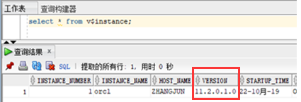

# Missing artifact com.oracle:ojdbc6:jar:11.2.0.1.0问题解决 ojdbc包pom.xml出错

```

<dependency>
	<groupId>com.oracle</groupId>
	<artifactId>ojdbc6</artifactId>
	<version>11.2.0.1.0</version>
</dependency>
```


原因：[Oracle](http://lib.csdn.net/base/oracle)的ojdbc.jar是收费的，所以maven的中央仓库中没有这个资源，只能通过配置本地库才能加载到项目中去。


## 解决办法

1. 首先确定你是否有安装oracle，如果有安装的话，找到ojdbc6.jar包

   F:\app\iou\product\11.2.0\dbhome_1\jdbc\lib\ojdbc6.jar(这是我路径，你们的可能与我不同)

   

2. 将ojdbc6.jar包添加到maven，（cmd命令窗口中输入）

   ```
   mvn install:install-file -DgroupId=com.oracle -DartifactId=ojdbc6 -Dversion=11.2.0.1.0 -Dpackaging=jar -Dfile=ojdbc6.jar
   ```

   

   注意：-Dversion=11.2.0.1.0 版本信息，在 Oracle 中使用这条语句查看：select * from v$instance;

   

   

3. pom引入依赖

   ```
   <dependency>
   	<groupId>com.oracle</groupId>
   	<artifactId>ojdbc6</artifactId>
   	<version>11.2.0.1.0</version>
   </dependency>
   ```

   


# Maven项目以jdbc的形式连接数据库

## 1、pom依赖

```
<!-- oracle -->
<dependency>
	<groupId>com.oracle</groupId>
	<artifactId>ojdbc6</artifactId>
	<version>11.2.0.1.0</version>
</dependency>
```


## 2、测试连接

```
@Test
    public void  test(){
        String driver = "oracle.jdbc.OracleDriver";    //驱动标识符
        String url = "jdbc:oracle:thin:@localhost:1521:orcl"; //链接字符串
        // url ="jdbc:oracle:thin:@xxx:1521:orcl";  // 连接远程的数据库可以这么写
        String user = "SC";         //数据库的用户名
        String password = "SC";     //数据库的密码
        Connection con = null;
        PreparedStatement pstm = null;
        ResultSet rs = null;

        try {
            Class.forName(driver);
            con = DriverManager.getConnection(url,user, password);
            String sql = "select * from dual";
            pstm =con.prepareStatement(sql);
            rs = pstm.executeQuery();
            while(rs.next()) {
                String id = rs.getString(1);
                System.out.println(id);
            }

        } catch(ClassNotFoundException e) {
            e.printStackTrace();
        }
        catch(SQLException e) {
            e.printStackTrace();
        }
        finally {
            if(rs != null) {
                try {
                    rs.close();
                } catch (SQLException e) {
                    e.printStackTrace();
                }
            }

            // 关闭执行通道
            if(pstm !=null) {
                try {
                    pstm.close();
                } catch (SQLException e) {
                    e.printStackTrace();
                }
            }

            // 关闭连接通道
            try {
                if(con != null &&(!con.isClosed())) {
                    try {
                        con.close();
                    } catch (SQLException e) {
                        e.printStackTrace();
                    }
                }
            } catch (SQLException e) {
                e.printStackTrace();
            }
        }
    }
```


# SpringBoot使用c3p0连接Oracle、sqlserver

## 注意

oracle依赖用最上面的形式添加进maven本地仓库


sqlserver依赖直接引入maven reponsitory上面的依赖,运行报错：

java.lang.ClassNotFoundException: com.microsoft.sqlserver.jdbc.SQLServerDriver

```
 <!-- https://mvnrepository.com/artifact/com.microsoft.sqlserver/sqljdbc4 -->
 <dependency>
 	<groupId>com.microsoft.sqlserver</groupId>
 	<artifactId>sqljdbc4</artifactId>
 	<version>4.0</version>
 	<scope>test</scope>
 </dependency>
```


查看本地仓库后，依赖确实没有下载下来，原因是：sqljdbc是微软sql server的jdbc驱动，微软不允许以maven的方式直接下载该文件。

具体其他解决办法可参考： https://www.cnblogs.com/kmsfan/p/7192199.html 


**另一种推荐办法：还是跟oracle一样，直接去官方手动下载依赖。然后安装到本地仓库**

从微软的官方网站下载jar包：http://www.microsoft.com/en-us/download/details.aspx?id=11774 

下载jar包之后可以通过下面的maven命令将jar包安装到自己的本地仓库：

```
mvn install:install-file -Dfile=sqljdbc4-4.0.jar -DgroupId=com.microsoft.sqlserver -DartifactId=mssql-jdbc -Dversion=4.0 -Dpackaging=jar

```


安装成功之后就可以在pom中引用sqljdbc依赖了。

```
<dependency>
	<groupId>com.microsoft.sqlserver</groupId>
	<artifactId>mssql-jdbc</artifactId>
	<scope>runtime</scope>
</dependency>
```


## 1、c3p0连接数据库依赖

```
<!-- c3p0  -->
<dependency>
	<groupId>com.mchange</groupId>
	<artifactId>c3p0</artifactId>
	<version>0.9.5.2</version>
</dependency>


<!-- sqlserver -->
<dependency>
	<groupId>com.microsoft.sqlserver</groupId>
	<artifactId>mssql-jdbc</artifactId>
	<scope>runtime</scope>
</dependency>

<!-- oracle -->
<dependency>
	<groupId>com.oracle</groupId>
	<artifactId>ojdbc6</artifactId>
	<version>11.2.0.1.0</version>
</dependency>
```


## 2.bean注入

spring-boot-c3p0.properties

```
c3p0.sqlserver.jdbcUrl=jdbc:sqlserver://localhost:1433;databaseName=UserManager
c3p0.sqlserver.user=sa
c3p0.sqlserver.password=zhangjun
c3p0.sqlserver.driverClass=com.microsoft.sqlserver.jdbc.SQLServerDriver
c3p0.sqlserver.minPoolSize=2
c3p0.sqlserver.maxPoolSize=10
c3p0.sqlserver.maxIdleTime=1800000
c3p0.sqlserver.acquireIncrement=3
c3p0.sqlserver.maxStatements=1000
c3p0.sqlserver.initialPoolSize=3
c3p0.sqlserver.idleConnectionTestPeriod=60
c3p0.sqlserver.acquireRetryAttempts=30
c3p0.sqlserver.acquireRetryDelay=1000
c3p0.sqlserver.breakAfterAcquireFailure=false
c3p0.sqlserver.testConnectionOnCheckout=false

c3p0.oracle.jdbcUrl=jdbc:oracle:thin:@localhost:1521:orcl
c3p0.oracle.user=zhangjun
c3p0.oracle.password=zhangjun
c3p0.oracle.driverClass=oracle.jdbc.driver.OracleDriver
c3p0.oracle.minPoolSize=2
c3p0.oracle.maxPoolSize=10
c3p0.oracle.maxIdleTime=1800000
c3p0.oracle.acquireIncrement=3
c3p0.oracle.maxStatements=1000
c3p0.oracle.initialPoolSize=3
c3p0.oracle.idleConnectionTestPeriod=60
c3p0.oracle.acquireRetryAttempts=30
c3p0.oracle.acquireRetryDelay=1000
c3p0.oracle.breakAfterAcquireFailure=false
c3p0.oracle.testConnectionOnCheckout=false


```


配置类：

```
import org.springframework.boot.context.properties.ConfigurationProperties;
import org.springframework.boot.jdbc.DataSourceBuilder;
import org.springframework.context.annotation.Bean;
import org.springframework.context.annotation.Configuration;
import org.springframework.context.annotation.PropertySource;

import javax.sql.DataSource;

@Configuration
@PropertySource("classpath:spring-boot-c3p0.properties")
public class DataSourceConfig {

    @Bean(name = "sqlserverDataSource")
    @ConfigurationProperties(prefix = "c3p0.sqlserver")
    public DataSource dataSource(){
        return DataSourceBuilder.create().type(com.mchange.v2.c3p0.ComboPooledDataSource.class).build();
    }


    @Bean(name = "oracleDataSource")
    @ConfigurationProperties(prefix="c3p0.oracle")
    public DataSource oracleDataSource() {
        return DataSourceBuilder.create().type(com.mchange.v2.c3p0.ComboPooledDataSource.class).build();
    }
}
```


## 3、测试

```
import org.junit.Test;
import org.junit.runner.RunWith;
import org.slf4j.Logger;
import org.slf4j.LoggerFactory;
import org.springframework.beans.factory.annotation.Autowired;
import org.springframework.boot.SpringBootConfiguration;
import org.springframework.boot.test.context.SpringBootTest;
import org.springframework.context.ApplicationContext;
import org.springframework.test.context.ContextConfiguration;
import org.springframework.test.context.junit4.SpringJUnit4ClassRunner;
import org.springframework.test.context.junit4.SpringRunner;

import javax.sql.DataSource;

import java.sql.Connection;
import java.sql.PreparedStatement;
import java.sql.ResultSet;
import java.sql.SQLException;


@RunWith(SpringRunner.class)
@SpringBootTest
public class DataSourceConfigTest {

    @Autowired
    DataSource sqlserverDataSource;

    @Autowired
    DataSource oracleDataSource;

    @Autowired
    ApplicationContext ios;

    // 记录器
    Logger logger = LoggerFactory.getLogger(getClass());

    @Test
    public void testSql() throws SQLException {

        System.out.println(ios.getBean("sqlserverDataSource"));
        Connection conn = sqlserverDataSource.getConnection();
        String addSql = "select * from PersonInfo where pid='513723199608084940'";
        PreparedStatement pStat = conn.prepareStatement(addSql);
        ResultSet rs = pStat.executeQuery();
        System.out.println("===============sqlserver查询结果===========");
        while(rs.next()){
            String id = rs.getString(1);
            System.out.println(id);
        }
        rs.close();
        pStat.close();
        conn.close();
    }

    @Test
    public void testOraSql() throws SQLException {

        System.out.println(ios.getBean("oracleDataSource"));
        Connection conn = oracleDataSource.getConnection();
        String addSql = "select * from dual";
        PreparedStatement pStat = conn.prepareStatement(addSql);
        ResultSet rs = pStat.executeQuery();
        System.out.println("===============oracle查询结果===========");
        while(rs.next()){
            String id = rs.getString(1);
            System.out.println(id);
        }
        rs.close();
        pStat.close();
        conn.close();
    }

    @Test
    public void testLog(){
        // 日志的级别
        // 由低到高 trance<debug<info<warn<error
        //可以调整输出的日志级别；日志就可以只在这个级别及以后更高级的级别
        logger.trace("这是trance日志");
        logger.debug("这是debug日志");
        // springBoot默认只输出info及以后的
        logger.info("这是info日志");
        logger.warn("这是warn日志");
        logger.error("这是error日志");
    }

}
```


