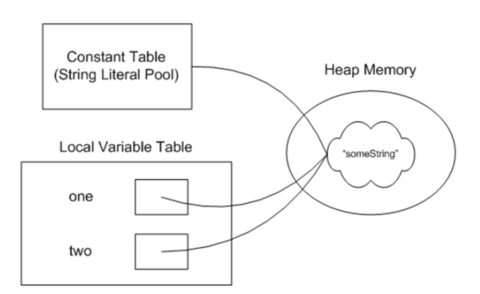

## String 不可变性
给一个已有字符串"abcd"第二次赋值成"abcedl"，不是在原内存地址上修改数据，而是重新指向一个新对象，新地址
String类是final类，也即意味着String类不能被继承，并且它的成员方法都默认为final方法。在Java中，被final修饰的类是不允许被继承的，并且该类中的成员方法都默认为final方法

**String对象一旦被创建就是固定不变的了，对String对象的任何改变都不影响到原对象，相关的任何change操作都会生成新的对象**


为了线程安全和并发效率


## String 字符串常量池的属性
像下面这样字符串one和two都用字面量"something"赋值。它们其实都指向同一个内存地址。

```
String one = "someString";
String two = "someString";
```
字符串常量池
字符串的分配和其他对象分配一样，是需要消耗高昂的时间和空间的，而且字符串我们使用的非常多。JVM为了提高性能和减少内存的开销，在实例化字符串的时候进行了一些优化：使用字符串常量池

每当我们创建字符串常量时，JVM会首先检查字符串常量池，如果该字符串已经存在常量池中，那么就直接返回常量池中的实例引用。如果字符串不存在常量池中，就会实例化该字符串并且将其放到常量池中。由于String字符串的不可变性我们可以十分肯定常量池中一定不存在两个相同的字符串





## String 拼接
两个字符串str1, str2的拼接首先会调用 String.valueOf(obj)，这个Obj为str1，而String.valueOf(Obj)中的实现是return obj == null ? "null" : obj.toString(), 然后产生StringBuilder， 调用的StringBuilder(str1)构造方法， 把StringBuilder初始化，长度为str1.length()+16。此时的StringBuilder对象是在堆上创建的！， 接下来调用StringBuilder.append(str2), 把第二个字符串拼接进去， 然后调用StringBuilder.toString返回结果
```
 String str61 = "ab";
 String str62 = "c";
 String str6 = str61 + str62;
```

jvm会直接把"ab" + "cd" 看成"abcd"。实际上jvm对于这时候的 + (加号)的处理是在编译期就已经完成了。这时候并没有涉及到stringbuilder
当一个字符串由多个字符串常量连接而成时，它自己肯定也是字符串常量

```
 String str5 = "ab"+"c";
```


## String new String 
String  S=new String("abc''),  产生(或者创建)几个对象？

引用s在Java栈中

当用**new的方法创建一个string对象**时会**先在字符串缓冲池中找**有没有和新创建的字符串内容相等的对象，如果没有的话就会在缓冲池新创建一个字符串对象然后再在堆中复制该对象的副本，如果缓冲池中已经有了和新创建的字符串内容相等的对象就会直接堆中复制该对象的副本，**声明引用s指向新创建的堆对象**

如果**不用new的方式**也是先会看缓冲池中有没有创建过这个对象，如果没有就在池里边创建一个，如果已经创建了 那新声明的引用就会直接指向这个对象.**声明引用s指向池中对象的地址**(**即是池中对象的地址赋值给栈中的引用s**)

此时： 堆中国

答案是：产生一个或者两个对象。如果常量池中原来没有“abc",就产两个对象，如果字符串常量池中"abc",就产生一个对象。


真的是在缓冲区创建一个对象，然后拷贝这个对象并放入堆区吗？？ 
不是指向引用 ？？
堆区存放的是这个对象还是这个对象的地址（此时堆区的地址指向）


使用String不一定创建对象
使用new String，一定创建对象
使用只包含常量的字符串连接符如"aa" + "aa"创建的也是常量,编译期就能确定,已经确定存储到String Pool中；
使用包含变量的字符串连接符如"aa" + s1创建的对象是运行期才创建的,存储在heap中；

对于equals相等的字符串，在常量池中永远只有一份，在堆中有多份


在JDK7中，常量池已经在Java堆上分配内存。执行intern方法时，如果常量池已经存在该字符串，则直接返回字符串引用，否则复制该字符串对象的引用到常量池中并返回

```
        //        Objects
        String str1 = new String("abc");
        String str2 = "abc";
        String str3 = "ab" + new String("c");
        String str4 = "abc";
        String str5 = "ab"+"c";

//        两个字符串str1, str2的拼接首先会调用 String.valueOf(obj)，
//       这个Obj为str1，而String.valueOf(Obj)中的实现是return obj == null ? "null" : obj.toString(),
//      然后产生StringBuilder， 调用的StringBuilder(str1)构造方法，
//    把StringBuilder初始化，长度为str1.length()+16。此时的StringBuilder对象是在堆上创建的！，
//    接下来调用StringBuilder.append(str2), 把第二个字符串拼接进去， 然后调用StringBuilder.toString返回结果
        String str61 = "ab";
        String str62 = "c";
        String str6 = str61 + str62;

        //   所有通过new操作符创建的string对象都会被分配到Java堆中
        //   xxx = ""; 静态常量区
        System.out.println(str1 == str2); // false
        System.out.println(str2 == str3); // false
        System.out.println(str2 == str4); // true
        System.out.println(str4 == str5); // true
        System.out.println(str5 == str6); // false

```

