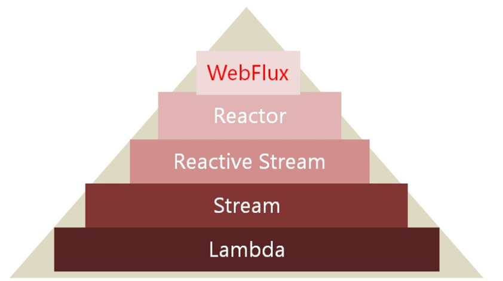
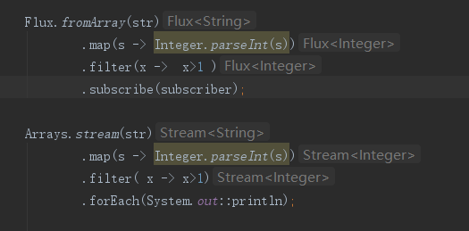
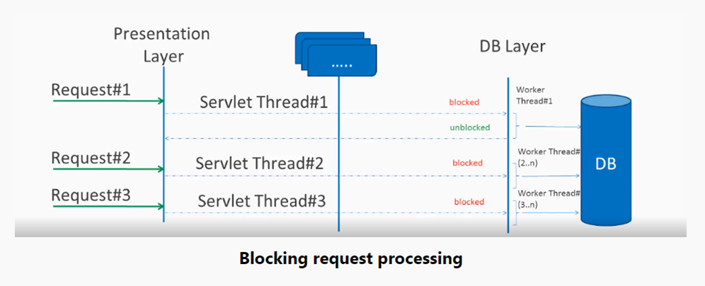
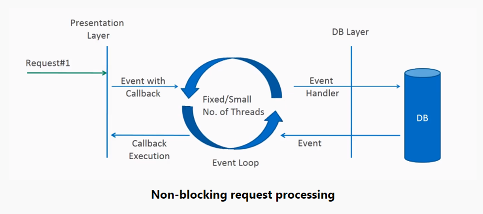
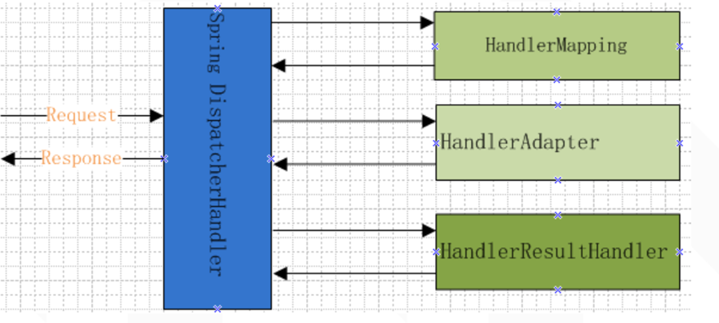
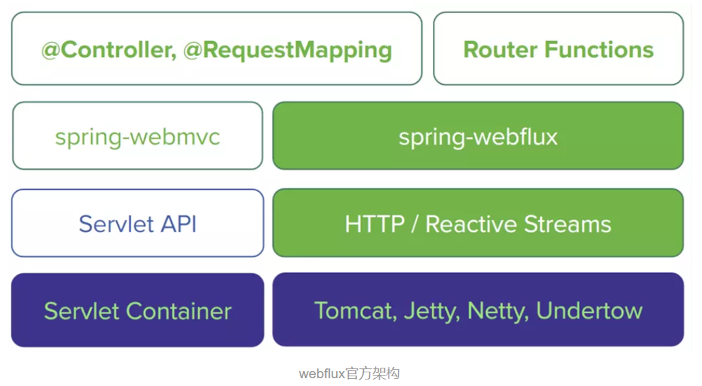
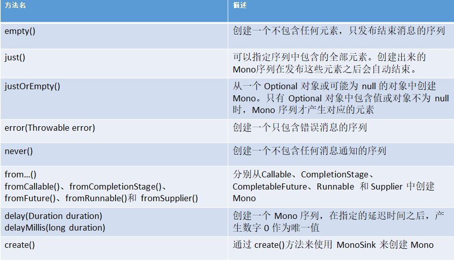

WebFlux复习 

https://howtodoinjava.com/spring-webflux/spring-webflux-tutorial/
https://docs.spring.io/spring/docs/current/spring-framework-reference/web-reactive.html#webflux
https://www.ibm.com/developerworks/cn/java/spring5-webflux-reactive/
https://www.baeldung.com/spring-webflux-errors


## 回顾线程知识
- Runable:线程任务类接口,没有返回值
- Callable:与上面的不同就是有返回值
- Executor:定义了线程池执行任务的接口,不过只定义了Runable的,也就是execute
- ExecutorService:是线程池的规范,像ThreadPoolExecutor就是它的实现类,继承了Executor,并且自己还扩展了对于Callable任务类的执行规范,也就是submit()
- Executors:一个工具类,提供了一些有默认配置的线程池,如new FixedThreadPool(int num),其实除了newWorkStealingPool(使用的是ForkJoinPool)外使用的都是ThreadPoolExecutor,包括ScheduledThreadPoolExecutor,定时器线程池,只是队列使用的是DelayedWorkQueue这种延时阻塞队列.
- Future: java对于future模式实现的接口，Futrue可以监视目标线程调用call的情况，当你调用Future的get()方法以获得结果时，当前线程就开始阻塞，直接call方法结束返回结果。 
- FutureTask:Future接口的实现类。它同时实现了两个接口：Runnable和Future，所以它既可以作为Runnable被线程执行，又可以作为Future得到Callable的返回值。

补充：
阻塞与非阻塞:
阻塞与非阻塞的区别是在于线程是否被阻塞的概念,也就是碰到一个会阻塞的代码(如IO)你是开启子线程去运行让主线程直接过还是让主线程去阻塞等着
同步与异步：
同步在某一个点上仍然需要去主动访问我们的任务线程 while(isDone()){future.get();}
异步,则是任务线程自己告诉我们,我们已经完成了.
区别在于,有没有完成任务后的回调函数!

- CompletableFuture：此类是java第一个真正的异步编程实现,FutureTask则是同步,原因也很简单,你需要主动去拿FutureTask里的返回值(get()方法),也就顺应了我们上文对于同步的观点,同步是需要我们程序去主动访问我们的任务线程。CompletableFuture则不需要我们主动获取,原因也很简单,CompletableFuture是基于事件驱动的数据处理.也就是说,CompletableFuture可以注册监听器,这样一旦我们的数据处理完成就会自动触发回调
例子：CompletableFutureTest

CompletableFuture其实就是典型的响应式编程风格  异步()，无阻塞(不挂起,另外线程来做)，链式调用


## 响应式编程 reactive programming


响应式编程是关于异步的事件驱动的需要少量线程的垂直扩展而非水平扩展的无阻塞应用
目的：在固定资源条件下，提高系统吞吐量(单位时间内完成的用户或系统请求数量)

基于事件驱动(事件模式或者说订阅者模式):
Reactor等也提供Java 8 Stream等运算符，但它们更适用于任何流序列（不仅仅是集合），并允许定义一个转换操作的管道，该管道将应用于通过它的数据，旨在处理同步或异步操作，并允许您缓冲，合并，连接或对数据应用各种转换

总的来说，只有在处理数据时才能执行业务逻辑（反应性）。
这意味着您不再能够返回简单的POJO，但您必须返回其他内容，这些内容可以在可用时提供结果。在反应流计划中，这称为发布者。 Publisher有一个subcribe（）方法，允许消费者在POJO可用时获取它。


Spring会去启动一个线程去处理Mono方法调用链,之后马上返回,看清楚,是启动,都不一定开始运行,可能只是就绪的状态就会返回(这里科普下线程生命周期的一个基础知识,当你启动一个线程后,此线程并非会马上运行,它还需要等待cpu的时间片)

但是!这里马上会返回的意思是处理Request请求的线程马上返回,而Response线程则不会马上响应给客户端,因为Mono线程还需要处理数据呢,而当Mono线程处理数据之后,会通过事件的形式被Response监听到,此时Response拿到数据后返回(此处可以理解为Mono在处理完数据后push给了Response)

Ok,这里大家应该都懂了吧,WebFlux框架在我们程序看来是异步的,但是在客户端响应看来还是同步的(因为我还是需要你返回给我数据我才可以响应给客户端),

逐个执行，不是立即可用，但是没有发布的顺序-》异步
您还应该意识到处理这些项目时没有特定的顺序。可能是第一个数字已经打印在控制台上，而第三个数字尚未乘以2。
```
    Flux.just(1,2,3,4)
                .map(x -> x*2)
                .subscribe(System.out::println);
```


因此，在您的情况下，您有一个Mono <ServerResponse>，这意味着只要ServerResponse可用，WebFlux框架就可以使用它。由于预期只有一个ServerResponse，它是Mono而不是Flux。


## 发布-订阅模式 / Reactive Streams

在 Java 平台上，Netflix（开发了 RxJava）、TypeSafe（开发了 Scala、Akka）、Pivatol（开发了 Spring、Reactor）共同制定了一个被称为 Reactive Streams 项目（规范），用于制定反应式编程相关的规范以及接口。
发布-订阅模式（观察者模式）

### 四种接口：
Reactive Streams规范定义了四种接口：
1. Publisher，发布者负责生产数据流，每一个订阅者都会调用subscribe方法来订阅消息。
1. Subscriber，订阅者。
1. Subscription，其实就是一个订单选项，相当于饭馆里的菜单，由发布者传递给订阅者。
1. Processor，处于数据流的中间位置，即是订阅者，也是新数据流的生产者。

Subscription订阅关系：
当Subscriber调用Publisher.subscribe方法订阅消息时，Publisher就会调用Subscriber的onSubscribe方法
一个Subscription对象只能由同一个Subscriber调用，所以不存在对象共享的问题。因此即便Subscription对象有状态，线程安全

1、Reactive Streams规范仅仅是一个标准，随着JDK9的发布已收编为官方API，java.util.concurrent.Flow
例子：ReactiveStream -> FlowDemo.java

2、Reactor 实现了 Reactive Streams，Web Flux 以 Reactor 为基础，实现 Web 领域的响应式编程框架
例子：ReactiveStream -> FlowDemo.java

总结：reactor = jdk8 stream + jdk9 reactive stream
例子：controllers -> ReactiveStreamTest.java


**reactor里面Flux和Mono就是stream，他的最终操作就是 subscribe。
reactor里面说的不订阅将什么也不会方法就是我们最开始学习的惰性求值。**

我们可以把jdk9里面flowdemo的订阅者代码原封不动的copy过来，直接就可以用在reactor的subscribe方法上。
**订阅就是相当于调用了stream的最终操作
**

### 背压：
当消息发布者产生数据的速度过快时，会使得消息订阅者的处理速度无法跟上产生的速度，从而给订阅者造成很大的压力。当压力过大时，有可能造成订阅者本身的奔溃，所产生的级联效应甚至可能造成整个系统的瘫痪。

订阅者能和发布者交互（通过代码里面的调用request和cancel方法交互），可以调节发布者发布数据的速率，解决把订阅者压垮的问题。订阅关系Subscription这个接口，他有request和cancel 2个方法，用于通知发布者需要数据和通知发布者不再接受数据。

补充 -> 背压在jdk9里面的实现:
发布者Publisher的实现类SubmissionPublisher的submit方法是block方法。订阅者会有一个缓冲池，默认为Flow.defaultBufferSize() = 256
当订阅者的缓冲池满了之后，发布者调用submit方法发布数据就会被阻塞，发布者就会停（慢）下来；订阅者消费了数据之后（调用Subscription.request方法），缓冲池有位置了，submit方法就会继续执行下去，就是通过这样的机制，实现了调节发布者发布数据的速率，消费得快，生成就快，消费得慢，发布者就会被阻塞，当然就会慢下来了。


## 异步非阻塞Web框架-WebFlux

Spring 5推出的响应式Web框架,WebFlux 模块的名称是 spring-webflux，名称中的 Flux 来源于 Reactor 中的类 Flux。该模块包含了对反应式 HTTP、服务器推送事件SSE和 WebSocket 的客户端和服务器端的支持。

与Spring MVC不同，它不需要Servlet API，完全异步和非阻塞， 并通过Reactor项目实现Reactive Streams规范。 并且可以在诸如Netty，Undertow和Servlet 3.1+容器的服务器上运行

Reactor是JVM的完全非阻塞响应式编程基础，具有高效的需求管理（以管理“背压”的形式）。
它直接集成了Java 8功能的API，特别是CompletableFuture，Stream和 Duration。它提供了可组合的异步序列API Flux（用于[0…N]元素）和 Mono（用于[0 | 1]元素），广泛地实现了Reactive Extensions规范。


## Reactive Streams、Reactor和WebFlux 关系：
Reactive Streams 是一套响应式编程 标准 和 规范；
Reactor 是基于 Reactive Streams 一套 响应式编程框架；
WebFlux 以 Reactor 为基础，实现 Web 领域的 响应式编程框架


### WebFlux实现异步非阻塞

当请求到达服务器时，会创建一个servlet线程。它将请求委托给工作线程进行I / O操作，例如数据库访问等。
在工作线程忙的时候，servlet线程（请求线程）保持等待状态，因此被阻塞。
由于服务器可以拥有一些有限数量的请求线程，因此它限制了服务器在最大服务器负载下处理该数量的请求的能力

在非阻塞或异步请求处理中，没有线程处于等待状态。通常只有一个请求线程接收请求。
所有传入的请求都带有事件处理程序和回调信息。请求线程将传入请求委托给线程池（通常是少量线程），该线程池将请求委托给它的处理函数，并立即开始处理来自请求线程的其他传入请求。
当处理程序函数完成时，来自池的一个线程收集响应并将其传递给回调函数


### DispatcherHandler  
核心控制器 等同于阻塞方式的DispatcherServlet


### 组件

WebFlux 模块从上到下依次是 Router Functions、WebFlux、Reactive Streams 三个新组件。

- Router Functions
	对标准的 @Controller，@RequestMapping 等的 Spring MVC 注解，提供一套函数式风格的 API，用于创建 Router、Handler 和Filter等。
- WebFlux
	核心组件，协调上下游各个组件提供 响应式编程 支持。
- Reactive Streams
	一种支持背压 (Backpressure) 的 异步数据流处理标准，主流实现有 RxJava 和 Reactor，Spring WebFlux 集成的是 Reactor


## Reactor的核心类

```
abstract class Mono<T> implements Publisher<T>
abstract class Flux<T> implements Publisher<T> 
```
Mono和Flux都是Publisher（发布者）。对消费者提供订阅接口，当有事件发生的时候，Flux或者Mono会通过回调消费者的相应的方法来通知消费者相应的事件，这也就是所谓的响应式编程模型

在 Web Flux，你的方法只需返回 Mono 或 Flux 即可。你的代码基本也只和 Mono 或 Flux 打交道。而 Web Flux 则会实现 Subscriber ，onNext 时将业务开发人员编写的 Mono 或 Flux 转换为 HTTP Response 返回给客户端


### Mono
Mono 实现了 org.reactivestreams.Publisher 接口的抽象类，代表0到1个元素的异步序列(流)

### Flux
Flux 同样实现了 org.reactivestreams.Publisher 接口的抽象类,代表0到N个元素的异步序列(流)

在该序列中可以包含三种不同类型的消息通知：正常的包含元素的消息、序列结束的消息和序列出错的消息。
当消息通知产生时，订阅者中对应的方法 onNext(), onComplete()和 onError()会被调用。


Flux 和 Mono 之间可以进行转换。比如：把两个 Mono 序列合并在一起，得到的是一个 Flux 对象


如同 Java 8 所引入的 Stream 一样，Reactor 的使用方式基本上也是分三步：
1. 开始阶段的创建
1. 中间阶段的处理
1. 最终阶段的消费


### 创建 Mono 和 Flux（开始阶段）
使用 Reactor 编程的开始必然是先创建出 Mono 或 Flux。有些时候不需要我们自己创建，而是实现例如 WebFlux 中的 WebClient 或 Spring Data Reactive 得到一个 Mono 或 Flux。

使用 WebFlux WebClient 调用 HTTP 接口
WebClient webClient = WebClient.create("http://localhost:8080");
public Mono<User> findById(Long userId) {
    return webClient
            .get()
            .uri("/users/" + userId)
            .accept(MediaType.APPLICATION_JSON)
            .exchange()
            .flatMap(cr -> cr.bodyToMono(User.class));
}


但有些时候，我们也需要主动地创建一个 Mono 或 Flux。


例子：
controllers -》 MonoTest.java
controllers -》 FluxTest.java


- generate()方法
SynchronousSink
generate中next只能调1次
通过 next()方法产生一个简单的值，
通过 complete()方法来结束该序列。如果不调用 complete()方法，所产生的是一个无限序列


- create()方法

FluxSink
可以在一次调用中产生多个元素,next()方法可以被多次调用

```
<T> Flux<T> create(Consumer<? super FluxSink<T>> emitter)
<T> Flux<T> create(Consumer<? super FluxSink<T>> emitter, OverflowStrategy backpressure)
```

OverflowStrategy:背压策略枚举类型
ERROR： 当下游跟不上节奏的时候发出一个错误信号。
DROP：当下游没有准备好接收新的元素的时候抛弃这个元素。
LATEST：让下游只得到上游最新的元素。
BUFFER：缓存下游没有来得及处理的元素（如果缓存不限大小的可能导致OutOfMemoryError）
IGNORE类型，即完全忽略下游背压请求，这可能会在下游队列积满的时候导致 IllegalStateException
没有第二个参数默认是 OverflowStrategy.BUFFER 缓存策略


### 处理 Mono 和 Flux（中间阶段）  -》  整理按顺序来

中间阶段的 Mono 和 Flux 的方法主要有 filter、map、flatMap、then、zip、reduce 等。这些方法使用方法和 Stream 中的方法类似。

#### reduce/reduceWith

#### buffer、bufferTimeout、bufferUntil、bufferWhile 
根据所包含的元素的最大数量、收集的时间间隔、条件收集到集合

#### filter
对流中包含的元素进行过滤，只留下满足 Predicate 指定条件的元素

#### widows 
window 操作符的作用类似于 buffer，所不同的是 window 操作符是把当前流中的元素收集到另外的 Flux 序列中，因此返回值类型是 Flux<Flux<T>>
所产生的流中包含的是 UnicastProcessor 类的对象

#### zip/zipWith
zipWith
把当前流中的元素与另外一个流中的元素按照一对一的方式进行合并。在合并时可以不做任何处理，由此得到的是一个元素类型为 Tuple2(二元数组) 的流；
也可以通过一个 BiFunction 函数对合并的元素进行处理，所得到的流的元素类型为BiFunction的返回值。
Tuple2<T1, T2> implements Iterable<Object>, Serializable

zip
打包。将两个源压缩在一起，也就是说，等待所有源发出一个元素，并将这些元素组合成一个输出值（由提供的组合器构造）。操作将继续这样做，直到所有源完成


#### take
take 系列操作符用来从当前流中提取元素

#### combineLatest
第1个Flux用了延时生成，第1个数字0，10秒后才产生，这时第2个Flux中的A,B早就生成完毕，所以此时二个Flux中最新生在的元素，就是[0,B]，类似的，10秒后，第2个数字1依次产生，再执行1次合并，生成[1,B]
```

```
#### first
```
 Flux.first(Flux.fromArray(new String[]{"A", "B"}),
                Flux.just(1, 2, 3))
                .subscribe(System.out::println);
```
#### map
```
 Flux.just('A', 'B', 'C').map(a -> (int) (a)).subscribe(System.out::println); // 65 66 67
```

#### map、flatMap 和 then 

方法：Mono.map()
方法：Mono.flatMap()
方法：Mono.then()

```
flatMap(Function<? super T, ? extends Mono<? extends R>> transformer)
map(Function<? super T, ? extends R> mapper)
then(Mono other)
```
例：
```
Mono.just(params)
    .flatMap(v -> doStep1(v))
    .flatMap(v -> doStep2(v))
    .flatMap(v -> doStep3(v));
```


then()
then() 看上去是下一步的意思，但它只表示执行顺序的下一步，不表示下一步依赖于上一步。then() 方法的参数只是一个 Mono，无从接受上一步的执行结果。而 flatMap() 和 map() 的参数都是一个 Function，入参是上一步的执行结果。

flatMap() 和 map()
flatMap() 和 map() 的区别在于，flatMap() 中的入参 Function 的返回值要求是一个 Mono 对象，而 map 的入参 Function 只要求返回一个 普通对象。在业务处理中常需要调用 WebClient 或 ReactiveXxxRepository 中的方法，这些方法的 返回值 都是 Mono（或 Flux）。所以要将这些调用串联为一个整体 链式调用，就必须使用 flatMap()，而不是 map()。


例子：
controllers -》 FluxTest.java


方法：Flux.merge()、Flux.mergeSequential()、contact()
merge:按照所有流中元素的实际产生顺序来合并，来自两个流的元素是按照时间顺序交织在一起
mergeSequential:首先产生第一个流中的全部元素，再产生第二个流中的全部元素

例子：
controllers -》 FluxTest.java


#### 更多
更多见：
https://www.jianshu.com/p/5172c48cb877
https://cloud.tencent.com/developer/article/1192055


#### 消息处理
需要处理 Flux 或 Mono 中的消息时，可以通过 subscribe 方法来添加相应的订阅逻辑
在调用 subscribe 方法时可以指定需要处理的消息类型。可以只处理其中包含的正常消息，也可以同时处理错误消息和完成消息

- 通过 subscribe()方法处理正常和错误消息
- 通过 onErrorReturn()方法返回一个默认值。
- 通过 onErrorResume()方法来根据不同的异常类型来选择要使用的产生元素的流
- 出现错误时，还可以通过 retry 操作符来进行重试

例子：controllers -> MonoTest


flatMap与merge与zip的区别：
flatMap:
嵌套请求->多用于一个接口的请求依赖另一个API请求返回的数据
zip:
使用zip操作符合并等待多个网络请求完成后，再刷新界面
merge：
只是将多个发布者的输出序列变为一个，方便订阅者统一处理，对于订阅者来说就仿佛只订阅了一个观察者一样。


问题三：集合循环之后的汇聚
可以看出，reduce() 方法的功能是将一个 Flux 聚合成一个 Mono

方法：Flux.fromIterable()
方法：Flux.reduce()
```
Mono<T> reduce(BiFunction<T, T, T> aggregator)
<A> Mono<A> reduceWith(Supplier<A> initial, BiFunction<A, ? super T, A> accumulator) 
```

```
Data initData = ...;
List<SubData> list = ...;
Flux.fromIterable(list)
    .reduce(initData, (data, itemInList) -> {
        // Do something on data and itemInList
        return data;
    });
```
例子：
controllers -》 FluxTest.java


### 消费 Mono 和 Flux（结束阶段）
直接消费的 Mono 或 Flux 的方式就是调用 subscribe() 方法。如果在 WebFlux 接口中开发，直接返回 Mono 或 Flux 即可。WebFlux 框架会完成最后的 Response 输出工作


## Scheduler 调度器
代表背后驱动反应式流的调度器，通常由各种线程池实现
反应式流和在其上可以进行的各种操作，通过调度器（Scheduler）可以指定这些操作执行的方式和所在的线程。有下面几种不同的调度器实现。
1. 当前线程，通过 Schedulers.immediate()方法来创建。
1. 单一的可复用的线程，通过 Schedulers.single()方法来创建。
1. 使用弹性的线程池，通过 Schedulers.elastic()方法来创建。线程池中的线程是可以复用的。当所需要时，新的线程会被创建。如果一个线程闲置太长时间，则会被销毁。该调度器适用于 I/O 操作相关的流的处理。
1. 使用对并行操作优化的线程池，通过 Schedulers.parallel()方法来创建。其中的线程数量取决于 CPU 的核的数量。该调度器适用于计算密集型的流的处理。
1. 使用支持任务调度的调度器，通过 Schedulers.timer()方法来创建。
1. 从已有的 ExecutorService 对象中创建调度器，通过 Schedulers.fromExecutorService()方法来创建
通过 publishOn()和 subscribeOn()方法可以切换执行操作的调度器。其中 publishOn()方法切换的是操作符的执行方式，而 subscribeOn()方法切换的是产生流中元素时的执行方式。
例子：controllers -> FluxTest.java


## SpringBoot中使用
配置：
```
<dependency>
    <groupId>org.springframework.boot</groupId>
    <artifactId>spring-boot-starter-webflux</artifactId>
</dependency>
```
Spring WebFlux 默认是使用 Netty 作为 Web 容器.
如果要切换 Web 容器，只需要在 Maven 中做一下配置即可

```
<dependency>
	<groupId>org.springframework.boot</groupId>
	<artifactId>spring-boot-starter-tomcat</artifactId>
</dependency>
```
spring-boot-starter-web会自动配置Spring MVC，Web和WebFlux的优先级是Web高

## WebFlux的编程模式
注解式、函数式
目前 Spring Boot 不支持在一个应用中同时使用两种不同的编程模式。
在注解控制器和函数式端点编程模型中，都是基于HttpHandler和WebHandler接口实现的，但是两种实现方式略有差异。
在注解控制器编程模型中，WebFlux 与 Spring MVC 非常类似，有一个类似于 Spring MVC 前端控制器DispatcherServlet的类，名为DispatcherHandler，它会总体负责请求的处理，而实际的请求映射、请求调用以及结果的处理则是分别由HandlerMapping、HandlerAdapter和HandlerResultHandler来实现的。

HandlerMapping：根据客户端的请求查询能够处理该请求的方法；
HandlerAdapter：真正负责请求的处理，目前有两个最重要的实现类，分别对应注解控制器和函数式模型；
HandlerResultHandler：针对响应结果进行处理，支持在请求体返回各种类型的内容以及视图的处理。


flatMap和 map 都是做映射之用。
对比理解Stream中的flatMap与map 输入T，flatMap返回Stream<R>  map返回R
所以要将这些调用串联为一个整体链式调用，就必须使用 flatMap，而不是 map

## WebFlux Web开发


Handler(HandlerFunction)
例如：HelloHandler
在函数式编程模型中，每个请求是由一个函数来处理的， 通过接口org.springframework.web.reactive.function.server.HandlerFunction 来表示。
HandlerFunction 是一个函数式接口，其中只有一个方法 Mono<T extends ServerResponse> handle(ServerRequest request)，因此可以用 labmda 表达式来实现该接口。接口 ServerRequest 表示的是一个 HTTP 请求。通过该接口可以获取到请求的相关信息，如请求路径、HTTP 头、查询参数和请求内容等。方法 handle 的返回值是一个 Mono<T extends ServerResponse>对象。接口 ServerResponse 用来表示 HTTP 响应。ServerResponse 中包含了很多静态方法来创建不同 HTTP 状态码的响应对象。

Router(RouterFunction)
创建了处理请求的 HandlerFunction 之后，下一步是为这些 HandlerFunction 提供路由信息，也就是这些 HandlerFunction 被调用的条件。这是通过函数式接口 org.springframework.web.reactive.function.server.RouterFunction 来完成的
接口 RouterFunction 的方法 Mono<HandlerFunction<T extends ServerResponse>> route(ServerRequest request)对每个 ServerRequest，都返回对应的 0 个或 1 个 HandlerFunction 对象，以 Mono<HandlerFunction>来表示。当找到对应的 HandlerFunction 时，该 HandlerFunction 被调用来处理该 ServerRequest，并把得到的 ServerResponse 返回。在使用 WebFlux 的 Spring Boot 应用中，只需要创建 RouterFunction 类型的 bean，就会被自动注册来处理请求并调用相应的 HandlerFunction


函数式
	Functional 、Java 8 lambda 风格的路由和处理

1、ServerHttpRequest和ServerHttpResponse
Reactive Controller操作的是非阻塞的ServerHttpRequest和ServerHttpResponse，不再是Spring MVC里的HttpServletRequest和HttpServletResponse。

ServerRequest和ServerResponse是不可变接口，提供给JDK8 对HTTP请求和响应的友好访问。 线程安全

ServerRequest提供了访问HTTP方法，URL,头部信息和查询参数的方法，访问body中的内容可以通过body方法进行访问

2、RouterFunction
路由处理由一个RouterFunction处理,它花费一个ServerRequest然后返回一个延迟的HandlerFunction

路由器功能用于将请求路由到相应的HandlerFunction。通常，您不会自己编写路由器函数，而是使用RouterFunctions实用程序类中的方法来创建路由器函数 。 RouterFunctions.route()（无参数）为您提供了一个用于创建路由器功能的流畅构建器，同时RouterFunctions.route(RequestPredicate, HandlerFunction)提供了创建路由器的直接方法。


3、HandlerFunction
在WebFlux.fn中一个http请求被一个HandlerFunction处理。HandlerFunction消费ServerRequest然后返回延迟的ServerResponse

接收请求参数：
1、注解式WebFlux中处理Get请求
通过request.queryParam获取get参数处理后返回
```
 public Mono<ServerResponse> hello(ServerRequest request) {
        Optional<String> name = request.queryParam("name");
        return ServerResponse.ok().contentType(MediaType.TEXT_PLAIN)
                .body(BodyInserters.fromObject("Hello:"+ name));
    }
```


2、注解式WebFlux中处理Post请求
application/json数据
Route中设置请求头类型:RequestPredicates.accept(MediaType.APPLICATION_JSON)
Handler中通过serverRequest.bodyToMono获取
```
RouterFunctions
                .route(RequestPredicates.POST("/post/findjson")
                        .and(RequestPredicates.accept(MediaType.APPLICATION_JSON)),handler::find)
```
```
Mono<Map> body = serverRequest.bodyToMono(Map.class);
```
Form-data数据：Content-Type: application/x-www-form-urlencoded
```
 .andRoute(RequestPredicates.POST("/post/findform")
                        .and(RequestPredicates.accept(MediaType.APPLICATION_FORM_URLENCODED)),handler::findform);
```
```
      // 获取form data,在方法中添加ServerWebExchange对象，使用方法getFormData
        ServerWebExchange exchange = request.exchange();
        Mono<MultiValueMap<String, String>> formData =exchange.getFormData();
```

异常处理： SayHelloHandle

**WebExceptionHandler 
GlobalErrorWebExceptionHandler**

SpringBoot:	@ControllerAdvice @ExceptionHandler
在WebFlux中，不能使用 @ControllerAdvice 来处理在选择处理程序之前发生的异常。

WebExceptionHandler，可用于处理来自WebFilter链和WebHandler的异常
使用WebExceptionHandler时，只要将其声明为Spring bean即可自动注入并使用，并可选择通过bean声明上的@Order或通过实现Ordered来表示优先级。需要注意的是webflux有默认的WebExceptionHandler-DefaultErrorWebExceptionHandler，其order为默认的-1。如果我们想自定义WebExceptionHandler，那么必须将order声明为-2以上，否则异常将不会传递到我们自定义的WebExceptionHandler中


Spring WebFlux没有Spring MVC的等效项 ResponseEntityExceptionHandler，因为WebFlux仅引发ResponseStatusException （或其子类），并且不需要将它们转换为HTTP状态代码。


功能级别处理异常
Mono和Flux API 内置了两个关键操作符，用于处理功能级别的错误。
如果我们在没有指定时间类型（type）的情况下调用相同的请求地址，例如/time，它将抛出异常。
Mono和Flux APIs内置了两个关键操作符，用于处理功能级别上的错误。


3.1。使用onErrorReturn处理错误
我们可以使用onErrorReturn（）在发生错误时 返回静态默认值


3.2。使用onErrorResume处理错误
我们可以使用三种方法在  ErrorResume  上处理错误：
1. 
1. 计算动态回退值
1. 使用回退方法执行备用路径
1. 捕获，包装和重新抛出错误，例如作为自定义业务异常


4.在全部范围内处理错误

扩展DefaultErrorAttributes类并覆盖其getErrorAttributes（）方法
AbstractErrorWebExceptionHandler类，供我们在处理全局错误时进行扩展和实现：


过滤器：

WebFilter
HandlerFilterFunction

webflux提供了一个新的过滤器接口WebFilter以提供对Mono和Flux的支持
WebFilter实现适用于所有端点，HandlerFilterFunction实现仅适用于基于路由器的实现。

简单的说：
WebFilter 这种过滤器没有servlet filter中的url pattern功能。也就是说它会对所有的 URL 请求进行链接，所以效率就比较低。
而 HandlerFilterFunction 这种用法更加专注具体的过滤细节，更符合 WebFlux 的特点

异常管理


WebFlux的Cookie管理
WebFlux读写Cookie不像WebMvc那么直接，最主要的原因是WebMvc是基于Servlet规范的，而WebFlux仅仅遵守的是HTTP协议。所以在使用的时候会发现HttpServletRequest、HttpServletResponse这些Servlet层级的接口根本就无法使用。

Cookie与Servlet并没有太直接的关系，前者是属于HTTP规范的而后者是一个J2EE的规范，在应用层面仅有的联系就是Servlet会读写Cookie中的JSESSIONID来标记与前端浏览器和服务端的关系。
WebFlux目前并没有为写Cookie提供任何工具。这就需要开发者按照HTTP的规范来写Cookie。 在HTTP协议交互的过程中，服务端可以通过在response中添加Set-Cookie头来让浏览器记录Cookie，而浏览器则在request中使用Cookie头来传递cookie。

写Cookie
写cookie使用ResponseEntity向response头中添加Set-Cookie即可。CookieBuilder的代码比较长，它是用于构建一个cookie字符串，Set-Cookie头除了设置key=value，还可以设置过期日期expires，域名domain，路径path等

读取：
可以直接使用@CookieValue这个Annotation来获取
也可以直接从 Request的Header 中获取


WebSession


WebMVC请求流程
WebFlux注解式请求流程
WebFlux函数式请求流程

## WebFlux对SSE，WebClient,WebSoket的支持

SSE：服务端推送（Server Send Event），在客户端发起一次请求后会保持该连接，服务器端基于该连接持续向客户端发送数据，从HTML5开始加入。
Websocket：这是也是一种保持连接的技术，并且是双向的，从HTML5开始加入，并非完全基于HTTP，适合于频繁和较大流量的双向通讯场景。


WebSoket服务器端和客户端
服务器端
客户端 在线测试：http://www.websocket-test.com/

SSE 
相对于 WebSocket 而言，服务器推送事件只支持服务器端到客户端的单向数据传递
在服务器端来说，SSE 是一个不断产生新数据的流，非常适合于用反应式流来表示。
传统模式：数据有固定的格式（"data:返回数据"+Math.random()+"\n\n"），需设置回复类型（Accept: text/event-stream）
在 WebFlux 中创建 SSE 的服务器端是非常简单的。只需要返回的对象的类型是 Flux<ServerSentEvent>，就会被自动按照 SSE 规范要求的格式来发送响应。
测试 SSE 时，我们只需要使用 curl 来访问即可，即当作是HTTP请求

WebClient:
