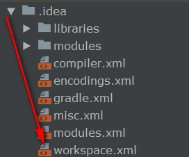

# [idea 2018.1 创建springboot开启找回Run Dashboard](https://www.cnblogs.com/yangtianle/p/8818255.html)

首先找到项目中.idea文件下的workspace.xml开打

　　　　

　　　　接下来找到<component name="RunDashboard">

　　　　

　　　　代码中加入

```
<option name="configurationTypes">  
      <set>  
        <option value="SpringBootApplicationConfigurationType" />  
      </set>  
 </option>  
```

　　　　这样Run Dashboard这个窗口就可以弹出来了。