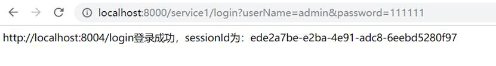

service iptables start 报错

service iptables status   Redirecting to /bin/systemctl status iptables.service Unit iptables.service could not be found


原因：Centos7中的防火墙调整为firewalld，试一下systemctl stop firewalld关闭防火墙


# 解决办法

## 1、使用service firewalld status


查看防火墙状态：

```
service firewalld status
```


 

查看防火墙开放端口：

```
netstat –anp
```


 

查看端口是否防火墙开放：            

```
firewall-cmd  --query-port=6379/tcp
```




 

如果显示no，则开启：

```
firewall-cmd  --add-port=6379/tcp –permanent
```


 

重启防火墙：

```
firewall-cmd  --reload
```


 

关闭防火墙：

```
systemctl stop firewalld.service
```


 ## 2、安装iptables-service

```
yum install iptables-services
```


设置开机启动

systemctl enable iptables


systemctl stop iptables
systemctl start iptables
systemctl restart iptables
systemctl reload iptables


保存设置

service iptables save


在执行一下 service iptables start    应该就没有问题了


杀死进程：

```
kill pid
kill -9 pid
```


批量杀死进程(强行终止)：

```
pkill -9 redis
```


查询进程：

```
ps -ef | grep redis
```

