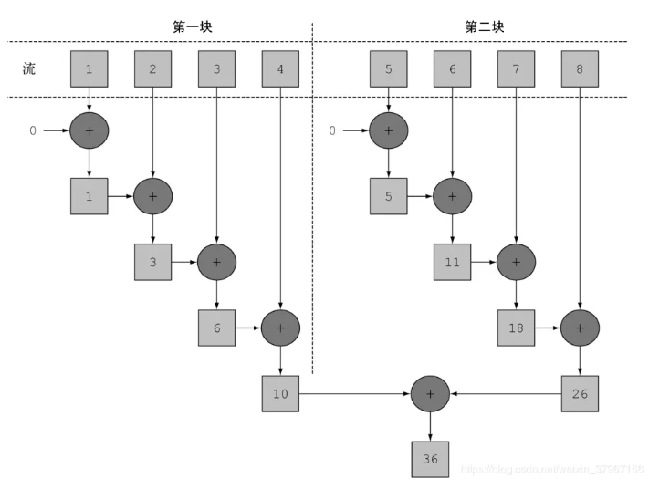
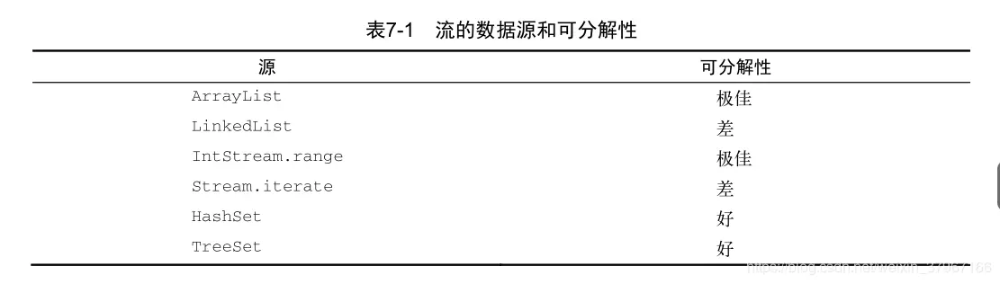
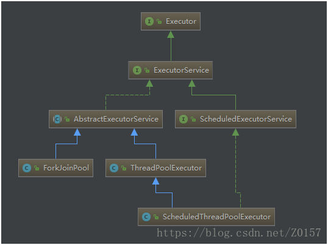
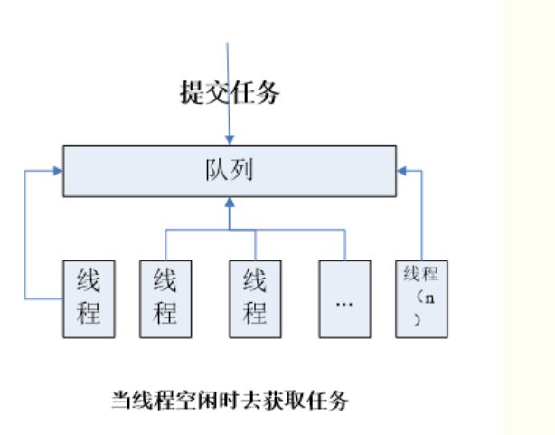
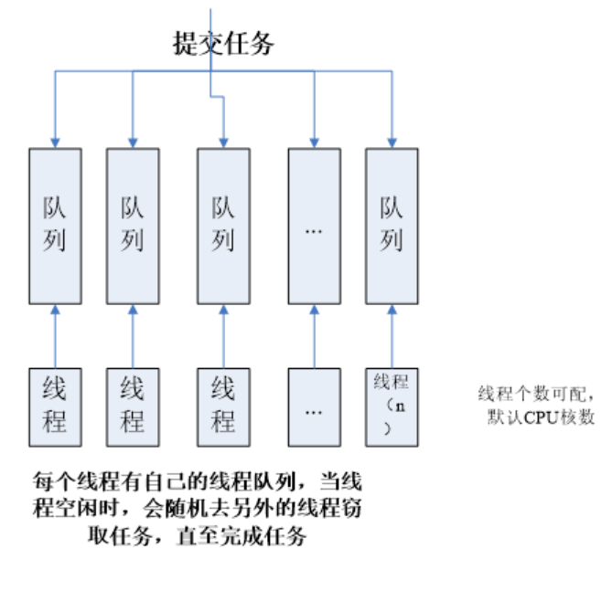
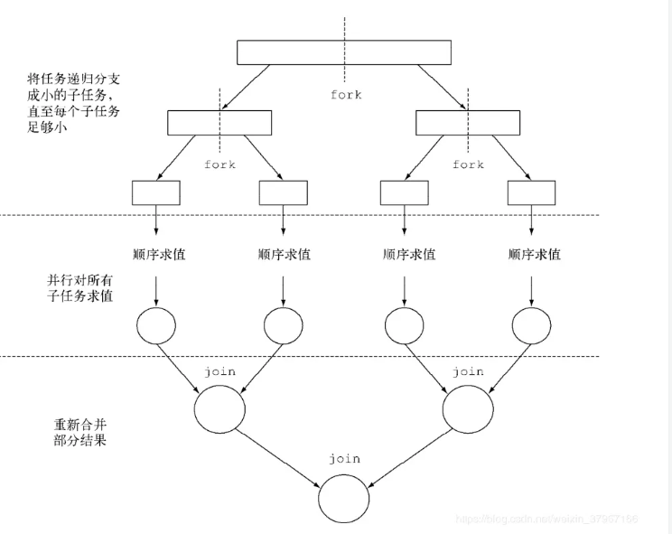
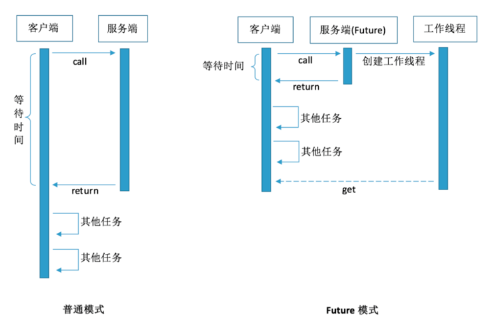

## 并行流

并行流就是一个把内容分成多个数据块，并用不同的线程分别处理每个数据块的流。这样一来，你就可以自动把给定操作的工作负荷分配给多核处理器的所有内核，让它们都忙起来

3.1 将顺序流转为并行流
你可以把流转换成并行流，从而让前面的函数归约过程（也就是求和）并行运行——对顺序流调用 parallel 方法：
```
	public static long parallelSum(long n) {
        return Stream.iterate(1L, i -> i + 1)
                .limit(n)
                .parallel()
                .reduce(0L, Long::sum);
    }
```

Stream 在内部分成了几块。因此可以对不同的块独立并行进行归纳操作，最后，同一个归纳操作会将各个子流的部分归纳结果合并起来，得到整个原始流的归纳结果。

第一块和第二块用多线程可以同时执行


类似地，你只需要对并行流调用 sequential 方法就可以把它变成顺序流。
配置并行流使用的线程池
看看流的 parallel 方法，你可能会想，并行流用的线程是从哪儿来的？有多少个？怎么自定义这个过程呢？

并行流内部使用了默认的 ForkJoinPool （7.2节会进一步讲到分支/合并框架），它默认的线 程 数 量 就是 你 的 处 理器 数 量 ， 这个 值 是 由 Runtime.getRuntime().available-Processors() 得到的。
但 是 你 可 以 通 过 系 统 属 性 java.util.concurrent.ForkJoinPool.common.parallelism 来改变线程池大小，如下所示：
System.setProperty("java.util.concurrent.ForkJoinPool.common.parallelism","12");
这是一个全局设置，因此它将影响代码中所有的并行流。反过来说，目前还无法专为某个并行流指定这个值。一般而言，让 ForkJoinPool 的大小等于处理器数量是个不错的默认值，除非你有很好的理由，否则我们强烈建议你不要修改它。


3.2 高效使用并行流
我们声称并行求和方法应该比顺序和迭代方法性能好。然而在软件工程上，靠猜绝对不是什么好办法！特别是在优化性能时，你应该始终遵循三个黄金规则：测量，测量，再测量。

- 如果有疑问，测量。把顺序流转成并行流轻而易举，但却不一定是好事。我们在本节中已经指出，并行流不总是比顺序流快。此外，并行流有时候会和你的直觉不一致，所以在考虑选择顺序流还是并行流时，第一个也是最重要的建议就是用适当的基准来检查其性能。


- 留意装箱。自动装箱和拆箱操作会大大降低性能。Java 8中有原始类型流（ IntStream 、LongStream 、 DoubleStream ）来避免这种操作，但凡有可能都应该用这些流。
有些操作本身在并行流上的性能就比顺序流差。特别是 limit 和 findFirst 等依赖于元素顺序的操作，它们在并行流上执行的代价非常大。例如， findAny 会比 findFirst 性能好，因为它不一定要按顺序来执行。你总是可以调用 unordered 方法来把有序流变成无序流。那么，如果你需要流中的n个元素而不是专门要前n个的话，对无序并行流调用limit 可能会比单个有序流（比如数据源是一个 List ）更高效。

- 还要考虑流的操作流水线的总计算成本。设N是要处理的元素的总数，Q是一个元素通过流水线的大致处理成本，则N*Q就是这个对成本的一个粗略的定性估计。Q值较高就意味着使用并行流时性能好的可能性比较大。


- 对于较小的数据量，选择并行流几乎从来都不是一个好的决定。并行处理少数几个元素的好处还抵不上并行化造成的额外开销。

- 要考虑流背后的数据结构是否易于分解。例如， ArrayList 的拆分效率比 LinkedList高得多，因为前者用不着遍历就可以平均拆分，而后者则必须遍历。另外，用 range 工厂方法创建的原始类型流也可以快速分解。

- 流自身的特点，以及流水线中的中间操作修改流的方式，都可能会改变分解过程的性能。例如，一个 SIZED 流可以分成大小相等的两部分，这样每个部分都可以比较高效地并行处理，但筛选操作可能丢弃的元素个数却无法预测，导致流本身的大小未知。


- 还要考虑终端操作中合并步骤的代价是大是小（例如 Collector 中的 combiner 方法）。如果这一步代价很大，那么组合每个子流产生的部分结果所付出的代价就可能会超出通过并行流得到的性能提升。




## 多线程回顾


### 在java5以后，一个可以调度执行的线程单元可以有三种方式定义
Thread、Runnable、Callable
其中Runnable实现的是void run()方法，其中Runnable可以提交给Thread来包装下，直接启动一个线程来执行 new Thread（Runnable t）.start()
Callable实现的是 V call()方法，并且可以返回执行结果，而Callable则一般都是提交给ExecuteService来执行

简单来说:
Executor就是Runnable和Callable的调度容器，
（ExecutorService extends Executor）
Future就是对于具体的Runnable或者Callable任务的执行结果进行取消、查询是否完成、获取结果。必要时可以通过**get方法获取执行结果，该方法会阻塞直到任务返回结果
**
Runnable和Callable的差别就是Runnable是没有结果可以返回的，就算是通过Future也看不到任务调度的结果的。 


Future + Callable,一般情况下是配合ExecutorService来使用的

试验Runnable、Callable通过Executor来调度的时候与Future的关系  
```
// 试验Runnable、Callable通过Executor来调度的时候与Future的关系  
package com.junzhang.train.ForkJoin;

import java.util.concurrent.Callable;
import java.util.concurrent.ExecutorService;
import java.util.concurrent.Executors;
import java.util.concurrent.Future;

public class RunnableAndCallable2Future {

    public static void main(String[] args) {
        // 创建一个执行任务的服务
        ExecutorService executor = Executors.newFixedThreadPool(3);
        try {
            //1.Runnable通过Future返回结果为空: 因为Runnable接口的run方法返回值为void
            //创建一个Runnable，来调度，等待任务执行完毕，取得返回结果
            Future<?> runnable1 = executor.submit(new Runnable() {
                @Override
                public void run() {
                    System.out.println("runnable1 running.");
                }
            });
            System.out.println("Runnable1:" + runnable1.get());

            // 2.Callable通过Future能返回结果
            //提交并执行任务，任务启动时返回了一个 Future对象，
            // 如果想得到任务执行的结果或者是异常可对这个Future对象进行操作
            Future<String> future1 = executor.submit(new Callable<String>() {
                @Override
                public String call() throws Exception {
                    // TODO Auto-generated method stub
                    return "result=task1";
                }
            });
            // 获得任务的结果，如果调用get方法，当前线程会等待任务执行完毕后才往下执行
            System.out.println("task1: " + future1.get());

            //3. 对Callable调用cancel可以对对该任务进行中断
            //提交并执行任务，任务启动时返回了一个 Future对象，
            // 如果想得到任务执行的结果或者是异常可对这个Future对象进行操作
            Future<String> future2 = executor.submit(new Callable<String>() {
                @Override
                public String call() throws Exception {
                    try {
                        while (true) {
                            System.out.println("task2 running.");
                            Thread.sleep(20);
                        }
                    } catch (InterruptedException e) {
                        System.out.println("Interrupted task2.");
                    }
                    return "task2=false";
                }
            });

            // 等待8秒后，再停止第二个任务。第二个任务为循环任务，每20毫秒打印一次
            Thread.sleep(8);
            System.out.println("task2 cancel: " + future2.cancel(true));

            // 4.用Callable时抛出异常则Future什么也取不到了
            // 获取第三个任务的输出，因为执行第三个任务会引起异常
            // 所以下面的语句将引起异常的抛出
            Future<String> future3 = executor.submit(new Callable<String>() {

                @Override
                public String call() throws Exception {
                    throw new Exception("task3 throw exception!");
                }

            });
            System.out.println("task3: " + future3.get());

        } catch (Exception e) {
            System.out.println(e.toString());
        }
        // 停止任务执行服务
        executor.shutdownNow();
    }


    /**
     * 运行结果：
     * runnable1 running.
     * Runnable1:null
     * task1: result=task1
     * task2 running.
     * task2 cancel: true
     * Interrupted task2.
     * java.util.concurrent.ExecutionException: java.lang.Exception: task3 throw exception!
     *
     */
}

```

FutureTask则是一个RunnableFuture<V>，即实现了Runnbale又实现了Futrue<V>这两个接口，另外它还可以包装Runnable和Callable<V>，所以一般来讲是一个符合体了，**它可以通过Thread包装来直接执行，也可以提交给ExecuteService来执行**，并且还可以通过v get()返回执行结果，在线程体没有执行完成的时候，主线程一直阻塞等待，执行完则直接返回结果。
```
new Thread(FutureTask ft),使用get()取得结果
Executors.newSingleThreadExecutor().submit(FutureTask ft),使用get()取得结果
```
```
   public static void main(String[] args) {
        Callable<String> task = new Callable<String>() {
            public String call() {
                System.out.println("Sleep start.");
                try {
                    Thread.sleep(1000 * 10);
                } catch (InterruptedException e) {
                    // TODO Auto-generated catch block
                    e.printStackTrace();
                }
                System.out.println("Sleep end.");
                return "time=" + System.currentTimeMillis();
            }
        };

        //直接使用Thread的方式执行 new Thread(FutureTask ft),使用get()取得结果
        FutureTask<String> ft = new FutureTask<String>(task);
        Thread t = new Thread(ft);
        t.start();
        try {
            System.out.println("waiting execute result");
            System.out.println("result = " + ft.get());
        } catch (InterruptedException e) {
            // TODO Auto-generated catch block
            e.printStackTrace();
        } catch (ExecutionException e) {
            // TODO Auto-generated catch block
            e.printStackTrace();
        }

        //使用Executors来执行 Executors.newSingleThreadExecutor().submit(FutureTask ft),使用get()取得结果
        System.out.println("=========");
        FutureTask<String> ft2 = new FutureTask<String>(task);
        Executors.newSingleThreadExecutor().submit(ft2);
        try {
            System.out.println("waiting execute result");
            System.out.println("result = " + ft2.get());
        } catch (InterruptedException e) {
            // TODO Auto-generated catch block
            e.printStackTrace();
        } catch (ExecutionException e) {
            // TODO Auto-generated catch block
            e.printStackTrace();
        }
    }
```

### 为什么需要创建线程池：
（1）因为服务器如果每一个请求都会创建一个新线程，会导致性能上的瓶颈，因为线程创建和销毁都需要jvm不停的处理，如果一个线程执行的时间 < (线程创建时间+线程销毁的时间)的时候，我们就要考虑线程的复用了！
（2）、线程数量创建过多，没有有效的管理，反而起到的是副作用，会大大降低系统的性能的！
（3）、我们要根据具体的业务需求不同，结合操作系统的处理器CPU核数，能够合理的控制线程池大小！选择不同策略的线程池，盲目使用也会带来一定风险，比如内存泄漏，死锁，并发问题.....

### 线程池的好处：
（1）、降低资源消耗：线程复用。
（2）、提高响应速度：有任务的时候，不需要去等待创建线程，直接使用已有的线程；
（3）、管理：线程池对线程进行统一分配，调优，监控等等；

### 线程池 ThreadPool Executor vs ForkJoinPool Executor
Java中对于线程池的支持，来自ThreadPoolExecutor
在Java 7中引入了一种新的线程池：ForkJoinPool

大约十年前，Java只有通过第三方库才能实现并发。Java5中引入了java.util.concurrent作为语言的一部分。可以使用ExecutorService轻松的操作线程池。java.util.concurrent不断演进，在Java 7中基于ExecutorService引入了Fork/Join框架。Java8的streams相当于提供了一个简单的方法来使用Fork/Join


ForkJoinPool：
它同ThreadPoolExecutor一样，也实现了Executor和ExecutorService接口（ExecutorService extends Executor）


以递归方式将可以并行的任务拆分成更小的任务，然后将每个子任务的结果合并起来生成整体结果。

它使用了一个无限队列来保存需要执行的任务，而线程的数量则是通过构造函数传入，如果没有向构造函数中传入希望的线程数量，那么当前计算机可用的CPU数量会被设置为线程数量作为默认值。


ThreadPool Executor：
工作方式：
  线程池有一个工作队列，队列中包含了要分配给各线程的工作。当线程空闲时，就会从队列中认领工作。由于线程资源的创建与销毁开销很大，所以ThreadPool允许线程的重用，减少创建与销毁的次数，提高效率


Java通过Executors提供ExecutorService线程池，分别为：
newCachedThreadPool创建一个可缓存线程池，如果线程池长度超过处理需要，可灵活回收空闲线程，若无可回收，则新建线程。（无界线程池，可以进行自动线程回收）
newFixedThreadPool 创建一个定长线程池，可控制线程最大并发数，超出的线程会在队列中等待。（固定大小线程池）
newScheduledThreadPool 创建一个定长线程池，支持定时及周期性任务执行。
newSingleThreadExecutor 创建一个单线程化的线程池，它只会用唯一的工作线程来执行任务，保证所有任务按照指定顺序(FIFO, LIFO, 优先级)执行。（单个后台线程）

ForkJoinPool Executor：
工作方式：
  使用一种分治算法，递归地将任务分割成更小的子任务，其中阈值可配置，然后把子任务分配给不同的线程执行并发执行，最后再把结果组合起来。该用法常见于数组与集合的运算。
  由于提交的任务不一定能够递归地分割成ForkJoinTask，且ForkJoinTask执行时间不等长，所以ForkJoinPool使用一种工作窃取的算法，允许空闲的线程“窃取”分配给另一个线程的工作。由于工作无法平均分配并执行。所以工作窃取算法能更高效地利用硬件资源


这个方法同时定义了将任务拆分成子任务的逻辑，以及无法再拆分或不方便再拆分时，生成单个子任务结果的逻辑。



举例：说得不是特别懂  个人理解：窃取另外的线程中的任务效率会更高， ？？？？
ForkJoinPool主要用来使用分治法(Divide-and-Conquer Algorithm)来解决问题。典型的应用比如快速排序算法。这里的要点在于，ForkJoinPool需要使用相对少的线程来处理大量的任务。比如要对1000万个数据进行排序，那么会将这个任务分割成两个500万的排序任务和一个针对这两组500万数据的合并任务。以此类推，对于500万的数据也会做出同样的分割处理，到最后会设置一个阈值来规定当数据规模到多少时，停止这样的分割处理。比如，当元素的数量小于10时，会停止分割，转而使用插入排序对它们进行排序。那么到最后，所有的任务加起来会有大概2000000+个。问题的关键在于，对于一个任务而言，只有当它所有的子任务完成之后，它才能够被执行。

所以当使用ThreadPoolExecutor时，使用分治法会存在问题，因为ThreadPoolExecutor中的线程无法向任务队列中再添加一个任务并且在等待该任务完成之后再继续执行。而使用ForkJoinPool时，就能够让其中的线程创建新的任务，并挂起当前的任务，此时线程就能够从队列中选择子任务执行


总结：Fork/Join 与 ExecutorService的区别：
Fork/Join与ExecutorService的主要区别在于工作窃取算法（work-stealing algorithm）。Fork/Join是实现了工作窃取算法的一种特殊的ExecutorService。 不同于Executor 框架，当一个任务等待它通过fork操作创建的子任务完成时，执行该任务的线程（称为工作线程）会寻找其他还未被执行的任务，并且开始执行这些任务。也就是等在自己的子任务完成时，还可以执行其他任务。 通过这种方式，线程充分利用运行时间，因而改善了应用的整体性能


JDK8中已使用Fork/Join ： Arrays.parallelSort
JAVA SE 8中， java.util.Arrays类的parallelSort()方法就使用了Fork/Join，该方法与sort()方法类似，但是它利用了 fork/join并发特性。对于很大的数组，在多核系统上，并发地对数组进行排序比顺序排序快很多
```
   Instant before = Instant.now();
    // 若为并行流，则排序失败
    IntStream.of(9,8,7,5,2,4,6,7,8,6,3,2)
            .parallel()
            .sorted()
            .forEach(System.out::println);


    // 利用Arrays类的parallelSort实现并行排序
    int[] ints = IntStream.of(9, 8, 7, 5, 2, 4, 6, 7, 8, 6, 3, 2)
            .toArray();
    Arrays.parallelSort(ints);
    Arrays.stream(ints)
            .forEach(System.out::println);

    Instant after = Instant.now();

    Duration duration = Duration.between(before,after);
    System.out.println("duration:"+duration.toMillis());
```

应用场景：
ThreadPool：多见于线程并发，阻塞时延比较长的，这种线程池比较常用，一般设置的线程个数根据业务性能要求会比较多。
ForkJoinPool：特点是少量线程完成大量任务，一般用于非阻塞的，能快速处理的业务，或阻塞时延比较少的


jdk1.7之后提供了两个Fork/Join 框架，两个框架最大区别为是否有返回值
```
//有返回值
public abstract class RecursiveTask<V> extends ForkJoinTask<V> {}
//无返回值
public abstract class RecursiveAction extends ForkJoinTask<Void> {}
```

使用RecursiveTask
要把任务提交到这个池ForkJoinPool，必须创建 RecursiveTask 的一个子类，其中 R 是并行化任务（以及所有子任务）产生的结果类型，或者如果任务不返回结果，则是 RecursiveAction 类型（当然它可能会更新其他非局部机构）。
要定义 RecursiveTask， 只需实现它唯一的抽象方法compute ：
```
protected abstract R compute();
```
RecursiveTask：
Fork/Join框架提供了执行返回一个结果的任务的能力。这些任务的类型是实现了RecursiveTask类。这个类继承了ForkJoinTask类和实现了执行者框架提供的Future接口


```
// 使用RecursiveTask求和
public class ForkJoinSumCalculator extends java.util.concurrent.RecursiveTask<Long> {

    private final long[] numbers;
    private final long start;
    private final long end;
    public static final long THRESHOLD = 10_000;

    public ForkJoinSumCalculator(long[] numbers) {
        this(numbers, 0, numbers.length);
    }

    private ForkJoinSumCalculator(long[] numbers, long start, long end) {
        this.numbers = numbers;
        this.start = start;
        this.end = end;
    }

    @Override
    protected Long compute() {
        long length = end - start;
        //小于临界值，则不进行拆分，直接计算初始值到结束值之间所有数之和
        if (length <= THRESHOLD) {
            return computeSequentially();
        }
        long middle = (start + end) / 2;

        //大于临界值，取中间值进行拆分，递归调用
        ForkJoinSumCalculator left = new ForkJoinSumCalculator(numbers,start, middle);
        left.fork(); //进行拆分，同时压入线程队列

        ForkJoinSumCalculator right = new ForkJoinSumCalculator(numbers,middle+1, end);
        right.fork(); //

        return left.join() + right.join();

    }

    private long computeSequentially() {
        System.out.println("start:"+start + ";end:"+end);
        long sum = 0;
        for (int i = (int) start; i < end; i++) {
            sum += numbers[i];
        }
        return sum;
    }

    public static long forkJoinSum(long n) {
        long[] numbers = LongStream.rangeClosed(1, n).toArray();
        ForkJoinTask<Long> task = new ForkJoinSumCalculator(numbers);
        return new ForkJoinPool().invoke(task);
    }

    public static void main(String[] args) {
        long l = ForkJoinSumCalculator.forkJoinSum(20000);
        System.out.println("l = " + l);
    }

}

```

由于fork/join框架在复杂逻辑时不易拆分，java8为fork/join进行了改进(parallelStream)
```
//java8 新特性
 @Test
 public void test2(){
     Instant start = Instant.now();        
     Long sum = LongStream.rangeClosed(0L, 50000000000L)
                          .parallel()
                          .reduce(0L, Long::sum);        
     System.out.println(sum);        
     Instant end = Instant.now();       
     System.out.println("耗费时间为：" + Duration.between(start, end).toMillis());//1536-8118
 }
```

## Future模式
Java 1.5开始，提供了Callable和Future，通过它们可以在任务执行完毕之后得到任务执行结果。
Future接口可以构建异步应用，是多线程开发中常见的设计模式。

当我们需要调用一个函数方法时。如果这个函数执行很慢,那么我们就要进行等待。但有时候,我们可能并不急着要结果。
因此,我们可以让被调用者立即返回,让他在后台慢慢处理这个请求。对于调用者来说,则可以先处理一些其他任务,在真正需要数据的场合再去尝试获取需要的数据。(异步)


为了保证系统响应迅速，需要寻找一种方法能够使调取接口能够异步执行，而Java正好提供了类似的方法，在java.util.concurrent中包含了Future相关的类，运用其中的一些类可以进行异步计算，以减少主线程的等待时间。比如启动一个main方法，main中又包含了若干个其它任务，在不使用Java future的情况下，main方法中的任务会同步阻塞执行，一个执行完成后，才能去执行另一个；如果使用java future，则main方法中的任务会异步执行，main方法不用等待一个任务的执行完成，只需往下执行就行。一个任务的执行结果又该怎么获取呢?这里就需要用到Future接口中的isDone()方法来判断任务是否执行完，如果执行完成则可获取结果，如果没有完成则需要等待。 
**可见虽然主线程中的多个任务是异步执行，但是无法确定任务什么时候执行完成，只能通过不断去监听以获取结果，所以这里是阻塞的。这样，可能某一个任务执行时间很长会拖累整个主任务的执行**


Future的局限性：
Future很难直接表述多个Future 结果之间的依赖性，开发中，我们经常需要达成以下目的：
将两个异步计算合并为一个（这两个异步计算之间相互独立，同时第二个又依赖于第一个的结果）
等待 Future 集合中的所有任务都完成。
仅等待 Future 集合中最快结束的任务完成，并返回它的结果
**
submit是异步执行，只有在Future调用get的时候会阻塞
**

https://blog.csdn.net/sunjin9418/article/details/53321818


## CompletableFuture 
CompletableFuture类实现了CompletionStage和Future接口

创建CompletableFuture对象
说明：Async结尾的方法都是可以异步执行的，如果指定了线程池，会在指定的线程池中执行，如果没有指定，默认会在ForkJoinPool.commonPool()中执行。下面很多方法都是类似的，不再做特别说明。

四个静态方法用来为一段异步执行的代码创建CompletableFuture对象，方法的参数类型都是函数式接口，所以可以使用lambda表达式实现异步任务

runAsync方法：它以Runnabel函数式接口类型为参数，所以CompletableFuture的计算结果为空。

supplyAsync方法以Supplier<U>函数式接口类型为参数，CompletableFuture的计算结果类型为U

Future 与 CompletableFuture 的使用：
https://www.cnblogs.com/happyliu/p/9462703.html


https://www.jianshu.com/p/2432af4e2f38
https://www.bilibili.com/video/av52421473/?p=7
https://www.bilibili.com/video/av43697557?from=search&seid=7395698010270488057


https://blog.csdn.net/jesonjoke/column/info/21011
https://www.toutiao.com/a6574556081635197453