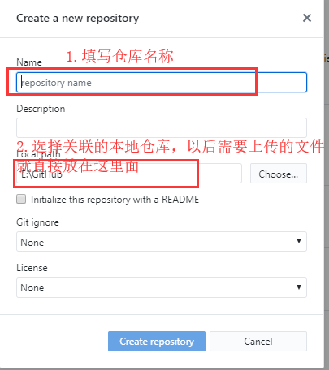
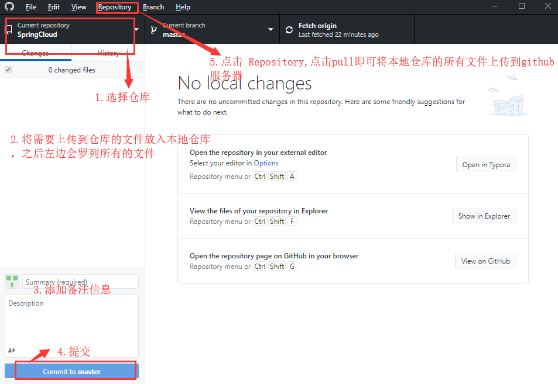

新手使用GitHub

1、进入github.com注册账号 https://github.com/

2、下载GitHub DeskTop https://desktop.github.com/

3、新建仓库 reponsitory

​	a、打开GitHub DeskTop,File -> new reponsitory

​	

​	

​	b、选择仓库，然后按下图步骤操作即可

​	**Repository -> push 点击push,图中有误**

