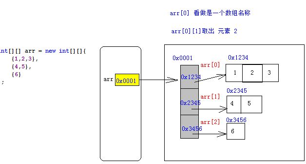

## 流式操作相关问题

## 回顾与思考
- lambda表达式是函数式接口的匿名实例对象，方法体是函数式接口中唯一抽象方法的实现。

- 接口提供默认方法，当一个类实现了具有相同默认方法签名、但具有不同的实现的多个接口会出现什么情况？

- 在lambda表达式内部编写代码，但尝试访问或修改在其外部定义的变量？
- lambda表达式中处理异常？


## lamdba表达式访问外部变量

### 匿名内部类
即用即造;因为接口和抽象类都不能直接实例化对象;
使用匿名内部类的方式构造接口、实例化对象（只要是抽象的，不管是抽象类还是接口，都可以通过匿名内部类的方式访问）
接口不能被实例化,但是接口的引用可以指向子类的实例。

使用匿名内部类：

```
Is is = new Is();  // error
但
// 接口不能被实例化,但是接口的引用可以指向子类的实例
// OK implements Is
// Is ok = new OK();
t2(new Is() {
    @Override
    public void test1() {
        System.out.println("ok");
    }
});

Is ok = new Is() {
    @Override
    public void test1() {
        System.out.println("ok");
    }
};
t2(ok);

public void t2(Is is){}
```

### lambda表达式-变量不可变

- lambda表达式可以其访问外层作用域定义的局部变量。但是lambda表达式不能修改外层局部变量的值
变量不可变（只是引用不可变):
lambda表达式访问外部变量  ->  闭包

```
//  相当于 final String str  // 引用类型：修改引用；值类型：修改值
String str = "wai";  
int x = 2;
obj.stream().forEach(new Consumer<String>() {
    private String name = "内部";
    @Override
    public void accept(String s) {
        System.out.println(str + "_" +name + "_" + x);   
//                    str = "333";    // final不能修改
//                    x = 4;
    }
});

```
- lambda表达式可以获取或者更改其外层类的属性
如果外层类的属性是 final 标识的，则lambda内只能访问，不可以修改。
如果外层类的属性是 static 标识的，同样可以访问和多次修改

```
public class Lambda6 {
    int age;
    public double method(){
        DemoFunc df = (n) -> {
            this.age = 23;
            this.age = 51; //可以多次修改
            return age;
        };
        return df.func(1.2);
    }
}

```
- 外层类的属性是某个类的对象引用，lambda表达式可以通过该引用访问或修改类的变量

```
class Test{
        int a ;
    }
    public class Lambda6 {
        Test t;
        public double method(){
            DemoFunc df = (n) -> {
                t.a = 100;
                return t.a;
            };
            return df.func(1.2);
        }
    }
```


需要用final修饰的原因：避免数据不同步

内部类里面使用外部类的局部变量时，其实就是内部类的对象在使用它，内部类对象生命周期中都可能调用它，而内部类试图访问外部方法中的局部变量时，外部方法的局部变量很可能已经不存在了，那么就得延续其生命，拷贝到内部类中，而拷贝会带来不一致性，从而需要使用final声明保证一致性。

静态属性：
比较好理解，本来就可以直接可以通过 类名.属性在任何地方都可以访问和修改
拷贝
jvm保证一致性(个人理解)


## 默认方法冲突
接口提供默认方法，当一个类实现具有相同默认方法签名、但具有不同的实现的多个接口会出现什么情况？

原则：
- 类的方法和接口的默认方法发生冲突，类方法优先
- 如果两个接口(一个接口是另一个接口的后代)发生冲突，后代接口优先；如果两个类（其中一个类是另一个类的后代），后代类优先
- 如果两个默认方法(或者是一个默认方法和一个抽象方法签名相同)不存在继承关系，类无法编译 （方案：提供实现）

在类中实现方法，使用 接口名.super.默认方法  可以使用接口中提供的默认方法。


## java.util.Objects类

Java7引入，定义了处理各种任务所需的静态方法，例如：非空验证、比较等

| 方法                                                         | 说明                                                         |
| ------------------------------------------------------------ | ------------------------------------------------------------ |
| static boolean equals(Object a, Object b)                    | 比较两个对象是否相等                                         |
| static boolean deepEquals(Object a, Object b)                | 两个数组是否深层相等                                         |
| static String toString(Object o, String nullDefault)         | 如果第一个参数为null,返回第二个参数                          |
| static <T> T requireNonNull(T obj)                           | 参数不为null,返回T,否则抛出NullPointerException              |
| static <T> T requireNonNull(T obj, String message)           | 参数obj不为null,返回T,否则抛出NullPointerException,并显示指定的message异常信息 |
| static <T> T requireNonNull(T obj, Supplier<String> messageSupplier) | 与上一个方法一致。但如果obj为null,则调用给定的Supplier为NullPointerException生成消息 |
| static boolean isNull(Object obj)                            | 对象为null,返回true,否则返回false。可用作Perdicate实例       |
| static boolean nonNull(Object obj)                           | 对象不为null,返回true,否则返回false。可用作Perdicate实例     |


- 过滤空元素
```
List<String> list = Arrays.asList(null,"this", "is", "a", "list", null);
list.stream()
        .filter(Objects::nonNull)
        .collect(Collectors.toList())
        .forEach(System.out::print);
```

- 数组比较
```
String[][] name1 = {{ "G","a","o" },{ "H","u","a","n"},{ "j","i","e"}};
String[][] name2 = {{ "G","a","o" },{ "H","u","a","n"},{ "j","i","e"}};
System.out.println(name1[0]); // [Ljava.lang.String;@61ca2dfa
System.out.println(Arrays.equals(name1, name2));    // false
System.out.println(Arrays.deepEquals(name1, name2));// true
```

二维数组存放:



## 随机数流
java.util.Random 

在指定范围内生成整型、长整型或双精度随机数流
Random定义了用于指定随机种子的构造函数，指定的种子相同，生成的随机数序列也相同，默认以当前系统时间为种子。

```
 // Math.random 返回0.0-1.0的双精度值
 // 相当于将Random实例化并调用nextDouble方法
 System.out.println(Math.random());
 System.out.println(new Random().nextDouble());
 Stream.generate(Math::random).limit(3).
        forEach((x) -> System.out.println(x));

```

生成随机数顺序流，可以使用Random类引入的ints、longs、doubles
返回流生成给定数量的双精度伪随机数(确定算法的随机)，>= randomNumberOrigin && < randomNumberBound

| 方法           
| ---------------------------------------- 
| IntStream ints(long streamSize)    
| IntStream ints()     
| IntStream ints(long streamSize, int randomNumberOrigin,int randomNumberBound) 
| IntStream ints(int randomNumberOrigin, int randomNumberBound) 

如果不指定最小值或最大值，对于doubles方法，最小值默认为0，最大值默认为1
对于ints方法，最小值和最大值默认为整型范围
对于longs,最小值和最大值默认为长整型数据的（有效）完整范围


```
 new Random().ints().limit(2).sorted().forEach(System.out::println);
        new Random().ints(3).sorted().forEach(System.out::println);
        new Random().ints(10,20).limit(3).sorted().forEach(System.out::println);
        new Random().ints(3,10,20)
                .boxed()
                .sorted(Comparator.reverseOrder())
                .collect(Collectors.toList())
                .forEach(System.out::println);
```

SecureRandom:
SecureRandom和Random都是如果种子一样，产生的随机数也一样： 因为种子确定，随机数算法也确定，因此输出是确定的。
SecureRandom是强随机数生成器，收集了一些随机事件，比如鼠标点击，键盘点击等等，SecureRandom 使用这些随机事件作为种子。这意味着，种子是不可预测的，而不像Random默认使用系统当前时间的毫秒数作为种子，有规律可寻。
主要应用的场景为：
用于安全目的的数据数，例如生成秘钥或者会话标示（session ID）


## 集合与映射的迭代
对集合和映射(map)进行迭代
使用java.lang.Iterable或java.util.Map接口中新增的默认方法forEach

public interface Collection<E> extends Iterable<E> 
Collection

map.entrySet().iterator()
final class EntrySet extends AbstractSet<Map.Entry<K,V>>{
···
public final Iterator<Map.Entry<K,V>> iterator() {
            return new EntryIterator();
        }
}

 

**foreach**:
终止操作
遍历集合中的每一个元素，然后对其进行我们想要的操作


**副作用**
行为参数对流操作的副作用通常是不鼓励的，因为它们通常会导致无意中违反无状态要求以及其他线程安全危害。
不是所有的Stream结束操作都需要返回结果，有些操作只是为了使用其副作用(Side-effects)，比如使用Stream.forEach()方法将结果打印出来就是常见的使用副作用的场景（事实上，除了打印之外其他场景都应避免使用副作用
副作用不应该被滥用，在Stream.forEach()里进行元素收集是个不错的选择，但遗憾的是这样使用的正确性和效率都无法保证，因为Stream可能会并行执行。大多数使用副作用的地方都可以使用归约操作更安全和有效的完成

此代码不必要地使用副作用。如果并行执行，非线程安全性HashMap会导致不正确的结果，并且添加所需的同步会导致争用，从而破坏并行性的好处。
```
 String[] keys = {"this","book","tt"};
        Map<String,Integer> wordCounts = new HashMap<>();
        Arrays.stream(keys)
                .forEach(s->wordCounts.put(s,0));   /// Unnecessary use of side-effects!
```

用collect 将流转换为其他形式
```
Map<String, Integer> wordCounts = Arrays.stream(keys)
        .collect(Collectors.toMap(x -> x, x -> 0));  // No side-effects!

Map<String, Integer> wordCounts = Arrays.stream(keys)
        .collect(Collectors.toMap(Function.identity(), x -> 0)); // No side-effects!

System.out.println("------------------------------");
wordCounts.forEach((k,v) -> System.out.println(k + "：" + v));
System.out.println("------------------------------");
```


###java.util.Collection是Iterable的子接口，因此forEach方法适用于ArrayList到LinkedHashSet的线性集合。

Iterable(interface)
```
 default void forEach(Consumer<? super T> action) {
        Objects.requireNonNull(action);
        for (T t : this) {
            action.accept(t);
        }
    }

```

###Map接口同样引入forEach方法作为默认方法,参数为BiConsumer
BiConsumer：传入两个泛型参数，返回void
在实现Map接口的forEach方法时，参数是entrySet方法中Map.Entry实例的键和值
```
 default void forEach(BiConsumer<? super K, ? super V> action) {
        Objects.requireNonNull(action);
        for (Map.Entry<K, V> entry : entrySet()) {
            K k;
            V v;
            try {
                k = entry.getKey();
                v = entry.getValue();
            } catch (IllegalStateException ise) {
                // this usually means the entry is no longer in the map.
                throw new ConcurrentModificationException(ise);
            }
            action.accept(k, v);
        }
    }
```
```
Set<Map.Entry<K, V>> entrySet();
```

迭代线性集合
```
List<String> list = Arrays.asList("this", "is", "a", "book");
// 1.通过 实现Stream的抽象方法
list.stream().forEach(System.out::print);

// 2. 通过list的默认方法（java8）
list.forEach(System.out::print);
```


迭代map
```
String[] keys = {"this", "is", "a", "book"};

Map<String, Integer> wordCounts = Arrays.stream(keys)
        .collect(Collectors.toMap(Function.identity(), x -> 0));

// 1. 通过map的默认方法 forEach（java8）
wordCounts.forEach((x,y)-> System.out.println(x + "："+y));


// 2. 通过entrySet获取Map.Entry实例
wordCounts.entrySet()
        .stream().
        forEach(x -> System.out.println(x.getKey()+"："+x.getValue()));

// 3. 通过KeySet获取Set
wordCounts.keySet().stream()
        .forEach(x -> System.out.println(x + "：" + wordCounts.get(x)));
```


## Map接口中的默认方法
java.util.Map接口新增各种默认方法

| 方法             | 说明                                                         |
| ---------------- | ------------------------------------------------------------ |
| Compute          | 根据现有的键和值计算新的值                                   |
| computeIfAbsent  | 如果键存在且键的值不为null返回对应值，否则通过提供的函数计算新的值并保存返回新值 |
| computeIfPresent | 计算新的值以替换现有的值                                     |
| forEach          | 迭代map，将所有的键和值传递给Consumer                        |
| getOrDefault     | 如果键在Map中存在，返回对应的值，否则返回默认值              |
| merge            | 如果键在Map中不存在，返回提供的值，否则计算新的值            |
| remove           | 如果键，删除匹配的条目                                       |
| replace          | 将现有键的值替换为新的值                                     |
| replaceAll       | 将Map中每个条目的值替换为堆当前条目调用给定函数的结果        |


computeIfAbsent
如果键的值不存在(为null)或键不存在，通过提供的函数计算新的值并保存后返回新的值； (键不存在添加映射,添加映射后返回新的值)


斐波拉契递归 computeIfAbsent

```
default V computeIfAbsent(K key,
            Function<? super K, ? extends V> mappingFunction)
```

```
	static Map<Integer, Integer> cache = new ConcurrentHashMap<>();
	@Test
	    public void  test3(){
	        cache.put(0, 0);
	        cache.put(1, 1);
	        // 普通方式
	        System.out.println("Fibonacci(5) = " + fibonacci(5));
	        // java8的本地缓存的方式
	        System.out.println("FibonacciJava8(5) = " + fibonacciJava8(5));
	    }

 /**
     * 普通的实现方式 普通方式使用大量的计算，存在性能问题. 并且计算量随着n的增加呈指数级增加，需要用到一些缓存策略，并且是线程安全的.
     *
     * @param n
     * @return
     */
    static int fibonacci(int n) {
        if (n == 0 || n == 1)
            return n;
        System.out.println("calculating Fibonacci(" + n + ")");
        return fibonacci(n - 2) + fibonacci(n - 1);
    }

    /**
     * 采用java8的本地缓存方式 如果缓存MAP中不存在指定key的值，会自动调用mappingFunction(key)计算key的value
     * 然后将key = value放入到缓存Map,java8会使用thread-safe的方式从cache中存取记录
     *
     * @param n
     * @return
     */
    static int fibonacciJava8(int n) {
        return cache.computeIfAbsent(n, (key) -> {
            System.out.println("calculating FibonacciJava8 " + n);
            return fibonacciJava8(n - 2) + fibonacciJava8(n - 1);
        });
    }


    /**
	 * 采用java7的同步线程方式
     * 在java7中的实现方式
     * 在java7中，通过synchronized进行线程同步，检查缓存是否存在key对应的值，如果不存在才进行计算并放入缓存中
     * 为了更好的性能，需要使用 double-checked locking，那样代码会更复杂
     *
     * @param n
     * @return
     */
    static int fibonacciJava7(int n) {
        if (n == 0 || n == 1)
            return n;

        Integer result = cache.get(n);

        if (result == null) {
            synchronized (cache) {
                result = cache.get(n);

                if (result == null) {
                    System.out.println("calculating FibonacciJava7(" + n + ")");
                    result = fibonacciJava7(n - 2) + fibonacciJava7(n - 1);
                    cache.put(n, result);
                }
            }
        }
        return result;
    }
```


computeIfPresent 、  merge 见例子：
computeIfPresent：如果键的值存在(不为null)，通过提供的函数计算新的值并保存后返回新的值 (键不存在不会添加映射)
merge：如果键不存在或键的值不存在(为null)， 返回提供的值  否则计算 (键不存在添加映射,添加映射后返回新的值)
```
default V computeIfPresent(K key,
            BiFunction<? super K, ? super V, ? extends V> remappingFunction)

default V merge(K key, V value,
            BiFunction<? super V, ? super V, ? extends V> remappingFunction)
```


另外几个方法：

```
        Map<String, String> map = new HashMap<>();
        map.put("name", "车厘子");
        map.put("price", "60");
        map.put("tr", "pp");


        // 如果键的值不存在(为null)或键不存在，通过提供的函数计算新的值并保存后返回新的值； (键不存在添加映射,添加映射后返回新的值)
//        String tr = map.computeIfAbsent("tr", (k) -> "tr");
//        System.out.println("tr="+tr);
//        map.forEach((k,v) -> System.out.println("k="+k+" v="+v));
//        System.out.println("====================================================");

        // 如果键的值存在(不为null)，通过提供的函数计算新的值并保存后返回新的值 (键不存在不会添加映射)
//        String tr1 =  map.computeIfPresent("tr", (k,v) -> "tr1");
//        System.out.println("tr1="+tr1);
//        map.forEach((k,v) -> System.out.println("k1="+k+" v1="+v));
//        System.out.println("====================================================");

        // 如果键不存在或键的值不存在(为null)， 返回提供的值  否则计算 (键不存在添加映射,添加映射后返回新的值)
//        String tr2 =  map.merge("tr","tr",(k,v) -> "tr2");
//        System.out.println("tr="+tr2);
//        map.forEach((k,v) -> System.out.println("k="+k+" v="+v));
//        System.out.println("====================================================");


        // 键对应的值不存在则返回默认值，但不会添加映射
//        System.out.println(map.getOrDefault("info", "无"));

        map.replace("name","芒果","香蕉");
        map.replace("name","香蕉");

        map.replaceAll((k,v)-> {
            if(k.equals("price")){
                v= v+"$";
            }
            return v;
        });


//        putIfAbsent  如果键不存在或键的值不存在(为null)，添加映射返回bull;否则返回旧值(键不存在添加映射返回null，存在返回旧值)
//        System.out.println(map.putIfAbsent("tr", "cd"));


        // put 如果键不存在添加映射返回null;否则替换并返回旧值(键不存在添加映射返回null,存在返回旧值)
        System.out.println(map.put("tr", "cd"));


        
        map.forEach((k,v)-> System.out.println(k+"："+v));

```


Function作为一个函数式接口，主要方法apply接收一个参数，返回一个值
compose方法是一个默认方法，这个方法接收一个function作为参数，将参数function执行的结果作为参数给调用的function，以此来实现两个function组合的功能
了解了compose方法，我们再来看andThen方法就好理解了，听名字就是“接下来”，andThen方法也是接收一个function作为参数，与compse不同的是，先执行本身的apply方法，将执行的结果作为参数给参数中的function


## 利用Supplier创建日志信息(惰性求值的应用)
java.util.logging.Logger
由日志级别控制是否可见的日志消息
```
public void info(String msg) {
        log(Level.INFO, msg);
    }
public void info(Supplier<String> msgSupplier) {
        log(Level.INFO, msgSupplier);
    }


public void warning(String msg) {
        log(Level.WARNING, msg);
    }
public void warning(Supplier<String> msgSupplier) {
        log(Level.WARNING, msgSupplier);
    }

severe……
config……
fine……
finer……
finest……


```


如果所提供的消息是一个简单的字符串，程序将评估它是否已被记录。
第二种重载，支持lambda表达式，且仅当日志级别合适才会调用它

```
logger.setLevel(Level.WARNING);
// 日志级别是info
// 执行getValue
logger.info("the data is"+getValue());
// 不会执行getValue 惰性求值
logger.info(() -> "the data is"+getValue());
```


## 闭包复合

函数组合：创建一些小的可重用函数，然后将这些小函数组合为新函数
Function、Consumer、Predicate接口中定义的默认方法的复合方法
apply返回结果，其余是返回一个Function

### Function：compose 和 andThen 来实现函数的组合
compose 和 andThen 的不同之处是函数执行的顺序不同。compose 函数先执行参数，然后执行调用者，而 andThen 先执行调用者，然后再执行参数
tip：由于 BiFunction 接收两个参数，它只提供 andThen 函数，如果有compose方法的话，那就是先执行参数内部Function的apply方法，但是执行完毕后只返回一个参数，而BiFunction需要两个参数

```
default <V> Function<V, R> compose(Function<? super V, ? extends T> before) {
        Objects.requireNonNull(before);
        return (V v) -> apply(before.apply(v));
    }

default <V> Function<T, V> andThen(Function<? super R, ? extends V> after) {
        Objects.requireNonNull(after);
        return (T t) -> after.apply(apply(t));
    }
```

### Consumer 接口定义的复合方法
```
 default Consumer<T> andThen(Consumer<? super T> after) {
        Objects.requireNonNull(after);
        return (T t) -> { accept(t); after.accept(t); };
    }
```
### Predicate
```
default Predicate<T> and(Predicate<? super T> other) {
        Objects.requireNonNull(other);
        return (t) -> test(t) && other.test(t);
    }

default Predicate<T> or(Predicate<? super T> other) {
        Objects.requireNonNull(other);
        return (t) -> test(t) || other.test(t);
    }

default Predicate<T> negate() {
        return (t) -> !test(t);
    }

static <T> Predicate<T> not(Predicate<? super T> target) {
    Objects.requireNonNull(target);
    return (Predicate<T>)target.negate();
}
```


##异常处理

文档：
https://4comprehension.com/sneakily-throwing-exceptions-in-lambda-expressions-in-java/
https://www.baeldung.com/java-lambda-exceptions


Java异常以Throwable为顶层父类。
Throwable又派生出Error类和Exception类。
错误：Error类以及他的子类的实例，代表了JVM本身的错误。错误不能被程序员通过代码处理
异常：Exception以及他的子类，可以被Java异常处理机制使用，是异常处理的核心

非检查异常（unckecked exception）：Error 和 RuntimeException 以及他们的子类。javac在编译时，不会提示和发现这样的异常，**不要求在程序处理这些异常**
检查异常（checked exception）：除了Error 和 RuntimeException的其它异常。javac强制要求程序员为这样的异常做预备处理工作（使用try…catch…finally或者throws


RuntimeException的子类大多数错误并不是由于程序本身有问题，而是运行时输入在某些case下导致的
例如：
```
Exception in thread "main" java.lang.RuntimeException: java.lang.NullPointerException
```

java8 lambda表达式利用函数式编程提供精简的方式表达行为。然而，JDK函数式接口没有很好地处理异常

问题：
lambda表达式中的代码需要抛出异常，
在lambda代码块中处理异常，但是结果如下，显得非常的臃肿。类似这样：
```
List<Integer> integers = Arrays.asList(3, 9, 7, 0, 10, 20);
        integers.forEach(i -> {
            try {
                System.out.println(50 / i);
            } catch (ArithmeticException e) {
                System.err.println("Arithmetic Exception occured : " + e.getMessage());
            }
        });
```

考虑：


### 提取方法，在方法中处理异常

- 对于非检查异常，在封装方法中一般可用 try catch捕获 或者不管
```
static Consumer<Integer> lambdaWrapper(Consumer<Integer> consumer) {
        return i -> {
            try {
                consumer.accept(i);
            } catch (ArithmeticException e) {
                System.err.println(
                        "Arithmetic Exception occured : " + e.getMessage());
            }
        };
    }
```
```
List<Integer> integers = Arrays.asList(3, 9, 7, 0, 10, 20);
        integers.forEach(lambdaWrapper(i -> System.out.println(50 / i)));
```
你可能觉得这仅仅从一个地方删除try-catch，移动到另一个方法中，实际并没有减少代码。
这时事实，因为包装器仅给特定的类型使用，但我们可以使用泛型提升包装方法的使用范围.

修改后的包装方法带两个参数，lamdba表达式和捕获异常类型。lamdba包装器能够处理任何类型，不仅是Integer，也可以捕获任何类型的异常，不仅是上面的ArithmeticException.
```
static <T, E extends Exception> Consumer<T>
    consumerWrapper(Consumer<T> consumer, Class<E> clazz) {
        return i -> {
            try {
                consumer.accept(i);
            } catch (Exception ex) {
                try {
                    E exCast = clazz.cast(ex);
                    System.err.println("Exception occured : " + exCast.getMessage());
                } catch (ClassCastException ccEx) {
                    throw new RuntimeException(ccEx);
                }
            }
        };
    }
```
clazz.cast(ex)：
throw new RuntimeException 方法上不需要再throws出去，非受检不需要显示处理

```
List<Integer> integers = Arrays.asList(3, 9, 7, 0, 10, 20);
        integers.forEach(
                consumerWrapper(
                        i -> System.out.println(50 / i),
                        ArithmeticException.class));
```


- 对于检查异常：lambdab表达式可能抛出的受检异常
考虑：直接扔出去

```
    @Test
    public  void test4() throws IOException{
        List<Integer> integers = Arrays.asList(3, 9, 7, 0, 10, 20);
        integers.forEach(integer -> writeToFile(integer));  // 编译失败
    }
```
```
static void writeToFile(Integer integer) throws IOException {
       throw new IOException("sss");
    }
```
lambda只能抛出在抽象方法签名中声明的异常
但lambda表达式无法直接抛出异常，因为函数式接口中的方法未抛出任何异常。也即是
Stream的forEach方法中如果抛出受检异常，那么我们必须要把它捕获吃掉，而不能抛给上一级


考虑：
lambda添加一个try catch代码块(不建议)
委托给某个提取的方法处理掉（**将受检异常变为不受检异常**）


被委托方法(包装器方法)：
接受异常
原有函数式接口的功能

Consumer接口的accept方法不会声明任何受检异常，为了能在foreach方法中使用可能抛出的受检异常的lambda表达式，创建一个单独的函数式接口，声明它将抛出Exception.新的函数式接口通过包装器方法连接到用户代码。

泛型包装器：可将受检异常作为非受检异常重新抛出，非受检异常不需要显示处理

具体步骤：
- 创建单独的函数式接口，声明它将抛出Exception
- 创建包装器warpper方法。传入ThrowingConsumer返回Consumer,在try/catch中包装accept方法.wrapper方法接受抛出Exception的代码，并构建必要的try catch代码块
```
@FunctionalInterface
public interface ThrowingConsumer <T, E extends Exception>{
   void accept(T t) throws E;
}
```
```
static <T> Consumer<T> throwingConsumerWrapper(
            ThrowingConsumer<T, Exception> throwingConsumer) {
        return i -> {
            try {
                throwingConsumer.accept(i);
            } catch (Exception ex) {
                throw new RuntimeException(ex);
            }
        };
    }
```
```
List<Integer> integers = Arrays.asList(3, 9, 7, 0, 10, 20);
integers.forEach(throwingConsumerWrapper(i -> writeToFile(i)));
```
或
```
static <T, E extends Exception> Consumer<T> handlingConsumerWrapper(
            ThrowingConsumer<T, E> throwingConsumer, Class<E> exceptionClass) {
        return i -> {
            try {
                throwingConsumer.accept(i);
            } catch (Exception ex) {
                try {
                    E exCast = exceptionClass.cast(ex);
                    System.err.println("Exception occured : " + exCast.getMessage());
                    System.out.println(exCast.getClass());
                }
                catch (ClassCastException ccEx) {
                    throw new RuntimeException(ex);
                }
            }
        };
    }
```
```
List<Integer> integers = Arrays.asList(3, 9, 7, 0, 10, 20);
integers.forEach(handlingConsumerWrapper( i -> writeToFile(i), IOException.class));
```

可使用任何抛出异常的Consumer来调用包装器
在抛出异常的consumer操作中编写代码，wrapper方法将其作为未受检异常重新抛出。

不足：
需要为所有计划使用的函数式接口创建单独的泛型包装器


