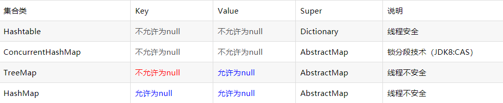

集合框架的注意事项


1、hashcode  int类型

粗显的理解：根据hash函数计算对象的地址得到的值


常见类的hashcode:

Integer:

```
@Native public static final int   MIN_VALUE = 0x80000000;
@Native public static final int   MAX_VALUE = 0x7fffffff;

# java是有有符号类型
// Math.pow(2, 31)  -》 2.147483648E9
System.out.println(Integer.MIN_VALUE); // -2147483648  - （2^31）   
System.out.println(Integer.MAX_VALUE); // 2147483647   2^31 - 1


# hashcode 就是自己的值
 public int hashCode() {
        return Integer.hashCode(value);
}
public static int hashCode(int value) {
        return value;
}
    
```


Long:

```
# hashcode 异或操作 无符号右移
public int hashCode() {
    return Long.hashCode(value);
}
public static int hashCode(long value) {
     return (int)(value ^ (value >>> 32));
}
```


String:

```

# 哈希计算公式可以计为s[0]*31^(n-1) + s[1]*31^(n-2) + ... + s[n-1]
# 比如有一个字符串“abcde”,采用31进制的计算方法来计算这个字符串的总和，你会写出下面的计算式子：
a*31^4+b*31^3+c*31^2+d*31^1+e*31^0.注意，这里的a,b,c,d或者e指的是它们的ASCII值

public int hashCode() {
    int h = hash;
    // hash变量的默认值为0。如果条件为true，则将我们的字符串转换为字符数组。
    // 基于条件h = 31 * h + val [i] ;，它将旧哈希值与31相乘，并计算整个字符串的完整哈希值
    if (h == 0 && value.length > 0) {
    	char val[] = value;  //
    	for (int i = 0; i < value.length; i++) {
    		h = 31 * h + val[i];
    	}
    	hash = h;
    }
    return h;
}
```


```
31是一个奇质数，所以31*i=32*i-i=(i<<5)-i
```

```
择值31是因为它是奇数质数。如果是偶数且乘法运算溢出，则信息将丢失，因为乘以2等于移位。使用质数的优势尚不清楚，但这是传统的。31的一个不错的特性是乘法可以用移位和减法来代替，以获得更好的性能：31 * i == (i << 5) - i。现代VM自动执行这种优化。
```


###### hashCode冲突

每当两个不同的对象具有相同的哈希码时，我们将其称为冲突

```
System.out.println("Aa".hashCode()); //2112
System.out.println("BB".hashCode()); //2112
```


HashMap的数据结构：数组+链表+红黑树

HashMap的key一般用String

HashMap<String,Object>

```
String的不变性
String实现Comparable接口的compareTo方法，比较得更加的快速
```

HashMap可以初始空间为16个元素的数组，但是可以手动指定初始化数组大小，通过构造函数指定初始化空间大小和扩容因子（当占到0.75的时候扩容，默认为0.75）

```
HashMap(int initialCapacity, float loadFactor)
```


HashMap中：

链表 -》红黑树：（以空间换时间）

链表元素超过8个并且数组元素大小大于64个


红黑树 -》 链表： （以时间换空间） 

链表长度小于6


1、hashMap.size() 元素的多少而不是容量

==2、hashMap允许null,线程不安全==




3、==map.forEach里面不要删除元素，删除元素使用Iterator,遍历使用entrySet().iterator()而不是keySet().iterator()==

```
map.foreach();

```


4、putIfAbsent()、getOrDefault

==getOrDefault 如果key存在，值为null,返回原有值null；如果key不存在，返回设置的默认值‘0’==

```
hashMap.putIfAbsent("kk","test");


#
hashMap.getOrDefault("kk","0");
```


 **HashMap的遍历与删除** 

==使用entrySet()比keySet()效率高：==

keySet其实是遍历了2次，一次是转为Iterator对象，另一次是从hashMap中取出 key所对应的value。而entrySet只是遍历了一次就把key和value都放到了entry中，效率更高。如果是JDK8，使用Map.foreach方法。 

```
Set<Entry<String, String>>entrySet = map.entrySet();Set<String> set = map.keySet();`
Map map = new HashMap(); 
Iterator iter = map.entrySet().iterator();  // 效率更高
while (iter.hasNext()) { 
    Map.Entry entry = (Map.Entry) iter.next(); 
    Object key = entry.getKey(); 
    Object val = entry.getValue(); 
} 


Map map = new HashMap(); 
Iterator iter = map.keySet().iterator(); 
while (iter.hasNext()) { 
    Object key = iter.next(); 
    Object val = map.get(key);  // 转换为iterator再去从key中拿值，效率更低
} 
```


==遍历：==

==1、只遍历，若用jdk8,则用map.foreach；也可以使用entrySet()的foreach遍历==

==2、若遍历还需要修改或删除，使用entrySet().iterator()==


==删除：== Java中的Map如果在遍历过程中要删除元素，除非通过迭代器自己的remove()方法，否则就会导致抛出**ConcurrentModificationException**异常 

==1、只能使用     entrySet().iterator()==

==2、key最好为String，不要嵌套 ====

```
   @Test
   public void testSearch(){
        // HashMap之遍历
        HashMap<String, Object> myHashMap = new HashMap<>();
        myHashMap.put("1", 1);
        myHashMap.put("2", 2);

        //1.foreach 适用于不需要修改HashMap内元素的遍历，只需要获取元素的键/值的情况
        for (Map.Entry<String, Object> item : myHashMap.entrySet()){
            String key = item.getKey();
            Object val = item.getValue();
            //todo with key and val
            //WARNING: DO NOT CHANGE key AND val IF YOU WANT TO REMOVE ITEMS LATER
        }

        //2.迭代器遍历
        //  不仅适用于HashMap，对其它类型的容器同样适用
        //　采用这种方法的遍历，可以用下文提及的方式安全地对HashMap内的元素进行修改，并不会对后续的删除操作造成影响。
        for (Iterator<Map.Entry<String, Object>> it = myHashMap.entrySet().iterator(); it.hasNext();){
            Map.Entry<String, Object> item = it.next();
            String key = item.getKey();
            Object val = item.getValue();
            //todo with key and val
            //you may remove this item using  "it.remove();"
        }

        //3.foreach（若不删除元素，用java8 foreach 推荐）
        myHashMap.forEach((k,v) -> {
            System.out.println("k="+k+",v="+v);
            //todo with key and val
            //WARNING: DO NOT CHANGE key AND val IF YOU WANT TO REMOVE ITEMS LATER
        });

    }
```


```
 // HashMap之删除元素
    @Test
    public  void testDel(){
        HashMap<String, Object> myHashMap = new HashMap<>();
        myHashMap.put("1", 1);
        myHashMap.put("2", 2);

        // 1、myHashMap.entrySet()删除元素，Java很有可能会在运行时抛出异常。
        // 由于我们在遍历HashMap的元素过程中删除了当前所在元素，下一个待访问的元素的指针也由此丢失了。
        for (Map.Entry<String, Object> item : myHashMap.entrySet()){
            myHashMap.remove(item.getKey());
        }
        for (Map.Entry<String, Object> item : myHashMap.entrySet()){
            System.out.println(item.getKey());
        }

        // 2、itretor遍历删除(正确)
        for (Iterator<Map.Entry<String, Object>> it = myHashMap.entrySet().iterator(); it.hasNext();){
            Map.Entry<String, Object> item = it.next();
            //... todo with item
            it.remove();
        }
        for (Map.Entry<String, Object> item : myHashMap.entrySet()){
            System.out.println(item.getKey());
        }

    }

    // 但是如果你的HashMap中的键值同样是一个HashMap，假设你需要处理的是 HashMap<HashMap<String, Integer>, Double> myHashMap 时，
    // 很不碰巧，你可能需要修改myHashMap中的一个项的键值HashMap中的某些元素，之后再将其删除。
    //　　这时，单单依靠迭代器的 remove() 方法是不足以将该元素删除的

    // 虽然 it.remove(); 被执行，但是并没有真正删除元素。
    //
    //　　原因在于期望删除的元素的键值（即 HashMap<String, Integer> temp ）被修改过了

    // 解决方案：
    //
    //　　既然在这种情况下，HashMap中被修改过的元素不能被删除，那么不妨直接把待修改的元素直接删除，再将原本所需要的“修改过”的元素加入HashMap。
    // 但是依然是RE：
    //
    //Exception in thread "main" java.util.ConcurrentModificationException
    //    at java.util.HashMap$HashIterator.remove(Unknown Source)
    //　　原因在于，迭代器遍历时，每一次调用 next() 函数，至多只能对容器修改一次。上面的代码则进行了两次修改：一次添加，一次删除。
    //
    //　　既然 java.util.ConcurrentModificationException 异常被抛出了，那么去想办法拿掉这个异常即可。
    //
    //　　最后的最后，我决定弃HashMap转投ConcurrentHashMap。将myHashMap定义为ConcurrentHashMap之后，其它代码不动。
    //　　最终，通过ConcurrentHashMap和一些小技巧的使用，变形实现了对被修改过键值的元素的删除。

    @Test
    public void testDelSpecial(){
        HashMap<HashMap<String, Integer>, Integer> myHashMap = new HashMap<>();
        HashMap<String, Integer> temp = new HashMap<>();
        temp.put("1", 1);
        temp.put("2", 2);
        myHashMap.put(temp, 3);
        for (Iterator<Map.Entry<HashMap<String, Integer>, Integer>>
             it = myHashMap.entrySet().iterator(); it.hasNext();){
            Map.Entry<HashMap<String, Integer>, Integer> item = it.next();
            item.getKey().remove("1");
            System.out.println(myHashMap.size());
            it.remove();
            System.out.println(myHashMap.size());
        }

        for (Iterator<Map.Entry<HashMap<String, Integer>, Integer>>
             it = myHashMap.entrySet().iterator(); it.hasNext();){
            Map.Entry<HashMap<String, Integer>, Integer> item = it.next();
            //item.getKey().remove("1");
            HashMap<String, Integer> to_put = new HashMap<>(item.getKey());
            to_put.remove("1");
            myHashMap.put(to_put, item.getValue());
            System.out.println(myHashMap.size());
            it.remove(); // java.util.ConcurrentModificationException
            System.out.println(myHashMap.size());
        }
    }

```


ArrayList 底层 Array数组


LinkedList 底层 双向链表


==LinkedHashMap  是 HashMap 的子类==

HashMap是无序的，也就是说，迭代HashMap所得到的元素顺序并不是它们最初放置到HashMap的顺序。

保持插入顺序的Map—— LinkedHashMap
虽然LinkedHashMap增加了时间和空间上的开销，但是它通过维护一个额外的双向链表保证了迭代顺序。特别地，该迭代顺序可以是插入顺序，也可以是访问顺序。因此，根据链表中元素的顺序可以将LinkedHashMap分为：==保持插入顺序的LinkedHashMap 和 保持访问顺序的LinkedHashMap，其中LinkedHashMap的默认实现是按插入顺序排序的==


在JAVA中一共有八种基本数据类型，他们分别是 
byte、short、int、long、float、double、char、boolean 

== Java的整形数据类型都是有符号的，并没有提供无符号数据类型 ==。
但是可以通过特殊的方法，可以让我们使用无符号数据类型。 (  byte :可以使用比byte类型范围大的数据类型保存byte值。然后只保留最后8位并将其他位置的2进制置0（& 0xff）就可以了 )


**整型：**

byte：-2^7 ~ 2^7-1，即-128 ~ 127。1字节。Byte。末尾加B

short：-2^15 ~ 2^15-1，即-32768 ~ 32767。2字节。Short。末尾加S

int：-2^31 ~ 2^31-1，即-2147483648 ~ 2147483647。4字节。Integer。

long：-2^63 ~ 2^63-1，即-9223372036854774808 ~ 9223372036854774807。8字节。Long。末尾加L。（也可以不加L）


**浮点型：**

float：4字节。Float。末尾加F。（也可以不加F）

double：8字节。Double。

**字符型：**

char：2字节。Character。采用unicode编码    

 ***\*utf-8是3个字节\**** 

**布尔型：**

boolean：Boolean。

类型转换：

**boolean类型与其他基本类型不能进行类型的转换（既不能进行自动类型的提升，也不能强制类型转换）， 否则，将编译出错**。


**byte型不能自动类型提升到char，char和short直接也不会发生自动类型提升（因为负数的问题）**，同时，byte当然可以直接提升到short型。

当对小于int的数据类型（byte, char, short）进行运算时，首先会把这些类型的变量值强制转为int类型进行计算，最后会得到int类型的值。因此，如果把2个short类型的值相加，最后得到的结果是int类型，如果需要得到short类型的结果，就必须显示地运算结果转为short类型